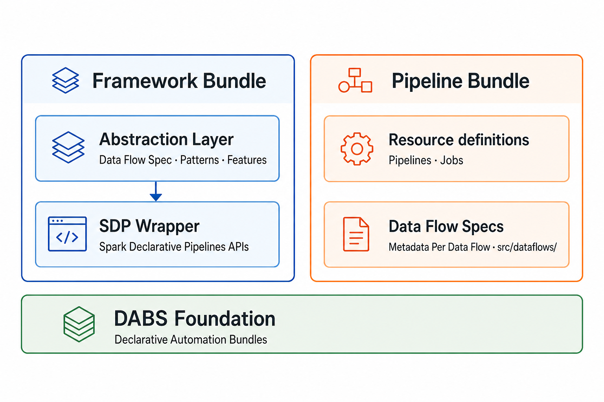

.. raw:: html

   

     <h1 class="lf-hero__title">The Lakeflow Framework</h1>
     
Metadata-driven pipelines for Databricks Lakeflow SDP

     

       Configure once, deploy everywhere. The Lakeflow Framework accelerates medallion
       pipelines with pattern-based data flow specs, DABs-native delivery, and
       support for both centralized and domain-oriented operating models.
     

     

        <a class="md-button md-button--primary lf-hero-btn" href="quick_start.html">
         Get Started
         <svg class="lf-btn-icon lf-btn-icon--after" xmlns="http://www.w3.org/2000/svg" viewBox="0 0 24 24" aria-hidden="true"><path fill="currentColor" d="M4 11v2h12l-5.5 5.5 1.42 1.42L20.84 12l-8.92-8.92L10.5 4.5 16 10H4z"/></svg>
       </a>
       <a class="md-button md-button--secondary lf-hero-btn" href="https://github.com/databricks-solutions/lakeflow_framework" target="_blank" rel="noopener">
         <svg class="lf-btn-icon lf-btn-icon--before" xmlns="http://www.w3.org/2000/svg" viewBox="0 0 496 512" aria-hidden="true"><path fill="currentColor" d="M165.9 397.4c0 2-2.3 3.6-5.2 3.6-3.3.3-5.6-1.3-5.6-3.6 0-2 2.3-3.6 5.2-3.6 3-.3 5.6 1.3 5.6 3.6m-31.1-4.5c-.7 2 1.3 4.3 4.3 4.9 2.6 1 5.6 0 6.2-2s-1.3-4.3-4.3-5.2c-2.6-.7-5.5.3-6.2 2.3m44.2-1.7c-2.9.7-4.9 2.6-4.6 4.9.3 2 2.9 3.3 5.9 2.6 2.9-.7 4.9-2.6 4.6-4.6-.3-1.9-3-3.2-5.9-2.9M244.8 8C106.1 8 0 113.3 0 252c0 110.9 69.8 205.8 169.5 239.2 12.8 2.3 17.3-5.6 17.3-12.1 0-6.2-.3-40.4-.3-61.4 0 0-70 15-84.7-29.8 0 0-11.4-29.1-27.8-36.6 0 0-22.9-15.7 1.6-15.4 0 0 24.9 2 38.6 25.8 21.9 38.6 58.6 27.5 72.9 20.9 2.3-16 8.8-27.1 16-33.7-55.9-6.2-112.3-14.3-112.3-110.5 0-27.5 7.6-41.3 23.6-58.9-2.6-6.5-11.1-33.3 2.6-67.9 20.9-6.5 69 27 69 27 20-5.6 41.5-8.5 62.8-8.5s42.8 2.9 62.8 8.5c0 0 48.1-33.6 69-27 13.7 34.7 5.2 61.4 2.6 67.9 16 17.7 25.8 31.5 25.8 58.9 0 96.5-58.9 104.2-114.8 110.5 9.2 7.9 17 22.9 17 46.4 0 33.7-.3 75.4-.3 83.6 0 6.5 4.6 14.4 17.3 12.1C428.2 457.8 496 362.9 496 252 496 113.3 383.5 8 244.8 8"/></svg>
         View on GitHub
       </a>
     

   

Deploy the framework once, then pipeline bundles shaped to how your organisation runs data — medallion, domain-owned data products, or your own architecture. Author pipelines with patterns and templates for speed and consistency.

.. container:: lf-landing-onboarding

   New to the framework? Read :doc:`what_is_lakeflow_framework` for a product-level overview, then continue with :doc:`quick_start`.

.. raw:: html

   

     <article class="lf-feature-card">
       

         <svg class="lf-feature-card__icon" xmlns="http://www.w3.org/2000/svg" viewBox="0 0 24 24" aria-hidden="true"><path fill="currentColor" d="M12 2 2 7v10l10 5 10-5V7L12 2m0 2.18 6.9 3.45L12 11.08 5.1 7.63 12 4.18M4 8.82l7 3.5v7.36l-7-3.5V8.82m9 10.86v-7.36l7-3.5v7.35l-7 3.51z"/></svg>
         <h3 class="lf-feature-card__title">Architecture</h3>
       

       

       
Operating models, Framework and Pipeline Bundles, data flow specs, and DABs on Lakeflow SDP.

       <a class="lf-feature-card__link" href="concepts.html">
         <svg class="lf-feature-card__link-icon" xmlns="http://www.w3.org/2000/svg" viewBox="0 0 24 24" aria-hidden="true"><path fill="currentColor" d="M4 11v2h12l-5.5 5.5 1.42 1.42L20.84 12l-8.92-8.92L10.5 4.5 16 10H4z"/></svg>
         Explore architecture
       </a>
     </article>
     <article class="lf-feature-card">
       

         <svg class="lf-feature-card__icon" xmlns="http://www.w3.org/2000/svg" viewBox="0 0 24 24" aria-hidden="true"><path fill="currentColor" d="M19 3H5a2 2 0 0 0-2 2v14a2 2 0 0 0 2 2h14a2 2 0 0 0 2-2V5a2 2 0 0 0-2-2M9 17H7v-7h2v7m4 0h-2V7h2v10m4 0h-2v-4h2v4z"/></svg>
         <h3 class="lf-feature-card__title">Samples</h3>
       

       

       
Feature samples, pattern samples, and the end-to-end TPCH reference warehouse.

       <a class="lf-feature-card__link" href="deploy_samples.html">
         <svg class="lf-feature-card__link-icon" xmlns="http://www.w3.org/2000/svg" viewBox="0 0 24 24" aria-hidden="true"><path fill="currentColor" d="M4 11v2h12l-5.5 5.5 1.42 1.42L20.84 12l-8.92-8.92L10.5 4.5 16 10H4z"/></svg>
         Browse feature &amp; pattern samples
       </a>
     </article>
     <article class="lf-feature-card">
       

         <svg class="lf-feature-card__icon" xmlns="http://www.w3.org/2000/svg" viewBox="0 0 24 24" aria-hidden="true"><path fill="currentColor" d="M4 8h4V4H4v4m6 12h4v-4h-4v4M4 20h4v-4H4v4M4 12h4V8H4v4m6 4h4v-4h-4v4m6-8v4h4V8h-4m-6 8h4v-4h-4v4m6 4h4v-4h-4v4m0-10v4h4V8h-4z"/></svg>
         <h3 class="lf-feature-card__title">Build</h3>
       

       

       
Bundle structure, pipeline bundle steps, data flow spec reference, and medallion patterns.

       <a class="lf-feature-card__link" href="build_pipeline_bundle.html">
         <svg class="lf-feature-card__link-icon" xmlns="http://www.w3.org/2000/svg" viewBox="0 0 24 24" aria-hidden="true"><path fill="currentColor" d="M4 11v2h12l-5.5 5.5 1.42 1.42L20.84 12l-8.92-8.92L10.5 4.5 16 10H4z"/></svg>
         Author pipeline bundles &amp; specs
       </a>
     </article>
     <article class="lf-feature-card">
       

         <svg class="lf-feature-card__icon" xmlns="http://www.w3.org/2000/svg" viewBox="0 0 24 24" aria-hidden="true"><path fill="currentColor" d="m12 2 4 4h3v8.17L12 22 5 14.17V6h3l4-4m0 2.83L9.83 7H7v5.76L12 18.4l5-5.64V7h-2.83L12 4.83z"/></svg>
         <h3 class="lf-feature-card__title">Deploy</h3>
       

       

       
Deploy the Framework Bundle and Pipeline Bundles — flat DAB deploy, pip wheel, local CLI, or CI/CD.

       <a class="lf-feature-card__link" href="deploy.html">
         <svg class="lf-feature-card__link-icon" xmlns="http://www.w3.org/2000/svg" viewBox="0 0 24 24" aria-hidden="true"><path fill="currentColor" d="M4 11v2h12l-5.5 5.5 1.42 1.42L20.84 12l-8.92-8.92L10.5 4.5 16 10H4z"/></svg>
         Deploy framework &amp; pipelines
       </a>
     </article>
     <article class="lf-feature-card">
       

         <svg class="lf-feature-card__icon" xmlns="http://www.w3.org/2000/svg" viewBox="0 0 24 24" aria-hidden="true"><path fill="currentColor" d="M14 2H6a2 2 0 0 0-2 2v16a2 2 0 0 0 2 2h12a2 2 0 0 0 2-2V8l-6-6m4 18H6V4h7v5h5v11M8 15h8v2H8v-2m0-4h8v2H8v-2m0-4h5v2H8V7z"/></svg>
         <h3 class="lf-feature-card__title">Features</h3>
       

       

       
Metadata-driven specs, configuration, Python extensions, data quality, sources and targets, and platform features.

       <a class="lf-feature-card__link" href="features.html">
         <svg class="lf-feature-card__link-icon" xmlns="http://www.w3.org/2000/svg" viewBox="0 0 24 24" aria-hidden="true"><path fill="currentColor" d="M4 11v2h12l-5.5 5.5 1.42 1.42L20.84 12l-8.92-8.92L10.5 4.5 16 10H4z"/></svg>
         Browse features by category
       </a>
     </article>
   

