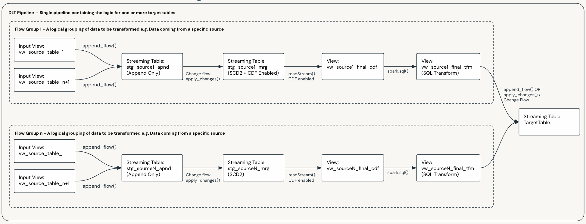
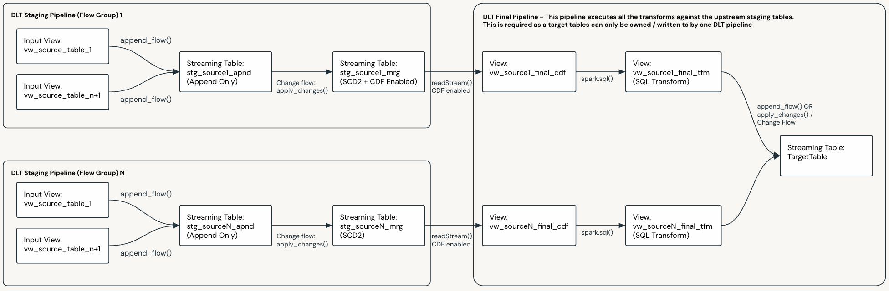

Bundle Scope and Structure
##########################

When creating a Pipeline Bundle, it is important to decide on the scope and structure of the bundle.

This will be informed by the following factors:

* Your organizational structure.
* Your operational standards, practices and your CI/CD processes.
* The size and complexity of your data estate.
* The Use Case
* The Layer of your Lakehouse you are targeting

Ultimately you will need to determine the best way to scope your Pipeline Bundles for your deployment.

.. important::

   Per the :doc:`/architecture/index` section of this documentation:
   
   * A data flow, and its Data Flow Spec, defines the source(s) and logic required to generate a **single target table**.
   * A Pipeline Bundle can contain multiple Data Flow Specs, and a Pipeline deployed by the bundle may execute the logic for one or more Data Flow Specs.
   
   For the above reasons **the smallest possible unit of logic that can be deployed by a Pipeline Bundle is a single Pipeline, executing a single data flow, that populates a single target table**.

Bundle Scope
============

Bundle Scope simply refers to the level of the logical grouping of Data Flows and Pipeline resources within a Pipeline Bundle.

Some of the most common groupings strategies are shown below:

.. list-table::
   :widths: 30 70
   :header-rows: 1

   * - Logical Grouping
     - Description
   * - Monolithic
     - A single Pipeline Bundle containing all data flows and Pipeline definitions. Only suitable for smaller and simpler deployments.
   * - Bronze
     - * Source System - A Pipeline per Source System or application
   * - Silver / Enterprise Models
     - * Subject Area / Sub-Domain - A Pipeline per Subject Area, or Sub-Domain
       * Use Case - A Pipeline per Use Case
       * Target Table - A Pipeline per target table, the most granular level for complex data flows
   * - Gold / Dimensional Models
     - * Data Mart - A Pipeline per Data Mart
       * Common Dimensions - A Pipeline for your Common Dimensions
       * Target Table - A Pipeline for complex Facts or target tables.
   * - Use Case
     - You may choose to have an end to end pipeline for given Use Cases

.. _patterns_scaling_pipelines:

Scaling and decomposing pipelines
=================================

There is no single rule for how to divide pipelines. Choices depend on organizational structure, CI/CD practices, data complexity (sources, transforms, volumes), latency and SLAs, and related constraints.

.. warning::

   Be aware of current Pipeline and concurrency limits for Spark Declarative Pipelines. Limits change over time; check:

   * https://docs.databricks.com/en/resources/limits.html
   * https://docs.databricks.com/en/delta-live-tables/limitations.html

Once you have chosen a logical grouping (table above), you can decompose a large pipeline where natural boundaries exist.

Example: start with one pipeline that has two Flow Groups flowing into a target via staging tables:

The same design decomposed into three pipelines:

* Each Flow Group is its own pipeline, targeting a final staging table.
* A final pipeline merges upstream staging tables into the target table.

For data-flow topology recipes (Basic 1:1, multi-source, stream-static, CDC from snapshot), see :doc:`/build/patterns/index`.

Bundle Structure
=================

The high-level structure of a Pipeline Bundle never changes and is as follows:

::

    my_pipeline_bundle/
    ├── fixtures/
    ├── resources/
    │   └── my_first_pipeline.yml
    ├── scratch/
    ├── src/
    │   ├── dataflows/               # Data Flow Spec files (required)
    │   ├── init/
    │   │   ├── pre/                 # Lifecycle scripts — run before SDP declarations (optional)
    │   │   └── post/                # Lifecycle scripts — run after SDP declarations (optional)
    │   ├── libraries/               # Cluster-install artefacts + sys.path loose .py (optional)
    │   ├── pipeline_configs/        # Global and env-specific pipeline config (required)
    │   └── python/                  # Spec-referenced Python modules and packages (optional)
    ├── databricks.yml
    └── README.md

.. note::

  Refer to the :doc:`/architecture/index` section for more details on the different components of a Pipeline Bundle.

The ``src/`` directories serve distinct purposes:

.. list-table::
   :header-rows: 1
   :widths: 25 75

   * - Directory
     - Purpose
   * - ``src/dataflows/``
     - All Data Flow Spec files. The framework reads every spec file recursively regardless
       of sub-folder structure. See below for organisation options.
   * - ``src/init/pre/`` and ``src/init/post/``
     - **Optional.** Lifecycle ``.py`` scripts executed before and after SDP declarations
       inside ``initialize_pipeline()``. Run in sorted filename order; files starting
       with ``_`` are skipped.
   * - ``src/libraries/``
     - **Optional.** Wheels bundled with the pipeline and referenced in the DAB
       ``libraries:`` YAML, plus any loose ``.py`` modules that need to be on
       ``sys.path`` without being spec-referenced. Libraries may equally be sourced from
       PyPI, UC Volumes, or artifact repositories — ``src/libraries/`` is only needed
       when the wheel travels with the bundle.
   * - ``src/pipeline_configs/``
     - Global and environment-specific pipeline configuration (``global.json``,
       substitutions, secrets).
   * - ``src/python/``
     - **Optional.** All customer Python referenced by Data Flow Specs —
       ``pythonModule``, ``pythonTransform.module``, and custom sinks. Added to
       ``sys.path`` at pipeline initialisation.

.. seealso::

   :doc:`/features/python/extensions` — full reference for ``src/libraries/``,
   ``src/python/``, ``src/init/``, and ``src/local/config/``, including examples,
   deprecation notices, and the cluster library installation options.

It is the structure of the ``src/dataflows`` directory that is flexible and can be organised in the way that best suits your standards and ways of working. The Framework will:

* Read all the Data Flow Spec files under the ``src/dataflows`` directory, regardless of the folder structure. Filtering of the data flows is done when defining your Pipeline and is discussed in the :doc:`/build/bundle-steps` section.
* Expect that the schemas, transforms and expectations related to a Data Flow Spec are located in their respective ``schemas``, ``dml`` and ``expectations`` sub-directories within the Data Flow Spec's home directory.

The most common ways to organize your ``src/dataflows`` directory are:

1. **Flat:**

  ::

      my_pipeline_bundle/
      ├── src/
      │   ├── dataflows
      │   │   ├── table_1_data_flow_spec_main.json
      │   │   ├── table_2_data_flow_spec_main.json
      │   │   ├── dml
      │   │   │   ├── table_1_tfm.sql
      │   │   │   ├── table_2_tfm_1.sql
      │   │   │   └── table_2_tfm_2.sql
      │   │   ├── expectations
      │   │   │   └── table_2_dqe.json
      │   │   ├── python_functions
      │   │   └── schemas
      │   │       ├── table_1.json
      │   │       └── table_2.json

2. **By Use Case:**

  ::

      my_pipeline_bundle/
      ├── src/
      │   ├── dataflows
      │   │   ├── use_case_1
      │   │   │   ├── table_1_data_flow_spec_main.json
      │   │   │   ├── table_2_data_flow_spec_main.json
      │   │   │   ├── dml
      │   │   │   │   ├── table_1_tfm.sql
      │   │   │   │   ├── table_2_tfm_1.sql
      │   │   │   │   └── table_2_tfm_2.sql
      │   │   │   ├── expectations
      │   │   │   ├── python_functions
      │   │   │   └── schemas
      │   │   │       ├── table_1.json
      │   │   │       └── table_2.json
      │   │   └── use_case_2
      │   │       ├── table_1_data_flow_spec_main.json
      │   │       ├── table_2_data_flow_spec_main.json
      │   │       ├── dml       
      │   │       ├── expectations
      │   │       ├── python_functions
      │   │       └── schemas

3. **By Target Table:**

  ::

      my_pipeline_bundle/
      ├── src/
      │   ├── dataflows
      │   │       ├── table_1
      │   │       │   ├── table_1_data_flow_spec_main.json
      │   │       │   ├── dml
      │   │       │   │   ├── table_1_tfm.sql
      │   │       │   ├── expectations
      │   │       │   ├── python_functions
      │   │       │   └── schemas
      │   │       │       └── table_1.json
      │   │       └── table_2
      │   │           ├── table_2_data_flow_spec_main.json
      │   │           ├── dml
      │   │           │   ├── table_2_tfm_1.sql
      │   │           │   └── table_2_tfm_2.sql
      │   │           ├── expectations
      │   │           │   └── table_2_dqe.json
      │   │           ├── python_functions
      │   │           └── schemas
      │   │               └── table_2.json
      │   └── pipeline_configs
