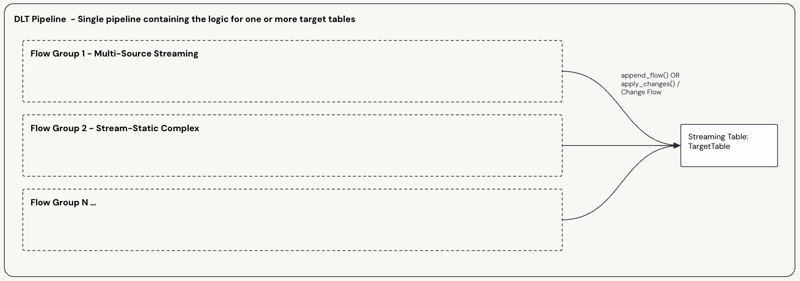

Data Flow and Pipeline Patterns
###############################

.. _patterns_overview:

Reference patterns for designing data flows and pipelines. These are not the only patterns the framework supports.

With the exception of Basic 1:1, the examples lean toward complex streaming (multi-source joins, CDC-driven updates, mixed stream/static topologies).

* Operating models and modelling paradigms: :doc:`/architecture/index`
* Multi-source streaming feature: :doc:`/features/platform/multi-source-streaming`
* Bundle and pipeline scope: :doc:`/build/bundle-structure`
* SDP concepts (datasets, flows): `Lakeflow Spark Declarative Pipelines — key concepts <https://docs.databricks.com/aws/en/ldp/concepts/#key-concepts>`_

For Gold-layer workloads, Materialized Views should generally be the first choice for dimensional modelling, batch processing, and aggregation-centric serving tables. Prefer streaming-first Gold patterns when lower-latency or less-aggregated use cases are required.

When selecting a pattern, start with ownership model, modelling approach, source characteristics (streaming, static, CDC), and latency needs.

.. important::

    Each pattern page includes a data flow example. Note that:

    * Examples highlight key differences between patterns
    * They show Append Only, SCD1, and SCD2 target-table behaviour
    * The sample customer address table uses a few basic columns for clarity

.. list-table::
   :widths: 30 70
   :header-rows: 1

   * - Pattern
     - Description
   * - :doc:`/build/patterns/basic-1-1`
     - **Suitable for:**
       
       Ingestion and basic 1:1 loads.

       |

       **Usage Scenario:**

       * You are ingesting data or performing one-to-one loads.
       * You only need to perform basic single row transforms.
       
       **Layers:**
       
       * Generally Bronze
   * - :doc:`/build/patterns/multi-source-streaming`
     - **Suitable for:**
       
       Multi-source streaming and basic transformations.
       
       |

       **Usage Scenario:**

       * You need to stream multiple tables in a single target table via a basic transform.
       * The source tables share common business keys.
       * You only need to perform basic single row transforms (e.g. enrichment).
       
       **Layers:**
       
       * Generally Silver
       
       **Models:**
       
       * 3NF such as ODS, Inmon and Enterprise Models
       * Data Vault
       
       **Considerations & Limitations:**
       
       * All source tables must share the same business keys. The column names do not need to be the same in the sources, but the keys must be conceptually the same.
       * In SCD 2 scenarios, a new version of a row will be generated any time data changes in any of the source streams. This will be particularly noticeable when you have late arriving records across streams and will lead to more row versions than normally expected.
   * - :doc:`/build/patterns/stream-static-basic`
     - **Suitable for:**
       
       When you have a streaming table that you need to join to one or many additional static tables to derive your desired target data set.
       
       |

       **Usage Scenario:**

       * You have a single streaming table driving the data flow and want to join to one or more other tables.
       * You only need to reflect changes when the driving streaming table updates.
       * The source tables do not share common business keys.
       * You only need to perform basic single row transforms.
       
       **Layers:**
       
       * Generally Silver
       * Gold (no complex transforms or aggregations)
       
       **Models:**
       
       * 3NF such as ODS, Inmon and Enterprise Models
       * Data Vault
       * Dimensional: dimensions and basic transactional facts
       
       **Considerations & Limitations:**
       
       * Updates in joined tables will not be reflected until a row with matching keys comes through on the driving streaming table.
   * - :doc:`/build/patterns/stream-static-streaming-dwh`
     - **Suitable for:**
       
       When you have a streaming table that you need to join to one or many additional static tables in order to derive your desired target data set, but you also want updates to the static tables to be reflected as they occur.
       
       |

       **Usage Scenario:**

       * You want to join multiple streaming tables.
       * You want changes in any/all tables to be updated as they occur.
       * You only need to perform basic single row transforms.
       
       **Layers:**
       
       * Generally Silver
       * Gold (no complex transforms or aggregations)
       
       **Models:**
       
       * 3NF such as ODS, Inmon and Enterprise Models
       * Data Vault
       * Dimensional: dimensions and basic transactional facts
       
       **Considerations & Limitations:**
       
       * More complex to implement than the Stream-Static Basic pattern but allows for true streaming joins.
   * - :doc:`/build/patterns/cdc-stream-from-snapshot`
     - **Suitable for:**
       
       Constructing a CDC stream from a snapshot source to be used in multi-source streaming or stream-static patterns.
       
       |

       **Usage Scenario:**

       * You need to stream multiple sources into a single target table but one or more of the sources are snapshot based.
       * You want to stream only the changes from a snapshot source.

.. toctree::
   :maxdepth: 1
   :hidden:

   Pattern - Basic 1:1 <basic-1-1>
   Pattern - Multi-Source Streaming <multi-source-streaming>
   Pattern - Stream-Static - Basic <stream-static-basic>
   Pattern - Stream-Static - Streaming Data Warehouse <stream-static-streaming-dwh>
   Pattern - CDC Stream from Snapshots <cdc-stream-from-snapshot>

.. _patterns_mix_and_match:

Mix and Match
=============

A pipeline can include one or more data flows, each based on a different pattern. Within a single data flow you can also mix patterns across :ref:`Flow Groups <concepts_flows_data_flow>` that populate the same target table:

Flow Groups logically group flows (for example one group per source system). See :doc:`/architecture/index` and :doc:`/features/platform/multi-source-streaming`. Groups and flows can be added or removed over time without a full pipeline refresh.
