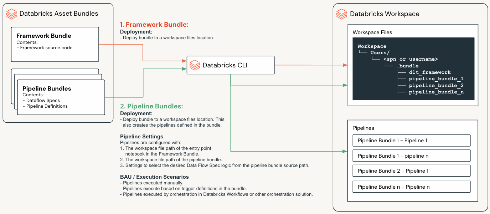
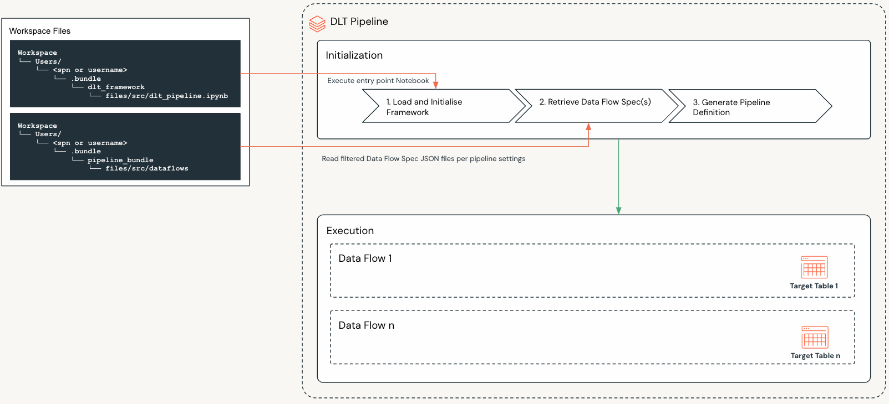

Framework Concepts
##################

The purpose of the Framework is to provide a standard metadata driven approach to creating Databricks Spark Declarative Pipelines.

The below diagram illustrates some of the key concepts of the Framework, which are explained in more detail in the following sections.

.. _concepts_dabs:

Databricks Asset Bundles (DABs)
===============================
Databricks Asset Bundles (DABs) are a way to package and deploy Databricks assets such as source code, Spark Declarative Pipelines notebooks and libraries. 
This concept is core to how the Lakeflow Framework has been designed and implemented.

Detailed documentation on DABs can be found at: https://docs.databricks.com/en/dev-tools/bundles/index.html

.. _concepts_bundle_types:

Bundle Types
============

The Lakeflow Framework is composed of two bundle types

* **Framework Bundle**

  The Framework Bundle contains the core framework source code and configuration.

* **Pipeline Bundles**

  Pipeline Bundles contain:
  
    * **Data Flow Specs** - A collection of files that define the execution logic of a Pipeline; these are a core concept which are explained further below in :ref:`concepts_dataflow_specs`.
    * **Pipeline Definitions** - YAML files that define the Pipeline configuration.

.. _concepts_framework_bundle:

Framework Bundle
----------------

The Framework Bundle contains:

.. list-table::
   :widths: 30 70
   :header-rows: 1

   * - Component
     - Description
   * - **Framework Source Code**
     - The core framework source code under the ``src`` folder.
   * - **Global Framework Configuration**
     - The global framework configuration under the ``src/config`` folder.
   * - **Data Flow Spec Schema Definition**
     - The Data Flow Spec schema definition and validations under the ``src/schemas`` folder.
   * - **Deployment YAML file**
     - The ``databricks.yml`` file which defines the bundle deployment settings.

The Framework Bundle is deployed to a given workspace files location from where it's source code can be referenced by any deployed Pipelines.

.. _concepts_framework_settings:

Framework Configuration
~~~~~~~~~~~~~~~~~~~~~~~

The Framework and most of its features will have configuration settings that can be set in the Framework Bundle ``src/config`` folder. The configuration settings are explained in the section: :doc:`features`

.. admonition:: Setting Precedence
  :class: note
  
  * Where settings can only be configured in the Framework Bundle, they can not be altered by a Pipeline Bundle.
  * Where settings can be configured in both the Framework Bundle and the Pipeline Bundles, Pipeline Bundle settings will take precedence.

.. _concepts_pipeline_bundles:

Pipeline Bundles
----------------
A Pipeline Bundle is used to define and deploy one or more Spark Declarative Pipelines.

A Pipeline Bundle contains:

.. list-table::
   :widths: 30 70
   :header-rows: 1

   * - Component
     - Description
   * - **Data Flow Specs**
     - Located under the ``src/dataflows`` folder. These are a core concept which are explained further below in :ref:`concepts_dataflow_specs`.
   * - **Pipeline Definitions**
     - YAML files in the ``resources`` folder. These are used to create the Spark Declarative Pipelines in the target workspace.
   * - **Pipeline Level Framework Configuration**
     - Configuration files under the ``src/pipeline_configs`` folder.
   * - **Deployment YAML file**
     - The ``databricks.yml`` file which defines the bundle deployment settings.

When Pipeline Bundles are deployed, DABs will:

1. Deploy the bundle to a given workspace files location from where its source code can be referenced by any Pipelines deployed by the bundle.
2. Create a Spark Declarative Pipeline per YAML file in the ``resources`` folder of the Pipeline Bundle.

Pipeline Bundle Structure:

::

    my_pipeline_bundle/
    ├── databricks.yml
    ├── fixtures/
    ├── resources/
    ├── scratch/
    ├── src/
    │   ├── dataflows/
    │   └── pipeline_configs/
    └── README.md

.. _concepts_dataflow_specs:

Data Flow Specs
~~~~~~~~~~~~~~~
A Data Flow Spec is a collection of files that define a single data flow that creates, maintains and loads a single target table.

A Data Flow Spec contains the following files:

  .. list-table::
    :widths: 30 70
    :header-rows: 1
    
    * - File Type
      - Description
    * - **Data Flow Specification**
      - One or more files that define the execution logic required to generate a target table.
    * - **Schema JSON**
      - One or more files that define the schema of the source tables, staging tables and target table in the Pipeline.
    * - **Expectations**
      - One or more files that specify the data quality expectations for the given target table.
    * - **SQL Transforms**
      - One or more SQL files that can be used to specify transformations in the pipeline.

.. important::

  * A Data Flow Spec defines the source(s) and logic required to generate a single target table 
  * A Pipeline Bundle can contain multiple Data Flow Specs, and a Pipeline deployed by the bundle may execute the logic for one or more Data Flow Specs.

Example Data Flow Spec Structure:

::

    my_pipeline_bundle/
    └── src/
        ├── dataflows
        │   ├── dataflowspec
        │   │   └── table_1.json
        │   ├── dml
        │   │   └── transform.sql
        │   ├── expectations
        │   │   └── table_1_expectations.json
        │   └── schemas
        │       └── source_table_schema.json
        │       └── table_1_schema.json
        └── pipeline_configs
            └── pipeline_config.json

.. _concepts_pipeline_resources:

Pipeline Resource YAML Files
~~~~~~~~~~~~~~~~~~~~~~~~~~~~
A Pipeline Bundle, must contain at least one YAML file in the ``resources`` folder that defines a Pipeline configuration; it may contain multiple YAML files, depending on the number of pipelines to be defined.

The resource YAML files are used by DABs to create, update or destroy the Spark Declarative Pipelines in the target workspace.

.. _concepts_pipeline_bundle_config:

Pipeline Bundle Configuration
~~~~~~~~~~~~~~~~~~~~~~~~~~~~~

Certain Framework features can be configured in a Pipeline Bundle, in the ``src/pipeline_configs`` folder. These configuration settings are explained in the section: :doc:`features`

.. _concepts_dataflow_types:

Pipelines
=========

A Spark Declarative Pipeline is essentially an ETL pipeline that executes on the Databricks platform. Pipeline bundles provide a standard way to define and deploy Spark Declarative Pipelines. 

The above diagram illustrates the following key concepts:

1. Pipeline Bundles define:

   * Spark Declarative Pipelines
   * The logic that Spark Declarative Pipelines execute
   * The staging and target tables that Spark Declarative Pipelines maintain

2. A Spark Declarative Pipeline is defined in a resource YAML file of a Pipeline Bundle.
3. Once the Pipeline Bundle is deployed, the Spark Declarative Pipeline is created in the target workspace with the following key settings:

   * The workspace files location of the entry point Notebook for the Framework.
   * The workspace files location of the Data Flow Spec source folder for the Pipeline Bundle.
   * Settings that define which data flows to execute when the pipeline is deployed.

4. When a Spark Declarative Pipeline executes, the following steps are performed:

.. list-table::
   :widths: 10 30 60
   :header-rows: 1

   * - Step
     - Name
     - Description
   * - 1
     - Load and Initialize Framework
     - Load and initialize the Framework
   * - 2
     - Retrieve Data Flow Specifications
     - 
       a. **Retrieve and validate:**
          - Read and validate ALL the Data Flow Specifications, Expectations, and Secrets Configurations from the workspace files location of the Pipeline Bundle.
          - If a file is not valid it will be added to an error list.
          - If any files failed validation, the pipeline will fail and the user will receive a list of validation errors.
       b. **Apply pipeline filters:**
          - The framework will apply any pipeline filters to the in memory dictionary.
          - The only exception to this is the File Filter which means the framework will specifically only read that file(s).
   * - 3
     - Generate Pipeline Definition
     - The Framework will then use the in memory dictionary to initialize the Spark Declarative Pipeline.
   * - 4
     - Execute Pipeline
     - The pipeline will then execute the logic defined in the Data Flow Specifications.

.. _concepts_data_flows:

Data Flows & Data Flow Specs
============================

A data flow defines the source(s) and logic required to generate a single target table. Data flows are defined using Data Flow Specs. 

.. admonition:: Data Flows as Building Blocks

 Each data flow and the components therein can be thought of as a building blocks to build out your overall Pipelines.

In the Lakeflow Framework the following types of data flows can be defined in a Data Flow Spec:

1. **Standard**

  A standard data flow is a more simple data flow type that allows a pipeline to be defined with a single source view (which may implement SQL or joins but would typically be over a single table) and target table. 
  They are simple to define and are useful for ingestion and Bronze scenarios.

2. **Flow**

  Flows data flows allow you to create simple or complex data flows, using the different components of a flow as building blocks. They implement the :doc:`feature_multi_source_streaming` feature of DLT.
  Flows are useful for Silver and Gold scenarios, and where multiple sources and transformations are required.

3. **Materialized Views**

  Materialized Views are the precomputed results of a query stored in a Table. They are useful for Gold scenarios, and where complex transformations are required.

.. important::

  * A data flow is defined by a Data Flow Spec
  * A data flow defines the source(s) and logic required to generate a single target table 
  * A Pipeline Bundle can contain multiple Data Flow Specs, and a Pipeline deployed by the bundle may execute the logic for one or more Data Flow Specs.

.. _concepts_standard_data_flow:

Standard Data Flow
-------------------

Data Flow Spec Components:

.. code-block:: text

   Standard Data Flow
   ├── Data Flow Metadata
   ├── Source Details
   ├── Target Details
   ├── CDC Details (optional)
   ├── Expectations (optional)
   ├── Quarantine Details (optional)
   └── Table Migration Details (optional)

.. list-table::
   :widths: 30 70
   :header-rows: 1

   * - Component
     - Description
   * - :ref:`Data Flow Metadata <dataflow-spec-standard-metadata-configuration>`
     - Defines the metadata for the data flow.
   * - :ref:`Source Details <dataflow-spec-standard-source-configuration>`
     - Specifies the source type, source view and its properties.
   * - :ref:`Target Details <dataflow-spec-standard-target-configuration>`
     - Specifies the target table, its configuration and properties.
   * - :ref:`CDC Details (optional) <dataflow-spec-standard-cdc-configuration>`
     - Enables the CDC flows to populate the target table.
   * - :ref:`Expectations (optional) <dataflow-spec-standard-data-quality-configuration>`
     - Enable expectations and specify the location of the expectations file(s).
   * - :ref:`Quarantine Details (optional) <dataflow-spec-standard-data-quality-configuration>`
     - Set the quarantine mode and if the mode is ``table`` the details of the quarantine table.
   * - :ref:`Table Migration Details (optional) <dataflow-spec-standard-table-migration-configuration>`
     - The details of the table being migrated from.

.. _concepts_flows_data_flow:

Flows Data Flow
---------------

Data Flow Spec Components:

.. code-block:: text
  :emphasize-lines: 8

   Flows Data Flow
   ├── Data Flow Metadata
   ├── Target Details
   ├── CDC Details (optional)
   ├── Expectations (optional)
   ├── Quarantine Details (optional)
   |── Table Migration Details (optional)
   └── Flow Groups
       ├── Flow Group 1
       └── Flow Group n
           ├── Staging Tables (optional)
           |   ├── Staging Table 1
           |   └── Staging Table n
           |       ├── Target Details
           |       └── CDC Details (optional)
           └── Flows
               ├── Flow 1
               └── Flow n
                   ├── Flow Type
                   ├── Flow Details
                   └── Views (optional)
                       ├── View 1
                       └── View n
                           ├── Mode
                           └── Source Details

.. list-table::
   :widths: 30 70
   :header-rows: 1

   * - Component
     - Description
   * - :ref:`Data Flow Metadata <dataflow-spec-flows-metadata-configuration>`
     - Defines the metadata for the data flow.
   * - :ref:`Target Details <dataflow-spec-flows-target-configuration>`
     - Specifies the target table, its configuration and properties.
   * - :ref:`CDC Details (optional) <dataflow-spec-flows-cdc-configuration>`
     - Enables the CDC flows to populate the target table.
   * - :ref:`Expectations (optional) <dataflow-spec-flows-data-quality-configuration>`
     - Enable expectations and specify the location of the expectations file(s).
   * - :ref:`Quarantine Details (optional) <dataflow-spec-flows-data-quality-configuration>`
     - Set the quarantine mode and if the mode is ``table`` the details of the quarantine table.
   * - :ref:`Table Migration Details (optional) <dataflow-spec-flows-table-migration-configuration>`
     - The details of the table being migrated from.
   * - :ref:`Flow Groups <dataflow-spec-flows-flow-groups-configuration>`
     - Contains the flow groups for the dataflow.

       * A flow group can contain one or more flows.
       * flows implements the :doc:`feature_multi_source_streaming` feature of DLT.'

Flow Groups Explained
~~~~~~~~~~~~~~~~~~~~~

A Flow Group is a logical grouping of related flows and staging tables, which ultimately allows you to define complex data flows with many sources, transformations and views, that can evolve over time.

.. list-table::
   :widths: 30 70
   :header-rows: 1

   * - Component
     - Description
   * - :ref:`Staging Tables <dataflow-spec-flows-staging-table-configuration>`
     - Allows you to define staging tables that can be used in any of the flows defined in the flow group.
   * - :ref:`Flows <dataflow-spec-flows-flow-configuration>`
     - A logical grouping of related flows.

.. important::

  The :doc:`Multi-Source Streaming <feature_multi_source_streaming>` feature allows you to stream multiple flows into a single target. 
  
  Core to this functionality is the ability to add and remove Flow Groups and Flows therein, as your requirements and systems evolve. This will not break the existing pipeline and will not require a full refresh of the Pipeline.  

Staging Tables Explained
~~~~~~~~~~~~~~~~~~~~~~~~

Staging tables are used to store the data that is being transformed and loaded into the target table. 

Some key points to note:

  * Staging tables are optional.
  * Staging tables can be referenced as a source or target in any of the flows defined in the flow group.
  * In some cases for very large and complex data flows, you may want to decompose your dataflow into a smaller more manageable data flows. In this instance staging tables may in fact become target tables in smaller more manageable data flows. In these cases they can only be used as a source in downstream Pipelines. This however really depend on the design practices you choose to follow.

When defining a staging table, you can specify the following:

  * The ``name`` of the staging table.
  * The ``type`` of staging table. Currently only Streaming Tables are supported.
  * Optional - The ``schemaPath`` of the staging table.
  * Optional - The ``tableProperties`` of the staging table.
  * Optional - The ``cdcSettings`` configuration of the staging table.

Flows Explained
~~~~~~~~~~~~~~~

Flows are the building blocks of a Data Flow and they implement the :doc:`feature_multi_source_streaming` feature of DLT.

Flows can be defined in one of two ways:

1. **Source Table --> Target Table**:

   This is the most simple flow and requires no views. This is only possible when using the ``merge`` flow type.

2. **View(s) --> Target Table**:

   This requires the definition of at least one view that is used as the source for the flow into the target table. You can also chain multiple views together where multiple transformation steps are required. 

.. list-table::
   :widths: 30 70
   :header-rows: 1

   * - Component
     - Description
   * - :ref:`Flow Type <dataflow-spec-flows-flow-configuration>`
     - Allows you to define the type of flow. The Framework supports three types of flows:

       * **append_view** - Uses a source view to append data to a staging or target table.
       * **append_sql** - Uses a raw SQL statement to append data to a staging or target table.
       * **merge** - Uses the :ref:`CDC API's <feature_cdc>` to merge data from a source view to a staging or target table.

   * - :ref:`Flow Details <dataflow-spec-flows-flow-configuration>`
     - Defines the source and target of the flow and any additional properties required for the flow type.
   * - :ref:`Views <dataflow-spec-flows-flow-configuration>` (optional)
     - Views are used to define the source and any additional transformations for a flow. The different types of views are documented in the following sections:
     
       * :doc:`feature_source_target_types`
       * :ref:`dataflow-spec-flows-view-configuration`

.. important::

  The :doc:`Multi-Source Streaming <feature_multi_source_streaming>` feature allows you to stream multiple flows into a single target. 
  
  Core to this functionality is the ability to add and remove Flow Groups and Flows therein, as your requirements and systems evolve. This will not break the existing pipeline and will not require a full refresh of the Pipeline.  

.. _concepts_materialized_views:

Materialized Views
-------------------

Materialized Views are the precomputed results of a query stored in a Table. They are typically used for Gold scenarios, and where complex transformations are required.

Data Flow Spec Components:

.. code-block:: text

   Materialized Views
   ├── Materialized View 1
   │   ├── Data Flow Metadata
   │   ├── Source Details
   │   ├── Table Details (optional)
   │   ├── Data Quality Expectations (optional)
   │   └──Quarantine Details (optional)
   └── Materialized View n
       ├── Data Flow Metadata
       ├── Source Details
       ├── Table Details (optional)
       ├── Data Quality Expectations (optional)
       └──Quarantine Details (optional)

.. list-table::
   :widths: 30 70
   :header-rows: 1

   * - Component
     - Description
   * - :ref:`Data Flow Metadata <dataflow-spec-materialized-view-metadata-configuration>`
     - Defines the metadata for the data flow.
   * - :ref:`Source Details <dataflow-spec-materialized-view-source-configuration>`
     - Specifies a source view, path to a SQL file or a raw SQL statement.
   * - :ref:`Table Details (optional) <dataflow-spec-materialized-view-table-configuration>`
     - Specifies any additional configuration for the target table, its configuration and properties.
   * - :ref:`Data Quality Expectations (optional) <dataflow-spec-materialized-view-data-quality-configuration>`
     - Enable expectations and specify the location of the expectations file(s).
   * - :ref:`Quarantine Details (optional) <dataflow-spec-materialized-view-quarantine-configuration>`
     - Set the quarantine mode and if the mode is ``table`` the details of the quarantine table.

Patterns
--------

Detailed documentation on the different patterns that can be used to build out your data flow and Pipelines can be found in the section: :doc:`patterns`
