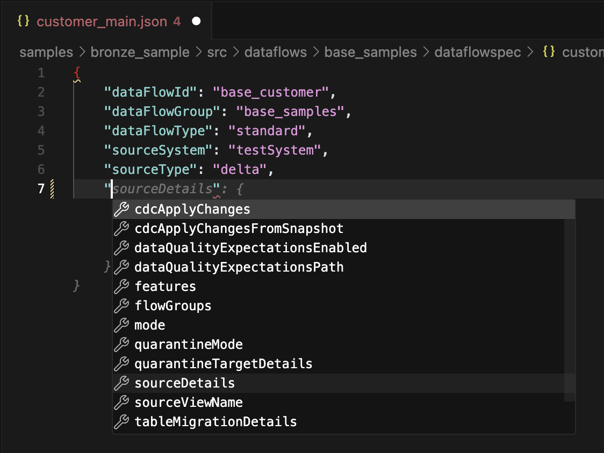
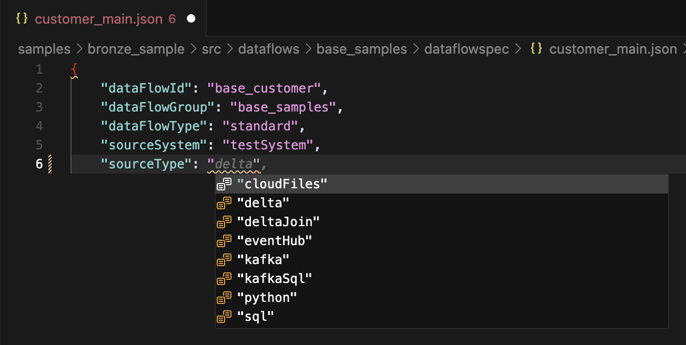
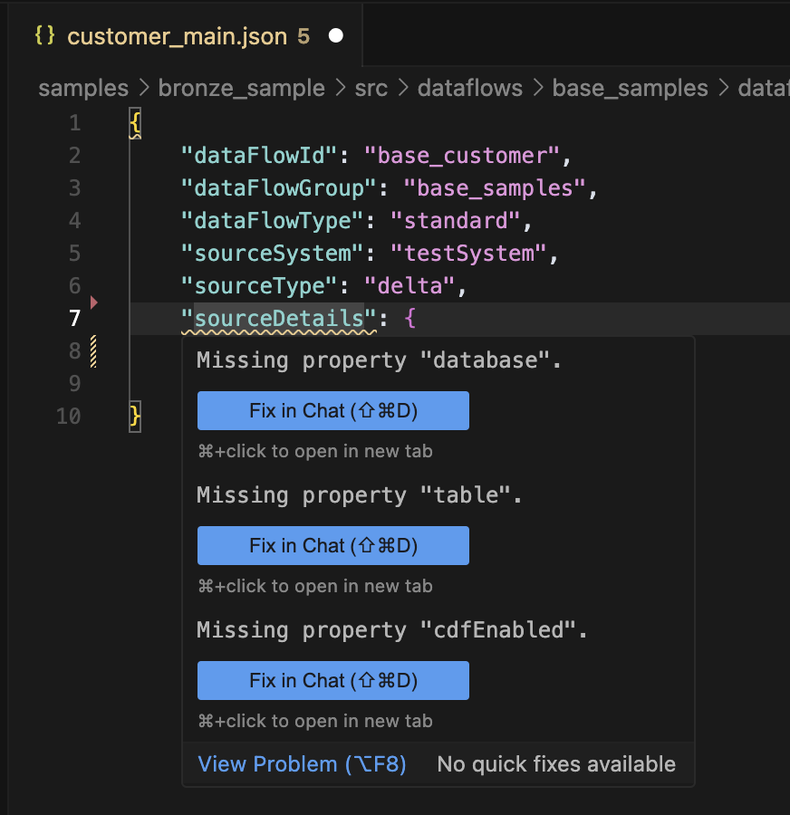
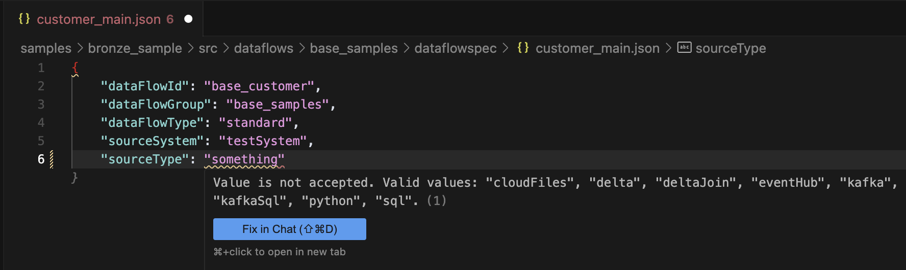
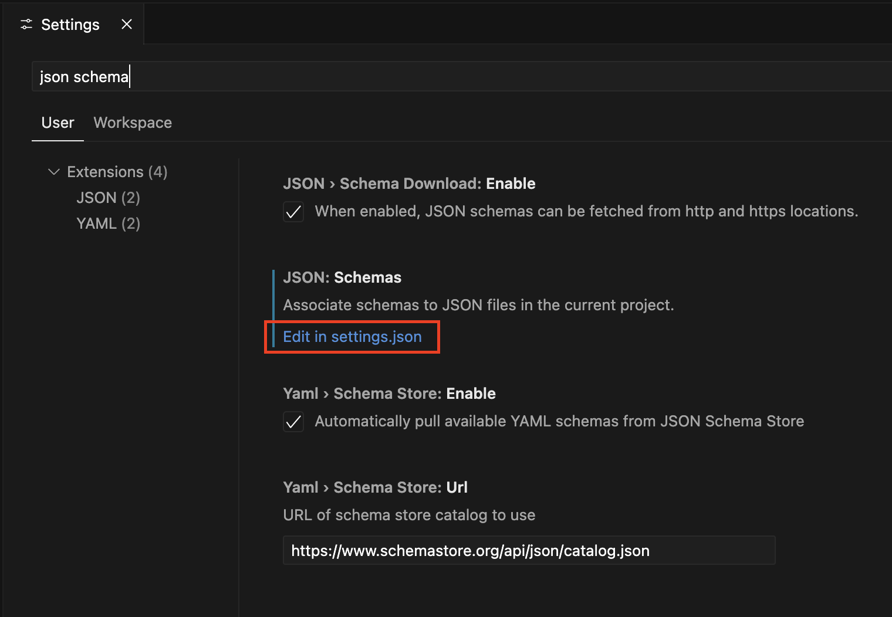

Auto Complete / Intellisense
=============================

.. list-table::
   :header-rows: 0

   * - **Applies To:**
     - :bdg-success:`Pipeline Bundle`
   * - **Configuration Scope:**
     - :bdg-success:`VS Code Settings`
   * - **Databricks Docs:**
     - NA

Overview
--------
The framework uses JSON Schema-based IntelliSense when creating or editing Data Flow specifications, which includes:

- Auto-completion (suggesting keys/values)
- Validation (checking for errors based on the schema)
- Quick Fixes (where applicable)

Autocompletion Example
~~~~~~~~~~~~~~~~~~~~~~
*Suggesting keys*

*Suggesting values*

Validation Example
~~~~~~~~~~~~~~~~~

*Schema Validation*

*Value Validation*

Configuration for VS Code
-------------------------
To enable Auto Complete / Intellisense in VS Code, you need to add the JSON schemas to your workspace or user ``settings.json`` file. 
Detailsed instructions are available in the `VS Code - JSON schema and Settings <https://code.visualstudio.com/docs/languages/json#_json-schemas-and-settings>`_ documentation.

To open the ``settings.json`` file, you can use the command palette (Ctrl+Shift+P or Cmd+Shift+P on Mac) and search for "JSON Schema".

Add the following code into your ``settings.json`` replacing ``<path to framework folder>`` with the path to the Lakeflow Framework project on your local machine unless you are adding this object directly to the ``settings.json`` in your ``.vscode`` directory in the Lakeflow Framework project in which case you should remove ``<path to framework folder>``.:

.. code-block:: json

    {
        "json.schemas": [
            {
                "fileMatch": [
                    "*_flow.json"
                ],
                "url": "<path to framework folder>/src/schemas/flow_group.json"
            },
            {
                "fileMatch": [
                    "*_main.json"
                ],
                "url": "<path to framework folder>/src/schemas/main.json"
            },
            {
                "fileMatch": [
                    "*_dqe.json"
                ],
                "url": "<path to framework folder>/src/schemas/expectations.json"
            },
            {
                "fileMatch": [
                    "*_secrets.json"
                ],
                "url": "<path to framework folder>/src/schemas/secrets.json"
            }
        ]
    }

Example ``settings.json`` file:

.. code-block:: json

  {
      "python.analysis.extraPaths": [
          "src"
      ],
      "json.schemas": [
          {
              "fileMatch": [
                  "*flow.json"
              ],
              "url": "/Users/erik.seefeld/Documents/dev_work/dlt_framework/src/schemas/flow_group.json"
          },
          {
              "fileMatch": [
                  "*main.json"
              ],
              "url": "/Users/erik.seefeld/Documents/dev_work/dlt_framework/src/schemas/main.json"
          },
          {
              "fileMatch": [
                  "*_dqe.json"
              ],
              "url": "/Users/erik.seefeld/Documents/dev_work/dlt_framework/src/schemas/expectations.json"
          },
          {
              "fileMatch": [
                  "*_secrets.json"
              ],
              "url": "/Users/erik.seefeld/Documents/dev_work/dlt_framework/src/schemas/secrets.json"
          }
      ]
  } 
