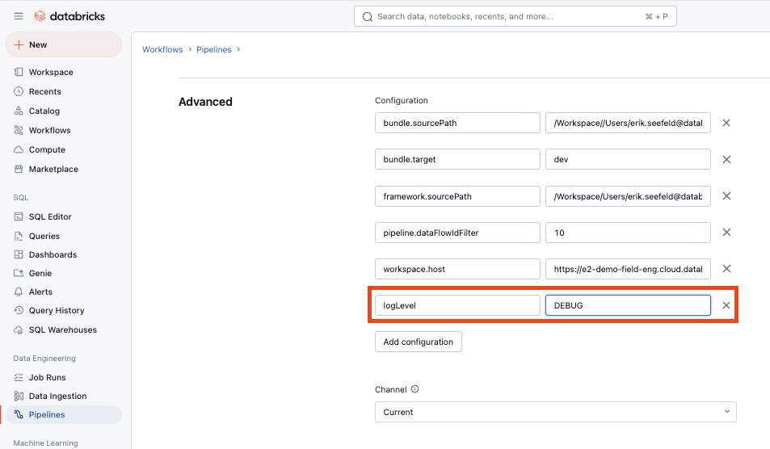

Logging
=======

.. list-table::
   :header-rows: 0

   * - **Applies To:**
     - :bdg-success:`Pipeline Bundle`
   * - **Configuration Scope:**
     - :bdg-success:`Pipeline`
   * - **Databricks Docs:**
     - NA

The Lakeflow Framework provides structured logging capabilities to help track pipeline execution and troubleshoot issues. Logging is implemented using Python's standard ``logging`` module with custom configuration.

Log Levels
---------- 

The framework supports standard Python logging levels:

- DEBUG: Detailed information for debugging
- INFO: General information about pipeline execution
- WARNING: Warning messages for potential issues
- ERROR: Error messages for failed operations
- CRITICAL: Critical errors that may cause pipeline failure

Configuration
-------------

The default log level for all pipelines is ``INFO``. 
To specify a different log level, you can set the ``logLevel`` parameter in the `Configuration` section of a Spark Declarative Pipeline. 
You can do this in one in one of the two ways described below.

Setting the Log Level in the Pipeline Yaml
^^^^^^^^^^^^^^^^^^^^^^^^^^^^^^^^^^^^^^^^^^^^

The log level can be configured when creating a pipeline yaml in the resources folder of a pipeline bundle. 
This is done by adding the ``logLevel`` parameter in the configuration section of the pipeline.yaml, per the below screenshot. 

.. image:: images/screenshot_pipeline_log_level_yaml.png

Setting the Log Level in the Databricks UI
^^^^^^^^^^^^^^^^^^^^^^^^^^^^^^^^^^^^^^^^^^

The log level can also be manually set at any time in the Databricks UI. 
To do so, browse to your desired Pipeline, open the Pipeline setting and add the ``logLevel`` in the `Advanced Configuration` section as shown below:

Permissions to View Logs
^^^^^^^^^^^^^^^^^^^^^^^^

By default, only the pipeline owner has permissions to view the logs for a given pipeline execution. 

To grant other users access to the logs, you must configure the add the below spark configuration to the Framework using the :doc:`feature_spark_configuration` feature of the Framework.

.. code-block:: text

    "spark.databricks.acl.needAdminPermissionToViewLogs": "false"

This is documented in the Databricks documentation here: https://docs.databricks.com/en/compute/clusters-manage.html

Viewing the Logs
----------------

The logs can be viewed in the Databricks UI by: 

1. Browsing to the desired Pipeline.
2. Selecting the desired Update ID (pipeline execution). 
3. Selecting the `Update` tab on the right hand side of the UI and then clicking on the `Logs` link at the bottom of the tab.

    .. image:: images/screenshot_logs_viewing_1.png

4. A new browser tab will open displaying the log in the STDOUT section as shown below:

    .. image:: images/screenshot_logs_viewing_2.png

Example Log Messages
------------------

The framework logs various types of information:

Pipeline Initialization:

.. code-block:: text

    2025-02-06 04:05:46,161 - DltFramework - INFO - Initializing Pipeline...
    2025-02-06 04:05:46,772 - DltFramework - INFO - Retrieving Global Framework Config From: {path}
    2025-02-06 04:05:46,908 - DltFramework - INFO - Retrieving Pipeline Configs From: {path}

Flow Creation:

.. code-block:: text

    2025-02-06 04:05:48,254 - DltFramework - Creating Flow: flow_name
    2025-02-06 04:05:48,254 - DltFramework - Creating View: view_name, mode: stream, source type: delta

Error Handling:

.. code-block:: text

    2025-02-06 04:06:26,527 - ERROR - DltFramework - Failed to process Data Flow Spec: {error_details}
