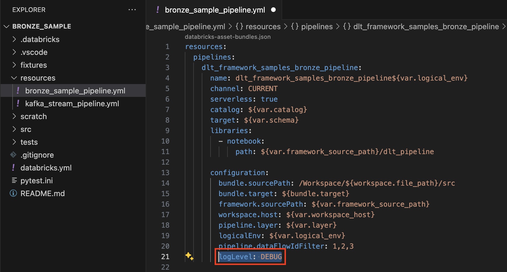
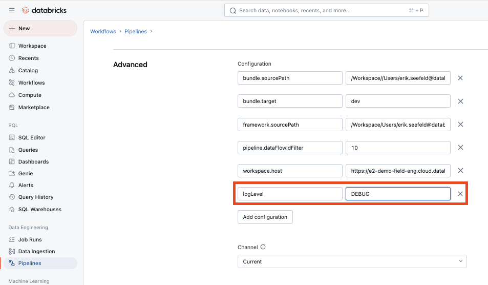

Logging
=======

.. list-table::
   :header-rows: 0

   * - **Applies To:**
     - :bdg-info:`Framework Bundle` :bdg-success:`Pipeline Bundle`
   * - **Configuration Scope:**
     - :bdg-info:`Global` :bdg-success:`Pipeline`
   * - **Databricks Docs:**
     - NA

The Lakeflow Framework provides logging capabilities to track pipeline execution and troubleshoot issues. By default, logging uses Python's standard ``logging`` module with a plain text stdout handler (logger name ``DltFramework``).

You can optionally plug in a **custom logger** via a dedicated ``logger.json`` config file.

.. admonition:: Setting Precedence
  :class: warning

  * Framework code and extensions should use the singleton accessor ``pipeline_config.get_logger()`` rather than creating their own loggers.

Log Levels
----------

The framework supports standard Python logging levels:

- **DEBUG**: Detailed information for debugging
- **INFO**: General information about pipeline execution (default)
- **WARNING**: Warning messages for potential issues
- **ERROR**: Error messages for failed operations
- **CRITICAL**: Critical errors that may cause pipeline failure

Spark ``logLevel`` Configuration
--------------------------------

The default log level for all pipelines is **INFO**.

To specify a different log level, set the ``logLevel`` parameter in the **Configuration** section of a Spark Declarative Pipeline. Spark ``logLevel`` takes precedence over the ``level`` field in ``logger.json`` when the logger is resolved.

Setting the Log Level in the Pipeline YAML
^^^^^^^^^^^^^^^^^^^^^^^^^^^^^^^^^^^^^^^^^^

Add ``logLevel`` in the configuration section of your pipeline resource YAML:

Setting the Log Level in the Databricks UI
^^^^^^^^^^^^^^^^^^^^^^^^^^^^^^^^^^^^^^^^^^

Browse to your pipeline, open **Settings**, and add ``logLevel`` under **Advanced Configuration**:

Pluggable Logger Configuration (``logger.json``)
------------------------------------------------

Custom logging is configured in ``logger.json`` files—not in ``global.json``—so the framework can initialize logging before loading merged global configuration.

| **Scope: Framework**
| Shipped defaults: ``{framework_path}/src/config/default/logger.json``
| Custom framework settings: ``{framework_path}/src/local/config/logger.json`` (sparse overlay — only include the keys you want to change)

.. important::

   Do **not** edit ``src/config/default/logger.json`` in the framework bundle.
   To change framework-level logging, create a sparse ``logger.json`` under
   ``src/local/config/`` containing only the keys you want to override.
   The framework deep-merges the local file on top of the defaults — no need
   to copy the full file. See :doc:`feature_framework_configuration` for details.

| **Scope: Pipeline bundle**
| ``{bundle_path}/pipeline_configs/logger.json``

If a file is missing, that side contributes an empty configuration. The shipped framework default disables the custom logger path:

.. code-block:: json

   {
     "enabled": false,
     "allow_pipeline_logger_override": false,
     "mirror_to_stdout": false,
     "level": "INFO",
     "factory_args": {}
   }

Configuration Schema
^^^^^^^^^^^^^^^^^^^^

.. list-table::
   :header-rows: 1
   :widths: 22 12 12 54

   * - Field
     - Default
     - Framework / Pipeline
     - Description
   * - ``enabled``
     - ``false``
     - ✓ / ✓
     - When ``true``, load and invoke the custom logger factory. When ``false``, use the framework default stdout logger only.
   * - ``library``
     - —
     - ✓ / ✓
     - Optional distribution name to probe (for example ``custom_logger``). If set and not importable, the framework falls back to the default logger and logs a warning.
   * - ``module``
     - —
     - ✓ / ✓
     - Python module to import (for example ``custom_logger.databricks``).
   * - ``factory``
     - —
     - ✓ / ✓
     - Callable on ``module`` (for example ``get_logger``). Invoked as ``factory(dbutils, spark, **factory_args)``.
   * - ``factory_args``
     - ``{}``
     - ✓ / ✓
     - Keyword arguments passed to the factory after ``dbutils`` and ``spark``. Overlapping keys are deep-merged according to precedence rules below.
   * - ``level``
     - ``"INFO"``
     - ✓ / ✓
     - Minimum log level for the resolved logger. Overridden by the Spark ``logLevel`` pipeline setting when set. The resolved level is also automatically injected as a ``"level"`` key in ``factory_args``.
   * - ``mirror_to_stdout``
     - ``false``
     - ✓ / ✓
     - When ``true`` and the custom logger initializes successfully, also emit log lines via the framework default stdout handler (``CompositeLogger``). Leave ``false`` if your custom logger already writes to stdout to avoid duplicate output.
   * - ``allow_pipeline_logger_override``
     - ``false``
     - ✓ only
     - Framework-only control for merge precedence. Ignored if present in the bundle file.

Merge Precedence (Framework + Bundle)
^^^^^^^^^^^^^^^^^^^^^^^^^^^^^^^^^^^^^

After mandatory Spark configuration provides ``framework.sourcePath`` and ``bundle.sourcePath``, the framework loads both ``logger.json`` files and merges them:

| ``allow_pipeline_logger_override: false`` (default)
| **Framework wins** on conflicting top-level keys and overlapping ``factory_args`` keys.

| ``allow_pipeline_logger_override: true`` (framework ``logger.json`` only)
| **Pipeline bundle wins** on conflicts.

Keys present in only one file are retained. The pipeline bundle must not rely on defining ``allow_pipeline_logger_override``; set it only in the framework file.

Custom Logger Contract
^^^^^^^^^^^^^^^^^^^^^^^

When implementing a custom logger for the framework, the following requirements
must be met to ensure compatibility with both the framework call sites and the
``CompositeLogger`` mirror path.

.. note::

   The step-by-step example below (``structured_stdout_logger``) is a fully
   compliant reference implementation. Use it as a starting point or as a
   working example of all requirements below.

.. list-table::
   :header-rows: 1
   :widths: 10 30 60

   * - #
     - Requirement
     - Detail
   * - 1
     - **Implement all six methods**
     - ``debug``, ``info``, ``warning``, ``error``, ``critical``, ``exception``.
       Each must accept ``(message, *args, **kwargs)``. The framework validates
       this at startup and falls back to the default logger if any method is missing.
   * - 2
     - **Handle** ``exc_info=True``
     - The framework passes ``exc_info=True`` on fallback warning paths.
       Pop it from ``kwargs`` before processing; if ``True``, capture the current
       traceback via ``traceback.format_exc()`` and include it in the record.
       Do **not** let it leak into an ``extra`` field.
   * - 3
     - **Discard** ``stacklevel`` **and** ``stack_info``
     - These are Python ``logging.Logger`` internal control kwargs. They carry no
       meaning outside the standard logging machinery. Pop and discard them silently
       before building your log record.
   * - 4
     - **Check level before formatting**
     - Apply your level filter *before* calling ``message % args`` (or equivalent).
       The standard ``logging.Logger`` defers formatting until emit-time; custom
       loggers should match this to avoid unnecessary work when a message is below
       the active level.
   * - 5
     - **Accept** ``level`` **in the factory signature**
     - The framework injects the resolved log level as a ``"level"`` keyword
       argument into ``factory_args`` before calling the factory (this is how
       the Spark ``logLevel`` pipeline setting propagates to the custom logger).
       Declare ``level: str = "INFO"`` in the factory signature and pass it to
       the logger instance so runtime level changes take effect.
   * - 6
     - **Accept and ignore** ``dbutils`` **and** ``spark`` **in the factory**
     - The factory is called as ``factory(dbutils, spark, **factory_args)``.
       Both arguments are always injected even if unused. Declare them in the
       factory signature.
   * - 7
     - **Implement** ``close()`` **(optional but recommended)**
     - Called by ``CompositeLogger.close()`` on shutdown. If your logger holds
       open connections or buffers, flush and release them here. A no-op
       implementation is acceptable.

.. code-block:: python

   class MyCustomLogger:
       """Minimal compliant custom logger skeleton."""

       def __init__(self, level: str = "INFO") -> None:
           import logging
           self._level = getattr(logging, level.upper(), logging.INFO)

       def _should_emit(self, level_name: str) -> bool:
           import logging
           return getattr(logging, level_name.upper(), logging.DEBUG) >= self._level

       def _strip_stdlib_kwargs(self, kwargs: dict):
           import traceback
           exc_info = kwargs.pop("exc_info", None)
           kwargs.pop("stacklevel", None)
           kwargs.pop("stack_info", None)
           if exc_info is True:
               return traceback.format_exc()
           return exc_info if isinstance(exc_info, str) else None

       def _emit(self, level: str, message: str, args: tuple, kwargs: dict) -> None:
           if not self._should_emit(level):
               return
           exc = self._strip_stdlib_kwargs(kwargs)
           formatted = message % args if args else message
           # ... write record ...

       def debug(self, message, *args, **kwargs): self._emit("DEBUG", message, args, kwargs)
       def info(self, message, *args, **kwargs): self._emit("INFO", message, args, kwargs)
       def warning(self, message, *args, **kwargs): self._emit("WARNING", message, args, kwargs)
       def error(self, message, *args, **kwargs): self._emit("ERROR", message, args, kwargs)
       def critical(self, message, *args, **kwargs): self._emit("CRITICAL", message, args, kwargs)
       def exception(self, message, *args, **kwargs):
           import traceback
           kwargs.pop("exc_info", None); kwargs.pop("stacklevel", None); kwargs.pop("stack_info", None)
           self._emit("ERROR", message, args, {**kwargs, "_exc": traceback.format_exc()})
       def close(self): pass

   def get_logger(dbutils, spark, level="INFO", **factory_args):
       return MyCustomLogger(level=level)

Example — framework-level structured stdout logger (``src/local/``)
^^^^^^^^^^^^^^^^^^^^^^^^^^^^^^^^^^^^^^^^^^^^^^^^^^^^^^^^^^^^^^^^^^^^^

.. note::

   This is an **illustrative example** using ``src/local/libraries/`` — a
   fork-safe location that makes the module available to all pipelines running
   against this framework bundle without any per-pipeline configuration.

   In practice, most teams will want to deliver their custom logger as a
   **Python package** (wheel or PyPI) and install it on each pipeline cluster
   via the standard cluster library mechanisms described in
   :doc:`feature_python_extensions`. That approach decouples the logger from
   the framework bundle and lets it be versioned and distributed independently.
   Using ``src/local/libraries/`` is best suited for lightweight, org-specific
   customisations that you want to keep co-located with the framework bundle.

The following walkthrough sets up a structured JSON stdout logger at the
framework level using ``src/local/libraries/``. Each log record is emitted as
a single-line JSON object, making it compatible with log aggregation tools
(Databricks log delivery, Splunk, Datadog) that parse structured JSON.

**Step 1 — Create the logger module**

Create ``src/local/libraries/structured_stdout_logger.py``:

.. code-block:: python

   from __future__ import annotations

   import json
   import logging
   import sys
   import traceback
   from datetime import datetime, timezone
   from typing import Any

   class StructuredStdoutLogger:
       """Emits each log record as a single-line JSON object to stdout."""

       def __init__(self, level: str = "INFO", logger_name: str = "DltFramework") -> None:
           self._level_value: int = getattr(logging, level.upper(), logging.INFO)
           self._logger_name: str = logger_name

       def _should_emit(self, level: str) -> bool:
           return getattr(logging, level.upper(), logging.DEBUG) >= self._level_value

       def _emit(self, level: str, message: str, exc_info: str | None = None, **kwargs: Any) -> None:
           if not self._should_emit(level):
               return
           record: dict[str, Any] = {
               "timestamp": datetime.now(timezone.utc).isoformat(),
               "level": level.upper(),
               "logger": self._logger_name,
               "message": message,
           }
           if kwargs:
               record["extra"] = kwargs
           if exc_info:
               record["exc_info"] = exc_info
           print(json.dumps(record, default=str), file=sys.stdout, flush=True)

       @staticmethod
       def _format(message: str, args: tuple) -> str:
           if args:
               try:
                   return message % args
               except (TypeError, ValueError):
                   return f"{message} {args}"
           return message

       def _extract_exc_info(self, kwargs: dict) -> str | None:
           """Pop and resolve logging.Logger-compatible control kwargs."""
           exc_info = kwargs.pop("exc_info", None)
           kwargs.pop("stacklevel", None)
           kwargs.pop("stack_info", None)
           if exc_info is True:
               return traceback.format_exc()
           if isinstance(exc_info, str):
               return exc_info
           return None

       def debug(self, message: str, *args: Any, **kwargs: Any) -> None:
           if not self._should_emit("DEBUG"):
               return
           exc = self._extract_exc_info(kwargs)
           self._emit("DEBUG", self._format(message, args), exc_info=exc, **kwargs)

       def info(self, message: str, *args: Any, **kwargs: Any) -> None:
           if not self._should_emit("INFO"):
               return
           exc = self._extract_exc_info(kwargs)
           self._emit("INFO", self._format(message, args), exc_info=exc, **kwargs)

       def warning(self, message: str, *args: Any, **kwargs: Any) -> None:
           if not self._should_emit("WARNING"):
               return
           exc = self._extract_exc_info(kwargs)
           self._emit("WARNING", self._format(message, args), exc_info=exc, **kwargs)

       def error(self, message: str, *args: Any, **kwargs: Any) -> None:
           if not self._should_emit("ERROR"):
               return
           exc = self._extract_exc_info(kwargs)
           self._emit("ERROR", self._format(message, args), exc_info=exc, **kwargs)

       def critical(self, message: str, *args: Any, **kwargs: Any) -> None:
           if not self._should_emit("CRITICAL"):
               return
           exc = self._extract_exc_info(kwargs)
           self._emit("CRITICAL", self._format(message, args), exc_info=exc, **kwargs)

       def exception(self, message: str, *args: Any, **kwargs: Any) -> None:
           kwargs.pop("exc_info", None)
           kwargs.pop("stacklevel", None)
           kwargs.pop("stack_info", None)
           self._emit("ERROR", self._format(message, args), exc_info=traceback.format_exc(), **kwargs)

       def close(self) -> None:
           pass

   def get_logger(
       dbutils: Any,
       spark: Any,
       level: str = "INFO",
       logger_name: str = "DltFramework",
   ) -> StructuredStdoutLogger:
       """Factory called by the framework as factory(dbutils, spark, **factory_args)."""
       return StructuredStdoutLogger(level=level, logger_name=logger_name)

**Step 2 — Enable the logger via** ``src/local/config/logger.json``

Add or update ``src/local/config/logger.json`` in the framework bundle
(a sparse file is sufficient — only the keys you want to set are needed):

.. code-block:: json

   {
     "enabled": true,
     "module": "structured_stdout_logger",
     "factory": "get_logger",
     "level": "INFO",
     "factory_args": {
       "logger_name": "DltFramework"
     }
   }

Because the module lives in ``src/local/libraries/``, it is on ``sys.path``
automatically — no ``library`` (pip install) entry is needed.

**Step 3 — Deploy and verify**

Deploy the framework bundle and run a pipeline. Log output in the Databricks
**Logs** UI should now appear as single-line JSON:

.. code-block:: json

   {"timestamp": "2026-05-17T00:20:00.123456+00:00", "level": "INFO", "logger": "DltFramework", "message": "Initializing Pipeline..."}
   {"timestamp": "2026-05-17T00:20:01.456789+00:00", "level": "ERROR", "logger": "DltFramework", "message": "Failed to process Data Flow Spec: schema mismatch", "exc_info": "Traceback (most recent call last):\n  ..."}

Example — enable a third-party logger in the pipeline bundle
^^^^^^^^^^^^^^^^^^^^^^^^^^^^^^^^^^^^^^^^^^^^^^^^^^^^^^^^^^^^

Install the library on the pipeline (wheel or PyPI via ``environment.dependencies``
in the pipeline resource YAML), then add ``pipeline_configs/logger.json``:

.. code-block:: json

   {
     "enabled": true,
     "library": "custom_logger",
     "module": "custom_logger.lakeflow_logger",
     "factory": "get_logger",
     "factory_args": {
       "log_to_output": false,
       "async_log_processing": false
     },
     "level": "INFO",
     "mirror_to_stdout": true
   }

.. tip::

   When ``mirror_to_stdout`` is ``true`` and your custom logger also writes to
   stdout, set the appropriate factory arg (e.g. ``log_to_output: false``) to
   prevent duplicate lines in the Databricks pipeline **Logs** UI.

Resolution and Fallback
^^^^^^^^^^^^^^^^^^^^^^^

Logger resolution is implemented in ``src/logger.py`` and runs at the start of ``DLTPipelineBuilder`` initialization:

1. Load framework and bundle ``logger.json``.
2. Merge per precedence rules.
3. If ``enabled`` is ``false``, return the framework default stdout logger.
4. If ``library`` is set but not importable, fall back to the default logger with a warning.
5. Otherwise import ``module``, call ``factory(dbutils, spark, **factory_args)``, and validate that the returned object exposes ``debug``, ``info``, ``warning``, ``error``, ``critical``, and ``exception``.
6. On **any** failure (import, factory, invalid return type, downstream init errors), fall back to the default logger with a warning—the pipeline does not fail because of logging misconfiguration.
7. If the custom logger succeeds and ``mirror_to_stdout`` is ``true``, wrap it in a **CompositeLogger** (custom primary + framework stdout mirror). If ``false`` (default), the framework default stdout logger is silenced so it does not produce duplicate output.

Composite Logging
^^^^^^^^^^^^^^^^^

When a custom logger initializes successfully and ``mirror_to_stdout`` is ``true``, the framework uses a single **CompositeLogger** instance registered in ``pipeline_config``:

- Log calls go to the **custom logger first** (primary), then to the **framework default stdout logger** (mirror).
- Failures in the primary logger are logged on the mirror; the pipeline continues.
- Failures in the mirror must not break the pipeline.

Set ``mirror_to_stdout`` to ``true`` only when your custom logger does **not** write to stdout and you still want pipeline log output visible in the Databricks **Logs** UI (for example, a custom logger that writes exclusively to an external system such as Application Insights or Datadog). If your custom logger already writes to stdout, leave ``mirror_to_stdout`` at its default of ``false``.

Using the Logger in Code
^^^^^^^^^^^^^^^^^^^^^^^^

.. code-block:: python

   from pipeline_config import get_logger

   logger = get_logger()
   logger.info("Processing batch %s", batch_id)

``utility.set_logger`` remains for backward compatibility and delegates to the framework default logger factory; new code should use ``pipeline_config.get_logger()``.

Custom loggers that support async flushing may require an explicit ``close()`` at the end of the pipeline. Consider a **post_init** hook under ``extensions/post_init/`` that calls ``close()`` on the primary logger when exposed.

Permissions to View Logs
^^^^^^^^^^^^^^^^^^^^^^^^

By default, only the pipeline owner has permission to view logs for a pipeline execution.

To grant other users access, add the following Spark configuration to the framework using the :doc:`feature_spark_configuration` feature:

.. code-block:: text

    "spark.databricks.acl.needAdminPermissionToViewLogs": "false"

This is documented in the Databricks documentation: https://docs.databricks.com/en/compute/clusters-manage.html

Viewing the default STDOUT Logs
--------------------------------

View logs in the Databricks UI:

1. Open the desired pipeline.
2. Select the desired **Update ID** (pipeline execution).
3. On the right, open the **Update** tab and click **Logs** at the bottom.

   .. image:: images/screenshot_logs_viewing_1.png

4. A new browser tab opens with output in the **STDOUT** section (including framework mirror output when ``mirror_to_stdout`` is enabled):

   .. image:: images/screenshot_logs_viewing_2.png

Example Log Messages
--------------------

Default stdout logger output (plain text):

.. code-block:: text

   2025-02-06 04:05:46,161 - DltFramework - INFO - Initializing Pipeline...
   2025-02-06 04:05:46,772 - DltFramework - INFO - Retrieving Global Framework Config From: {path}
   2025-02-06 04:05:46,908 - DltFramework - INFO - Retrieving Pipeline Configs From: {path}

Flow creation:

.. code-block:: text

   2025-02-06 04:05:48,254 - DltFramework - INFO - Creating Flow: flow_name
   2025-02-06 04:05:48,254 - DltFramework - INFO - Creating View: view_name, mode: stream, source type: delta

Error handling:

.. code-block:: text

   2025-02-06 04:06:26,527 - DltFramework - ERROR - Failed to process Data Flow Spec: {error_details}

Structured stdout logger output (JSON, via ``structured_stdout_logger``):

.. code-block:: json

   {"timestamp": "2025-02-06T04:05:46.161000+00:00", "level": "INFO", "logger": "DltFramework", "message": "Initializing Pipeline..."}
   {"timestamp": "2025-02-06T04:05:48.254000+00:00", "level": "INFO", "logger": "DltFramework", "message": "Creating Flow: flow_name"}
   {"timestamp": "2025-02-06T04:06:26.527000+00:00", "level": "ERROR", "logger": "DltFramework", "message": "Failed to process Data Flow Spec: schema mismatch", "exc_info": "Traceback (most recent call last):\n  ..."}

Troubleshooting
---------------

Custom logger not loading / pipeline still uses default logger
^^^^^^^^^^^^^^^^^^^^^^^^^^^^^^^^^^^^^^^^^^^^^^^^^^^^^^^^^^^^^^

The framework always falls back to the default stdout logger on any initialisation
error rather than failing the pipeline. Check the pipeline logs for a warning
beginning with ``Failed to initialize custom logger:`` — the message will contain
the original exception.

Common causes:

- **Module not on** ``sys.path`` — if the module lives in ``src/local/libraries/``
  it is registered automatically. If it is a cluster library, confirm the
  library is installed on the pipeline cluster and the ``module`` path matches
  the installed package's import path.
- **Wrong** ``factory`` **name** — the value must match the exact function name
  exported by the module (case-sensitive).
- **Missing** ``enabled: true`` — the default config has ``enabled: false``;
  the override config must explicitly set it to ``true``.
- **Config not found** — ``logger.json`` must live at
  ``src/local/config/logger.json`` (framework bundle) or
  ``pipeline_configs/logger.json`` (pipeline bundle). Confirm the file is
  present and valid JSON.

Logger ignores ``logLevel = "DEBUG"`` set in pipeline settings
^^^^^^^^^^^^^^^^^^^^^^^^^^^^^^^^^^^^^^^^^^^^^^^^^^^^^^^^^^^^^^

The resolved log level is injected automatically into ``factory_args`` as
``"level"`` before the factory is called. The factory **must** accept a
``level`` keyword argument and forward it to the logger instance — see
requirement 5 in the `Custom Logger Contract`_ above.

If the third-party logger uses a different parameter name (e.g. ``log_level``),
add a thin wrapper (see below) that maps the argument:

.. code-block:: python

   # src/local/libraries/my_logger_wrapper.py
   from mylib import get_logger as _get_logger

   def get_logger(dbutils, spark, level="INFO", **factory_args):
       return _get_logger(dbutils, spark, log_level=level, **factory_args)

Third-party logger cannot be called as ``factory(dbutils, spark, **factory_args)``
^^^^^^^^^^^^^^^^^^^^^^^^^^^^^^^^^^^^^^^^^^^^^^^^^^^^^^^^^^^^^^^^^^^^^^^^^^^^^^^^^^^

Some loggers require multi-step initialisation, a context manager, or arguments
that are incompatible with the framework's injection. Place a thin wrapper in
``src/local/libraries/`` (framework bundle) or as a cluster-installed module
(pipeline bundle). The wrapper's ``get_logger`` handles the adaptation and
``logger.json`` points to the wrapper rather than the upstream library:

.. code-block:: python

   # src/local/libraries/my_logger_wrapper.py
   from my_logger.databricks import get_logger as _get_logger

   def get_logger(dbutils, spark, level="INFO", **factory_args):
       """Thin adapter — translates framework call convention to my_logger."""
       return _get_logger(dbutils, spark, level=level, log_to_output=False, **factory_args)

.. code-block:: json

   {
     "enabled": true,
     "module": "my_logger_wrapper",
     "factory": "get_logger",
     "level": "INFO",
     "factory_args": {}
   }

