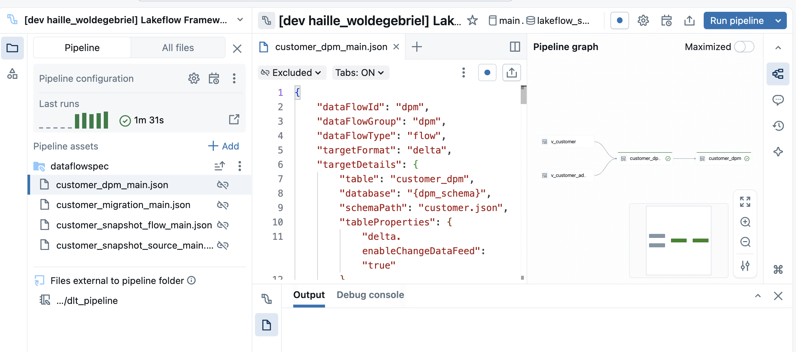

UI Integration
=============================

.. list-table::
   :header-rows: 0

   * - **Applies To:**
     - :bdg-success:`Pipeline Bundle`
   * - **Configuration Scope:**
     - :bdg-success:`VS Code Settings`
   * - **Databricks Docs:**
     - NA

Overview
--------
The framework integrates with the Databricks Pipeline Editor UI to provide a seamless experience when creating or editing Data Flow specifications. This allows for live validation and editing of a Data Flow spec while having the ability to debug natively in the Pipeline Editor.

Configuration to enable Pipeline Editor UI Integration
--------------------------------------
To enable UI Integration, you need to add a root_path configuration to your Pipeline resource file that points to the root directory of the Data Flow specifications for that pipeline as shown below.

.. code-block:: yaml

    resources:
        pipelines:
            lakeflow_samples_bronze_base_pipeline:
            name: Lakeflow Framework - Bronze - Base Pipeline (${var.logical_env})
            channel: CURRENT
            serverless: true
            catalog: ${var.catalog}
            schema: ${var.schema}
            libraries:
                - notebook:
                    path: ${var.framework_source_path}/dlt_pipeline

            configuration:
                bundle.sourcePath: ${workspace.file_path}/src
                bundle.target: ${bundle.target}
                framework.sourcePath: ${var.framework_source_path}
                workspace.host: ${var.workspace_host}
                pipeline.layer: ${var.layer}
                logicalEnv: ${var.logical_env}
                pipeline.dataFlowGroupFilter: base_samples
            **root_path**: ${workspace.file_path}/src/dataflows/base_samples/dataflowspec

Below is an example of the Pipeline Editor UI integration.

