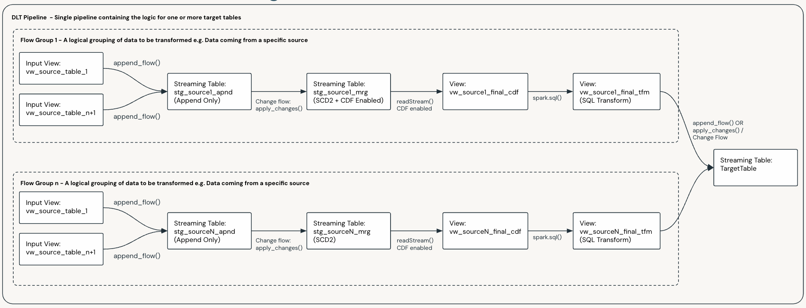
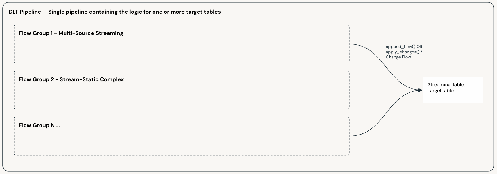
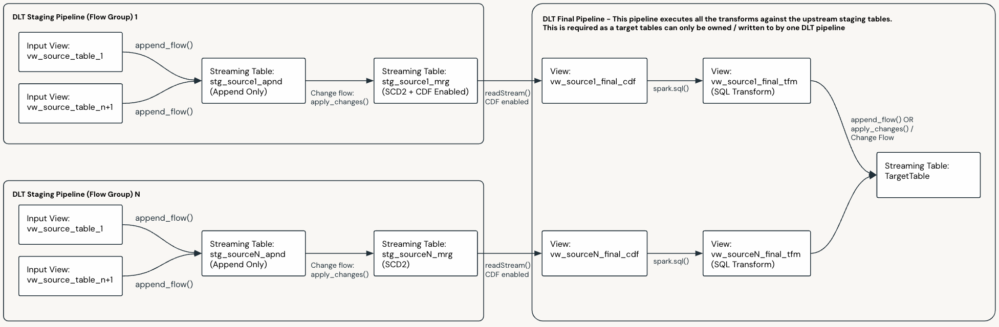

Data Flow and Pipeline Patterns
###############################

.. _patterns_overview:

Patterns Overview 
=================

Below we summarize the core patterns that can be used to design and build out your data flows and pipelines.

.. important::

    The documentation for each pattern is accompanied with a data flow example. Please note that:

    * The examples are designed to relay the key differences between the various patterns
    * The examples demonstrate the changes to the target tables in Append Only, SCD1 and SCD2 scenarios.
    * The customer address master table only has a few basic columns so that we can keep the example simple.

.. list-table::
   :widths: 30 70
   :header-rows: 1

   * - Pattern
     - Description
   * - :doc:`patterns_streaming_basic_1_1`
     - **Suitable for:**
       
       Ingestion and basic 1:1 loads.

       |
       **Usage Scenario:**

       * You are ingesting data or performing one-to-one loads.
       * You only need to perform basic single row transforms.
       
       **Layers:**
       
       * Generally Bronze
   * - :doc:`patterns_streaming_multi_source_streaming`
     - **Suitable for:**
       
       Multi-source streaming and basic transformations.
       
       |
       **Usage Scenario:**

       * You need to stream multiple tables in a single target table via a basic transform.
       * The source tables share common business keys.
       * You only need to perform basic single row transforms (e.g. enrichment).
       
       **Layers:**
       
       * Generally Silver
       
       **Models:**
       
       * 3NF such as ODS, Inmon and Enterprise Models
       * Data Vault
       
       **Considerations & Limitations:**
       
       * All source tables must share the same business keys. The column names do not need to be the same in the sources, but the keys must be conceptually the same.
       * In SCD 2 scenarios, a new version of a row will be generated any time data changes in any of the source streams. This will be particularly noticeable when you have late arriving records across streams and will lead to more row versions than normally expected.
   * - :doc:`patterns_streaming_stream_static_basic`
     - **Suitable for:**
       
       When you have a streaming table that you need to join to one or many additional static tables to derive your desired target data set.
       
       |
       **Usage Scenario:**

       * You have a single streaming table driving the data flow and want to join to one or more other tables.
       * You only need to reflect changes when the driving streaming table updates.
       * The source tables do not share common business keys.
       * You only need to perform basic single row transforms.
       
       **Layers:**
       
       * Generally Silver
       * Gold (no complex transforms or aggregations)
       
       **Models:**
       
       * 3NF such as ODS, Inmon and Enterprise Models
       * Data Vault
       * Dimensional: dimensions and basic transactional facts
       
       **Considerations & Limitations:**
       
       * Updates in joined tables will not be reflected until a row with matching keys comes through on the driving streaming table.
   * - :doc:`patterns_streaming_stream_static_streaming_dwh`
     - **Suitable for:**
       
       When you have a streaming table that you need to join to one or many additional static tables in order to derive your desired target data set, but you also want updates to the static tables to be reflected as they occur.
       
       |
       **Usage Scenario:**

       * You want to join multiple streaming tables.
       * You want changes in any/all tables to be updated as they occur.
       * You only need to perform basic single row transforms.
       
       **Layers:**
       
       * Generally Silver
       * Gold (no complex transforms or aggregations)
       
       **Models:**
       
       * 3NF such as ODS, Inmon and Enterprise Models
       * Data Vault
       * Dimensional: dimensions and basic transactional facts
       
       **Considerations & Limitations:**
       
       * More complex to implement than the Stream-Static Basic pattern but allows for true streaming joins.
   * - :doc:`patterns_streaming_cdc_stream_from_snapshot`
     - **Suitable for:**
       
       Constructing a CDC stream from a snapshot source to be used in multi-source streaming or stream-static patterns.
       
       |
       **Usage Scenario:**

       * You need to stream multiple sources into a single target table but one or more of the sources are snapshot based.
       * You want to stream only the changes from a snapshot source.
       

Patterns Documentation
======================

.. toctree::
   :maxdepth: 1

   Pattern - Basic 1:1 <patterns_streaming_basic_1_1>
   Pattern - Multi-Source Streaming <patterns_streaming_multi_source_streaming>
   Pattern - Stream-Static - Basic <patterns_streaming_stream_static_basic>
   Pattern - Stream-Static - Streaming Data Warehouse <patterns_streaming_stream_static_streaming_dwh>
   Pattern - CDC Stream from Snapshots <patterns_streaming_cdc_stream_from_snapshot>
.. _patterns_mix_and_match:

Multi-Source Streaming and Flow Groups
======================================

The :doc:`Multi-Source Streaming <feature_multi_source_streaming>` feature allows you to stream multiple flows into a single target.

Per the :doc:`concepts` section of this documentation, Flow Groups are used to logically group flows. This is useful when you have multiple complex sources and makes data flow development and maintenance more manageable.

You can design your pipelines with multiple flow groups, e.g if you have tables from 50 source systems streaming into one target table via a series of different transformations, you would likely design your data flow to have 50 Flow Groups, one for each source.

The diagram below shows a data flow with two flow groups, each with their own flows, and each populating the same target table:

.. important::

  This applies to all data flows and patterns that use Flow Groups.

.. important::

   Per the :doc:`concepts` section of this documentation, Flow Groups and Flows can be added and removed from a data flow as your requirements and systems evolve. This will not break the existing pipeline and will not require a full refresh of the Pipeline.

Mix and Match
=============

You can have one or more data flows in a single pipeline, and each of these can be based on a different pattern. 

You can also mix and match patterns in a single data flow, where you have multiple :ref:`Flow Groups <concepts_flows_data_flow>` populating the same target table; as shown below:

.. _patterns_scaling_pipelines:

Scaling and Pipeline Scope 
==========================

When designing your data flows and pipelines, you will need to decide how you will scale and scope your data flows and pipelines to support your business requirements. 

There is no hard and fast rule in determining how to divide up your pipelines, what you choose will depend on your specific requirements and constraints. The following factors will influence your choice:

* Your organizational structure.
* Your operational practices and your CI/CD processes.
* The size and complexity of your data e.g. the number of sources, transformations, targets and volumes.
* Your latency requirements and your SLA's.
* and many more ...

Ultimately you will need to determine the best way to divide up your pipelines to support your business requirements.

.. important::

   Per the :doc:`concepts` section of this documentation:
   
   * A data flow, and its Data Flow Spec, defines the source(s) and logic required to generate a **single target table**.
   * A Pipeline Bundle can contain multiple Data Flow Specs, and a Pipeline deployed by the bundle may execute the logic for one or more Data Flow Specs.
   
   For the above reasons **the smallest possible division for a Pipeline is a single data flow and hence a single target table**.

.. warning::

   Be aware of the current Pipeline and concurrency limits for DLT. These are subject to change and you can check the latest limits at:

   * https://docs.databricks.com/en/resources/limits.html
   * https://docs.databricks.com/en/delta-live-tables/limitations.html

Pipeline Scope
---------------

The most common strategy is to logically group your target tables as a starting point and then determine your pipeline scope from there. 
Some of the most common groupings are shown below:

.. list-table::
   :widths: 30 70
   :header-rows: 1

   * - Logical Grouping
     - Description
   * - Use Case
     - You may choose to have an end to end pipeline for given Use Cases
   * - Bronze
     - * Source System - A Pipeline per Source System or application
   * - Silver / Enterprise Models
     - * Subject Area / Sub-Domain - A Pipeline per Subject Area, or Sub-Domain
       * Use Case - A Pipeline per Use Case
       * Target Table - A Pipeline per target table, the most granular level for complex data flows
   * - Gold / Dimensional Models
     - * Data Mart - A Pipeline per Data Mart
       * Common Dimensions - A Pipeline for your Common Dimensions
       * Target Table - A Pipeline for complex Facts or target tables.

Once you have determined the best way to divide up your pipelines, you can then determine the best way to implement them, which will fall into one of the following categories:

Decomposing Pipelines
---------------------

You can break a pipeline down into smaller, more manageable pipelines where natural boundaries exist.

In the below example, we start with a pipeline that has two Flow Groups flowing into a target table, via some staging tables:

Below is the same pipeline decomposed into three pipelines:

* Each Flow Group has been broken out into a separate pipeline, the target table of which is the final staging table.
* There is a final pipeline that merges the up stream staging tables into the final target table.

