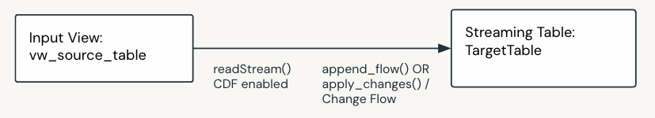

Pattern - Basic 1:1
====================

Description
------------
Suitable for ingestion and basic 1:1 loads.
Use when:

- You are ingesting data or performing one-to-one loads.
- You only need to perform basic single row transforms.

**Layers:** Generally Bronze

**Data Flow Components:**

.. list-table::
   :header-rows: 1

   * - No.
     - Component
     - Description
     - M / O
   * - 1
     - Input View
     - Input view created over the streaming source table. This view can optionally read from CDF if the source table is CDF enabled.
     - M
   * - 2
     - Flow
     - Append or Change flow to streaing target table.
     - M
   * - 3
     - Target Table
     - A streaming table, the schema of which is specified in the dataflowspec.
     - M

Feature Support
----------------

.. list-table::
   :header-rows: 1

   * - Supported
     - Not Supported
   * - * Append Only & SCD 1/2
       * Basic transforms such as:

         * Data type conversion
         * Concatenation
         * Single row calculations
         * Formatting

       * Cleansing & Data Quality Rules
     - * Complex transforms
       * Joins
       * Multiple streaming sources
       * Window By

Sample
------
- Bundle: ``dlt_framework/src/samples/bronze_sample``

Example Data Flow
------------------

Day 1 Load
~~~~~~~~~~

* **Source Table (Append-Only)**

  CUSTOMER

  .. list-table::
     :header-rows: 1

     * - customer_id
       - first_name
       - last_name
       - email
       - load_timestamp
     * - 1
       - John
       - Doe
       - john.doe@example.com
       - 2023-01-01 10:00
     * - 2
       - Jane
       - Smith
       - jane.smith@example.com
       - 2023-01-01 10:00

* **Target Table**

  **Append-Only Scenario**

  .. list-table::
     :header-rows: 1

     * - customer_id
       - first_name
       - last_name
       - email
       - load_timestamp
     * - 1
       - John
       - Doe
       - john.doe@example.com
       - 2023-01-01 10:00
     * - 2
       - Jane
       - Smith
       - jane.smith@example.com
       - 2023-01-01 10:00

  **SCD1 Scenario**

  .. list-table::
     :header-rows: 1

     * - customer_id
       - first_name
       - last_name
       - email
       - load_timestamp
     * - 1
       - John
       - Doe
       - john.doe@example.com
       - 2023-01-01 10:00
     * - 2
       - Jane
       - Smith
       - jane.smith@example.com
       - 2023-01-01 10:00

  **SCD2 Scenario**

  .. list-table::
     :header-rows: 1

     * - customer_id
       - first_name
       - last_name
       - email
       - _START_AT
       - _END_AT
     * - 1
       - John
       - Doe
       - john.doe@example.com
       - 2023-01-01 10:00
       - NULL
     * - 2
       - Jane
       - Smith
       - jane.smith@example.com
       - 2023-01-01 10:00
       - NULL

Day 2 Load
~~~~~~~~~~

* **Source Table (Append-Only)**

  CUSTOMER

  .. raw:: html

      <table class="docutils align-default"> <tr> <th>customer_id</th> <th>first_name</th> <th>last_name</th> <th>email</th> <th>load_timestamp</th> </tr>
      <tr> <td>1</td> <td>John</td> <td>Doe</td> <td>john.doe@example.com</td> <td>2023-01-01 10:00</td> </tr>
      <tr> <td>2</td> <td>Jane</td> <td>Smith</td> <td>jane.smith@example.com</td> <td>2023-01-01 10:00</td> </tr>
      <tr class="highlight-row"> <td>1</td> <td>John</td> <td>Doe</td> <td>jdoe@example.com</td> <td>2023-01-02 10:00</td> </tr>
      <tr class="highlight-row"> <td>3</td> <td>Alice</td> <td>Green</td> <td>alice.green@example.com</td> <td>2023-01-02 10:00</td> </tr>
      <tr class="highlight-row"> <td>4</td> <td>Joe</td> <td>Bloggs</td> <td>joe.bloggs@example.com</td> <td>2023-01-02 10:00</td> </tr>
      </table>

* **Target Table**

  **Append-Only Scenario**

  .. raw:: html

    <table class="docutils align-default"> <tr> <th>customer_id</th> <th>first_name</th> <th>last_name</th> <th>email</th> <th>load_timestamp</th> </tr>
    <tr> <td>1</td> <td>John</td> <td>Doe</td> <td>john.doe@example.com</td> <td>2023-01-01 10:00</td> </tr>
    <tr> <td>2</td> <td>Jane</td> <td>Smith</td> <td>jane.smith@example.com</td> <td>2023-01-01 10:00</td> </tr>
    <tr class="highlight-row"> <td>1</td> <td>John</td> <td>Doe</td> <td>jdoe@example.com</td> <td>2023-01-02 10:00</td> </tr>
    <tr class="highlight-row"> <td>3</td> <td>Alice</td> <td>Green</td> <td>alice.green@example.com</td> <td>2023-01-02 10:00</td> </tr>
    <tr class="highlight-row"> <td>4</td> <td>Joe</td> <td>Bloggs</td> <td>joe.bloggs@example.com</td> <td>2023-01-02 10:00</td> </tr>
    </table>

  **SCD1 Scenario**

  .. raw:: html

    <table class="docutils align-default"> <tr> <th>customer_id</th> <th>first_name</th> <th>last_name</th> <th>email</th> <th>load_timestamp</th> </tr>
    <tr> <td>1</td> <td>John</td> <td>Doe</td> <td class="highlight-cell">jdoe@example.com</td> <td>2023-01-01 10:00</td> </tr>
    <tr> <td>2</td> <td>Jane</td> <td>Smith</td> <td>jane.smith@example.com</td> <td>2023-01-01 10:00</td> </tr>
    <tr class="highlight-row"> <td>3</td> <td>Alice</td> <td>Green</td> <td>alice.green@example.com</td> <td>2023-01-02 10:00</td> </tr>
    <tr class="highlight-row"> <td>4</td> <td>Joe</td> <td>Bloggs</td> <td>joe.bloggs@example.com</td> <td>2023-01-02 10:00</td> </tr>
    </table>

  **SCD2 Scenario**

  .. raw:: html

    <table class="docutils align-default"> <tr> <th>customer_id</th> <th>first_name</th> <th>last_name</th> <th>email</th> <th>_START_AT</th> <th>_END_AT</th> </tr>
    <tr class="highlight-row"> <td>1</td> <td>John</td> <td>Doe</td> <td>jdoe@example.com</td> <td>2023-01-02 10:00</td> <td>NULL</td> </tr>
    <tr> <td>1</td> <td>John</td> <td>Doe</td> <td>john.doe@example.com</td> <td>2023-01-01 10:00</td> <td class="highlight-cell">2023-01-02 10:00</td> </tr>
    <tr> <td>2</td> <td>Jane</td> <td>Smith</td> <td>jane.smith@example.com</td> <td>2023-01-01 10:00</td> <td>2023-01-02 10:00</td> </tr>
    <tr class="highlight-row">> <td>3</td> <td>Alice</td> <td>Green</td> <td>alice.green@example.com</td> <td>2023-01-01 10:00</td> <td>NULL</td> </tr>
    <tr class="highlight-row"> <td>4</td> <td>Joe</td> <td>Bloggs</td> <td>joe.bloggs@example.com</td> <td>2023-01-01 10:00</td> <td>NULL</td> </tr>
    </table> 