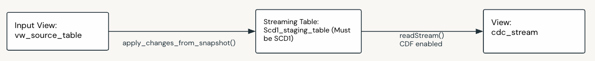

Construct CDC Stream from Snapshot Source
==========================================

Description
------------
Suitable for multi-source streaming and stream-static patterns where one or more sources are snapshot based.

Use when:

- You have more than one snapshot sources and want to combine and stream changes to a target table.
- You have a combination of snapshot and cdc sources and want to combine and stream changes to a target table.

.. note::
   - This pattern is not intended to be used in isolation. It is intended to convert snapshot sources into a CDC stream that can be used as part of a multi-source streaming or stream-static patterns.
  
**Layers:** 

- Bronze (Construct CDC stream)
- Silver (Use CDC stream)

Data Flow Components:
---------------------

.. list-table::
   :header-rows: 1
   :widths: 5 20 55 20

   * - No.
     - Component
     - Description
     - M / O
   * - 1
     - Input View
     - Input view created over the snapshot source. In incremental mode this is a physical SDP view created over the source that can look different at any given time representing the latest state of the source. In historical mode, this is a logical component as instead it'd be configured to automatically get the next snapshot as the source.
     - M
   * - 2
     - Change Flow
     - An SCD1 Change Flow that streams changes from the snapshot source to a staging table. This needs to be an SCD1 to allow for physical deletes in the snapshot source to be propagated to the CDF as a delete operation, SCD2 does not support this.
     - M
   * - 3
     - Staging Table
     - A staging table with CDF enabled.
     - M
   * - 4
     - View
     - A view over the staging table that reads a stream from the staging table's CDF. This will be the CDC stream of the snapshot source. This view can now be an input view in any of the :doc:`Multi-Source Streaming <patterns_streaming_multi_source_streaming>` patterns below.
     - M

\* M / O: Mandatory or Optional.

Feature Support
---------------

.. list-table::
   :header-rows: 1
   :widths: 50 50

   * - Supported
     - Not Supported
   * - - Incremental and historical snapshot modes
       - Physical deletes in source propagated as CDF deletes
       - Basic transforms such as:
         - Data type conversion
         - Column selection and renaming
         - Single row calculations
         - Data quality rules
     - - Complex transformations
       - Window functions
       - Aggregations
       - SCD2 staging tables

Considerations and Limitations
---------------------------

.. important::
   - In historical mode, if there are multiple snapshots processed in the first run, reading stream from the CDF of the staging table will only return the lastest snapshot's records as inserts. To get all the changes from all historical snapshots, set startingVersionFromDLTSetup to true when reading the CDF of the staging table, see :doc:`dataflow_spec_ref_source_details`.

Samples
-------
Construct CDC stream from snapshot source in bronze:

- Bundle: ``samples/bronze_sample``
- Sample: ``samples/bronze_sample/src/dataflows/feature_samples/dataflowspec/historical_snapshot_datetime_scd1_main.json``

Use CDC stream as input view in silver:

- Bundle: ``samples/silver_sample``
- Sample: ``samples/silver_sample/src/dataflows/feature_samples/dataflowspec/customer_snapshot_source_main.json``

Example Data Flow
---------------

The sample demonstrates converting a snapshot source into a CDC stream:

1. Source snapshot table "customer" is configured with incremental mode
2. CDC from Snapshot (Change Flow) detects changes between snapshots
3. Changes are written to staging table in SCD1 mode with CDF enabled
4. Final view reads CDF stream from staging table
5. CDC stream can now be used as input to other streaming patterns

Day 1 Load
~~~~~~~~~~

* **Source Table (Snapshot)**

  CUSTOMER

  .. raw:: html

      <table class="docutils align-default"> <tr> <th>customer_id</th> <th>first_name</th> <th>last_name</th> <th>email</th> <th>updated_timestamp</th> </tr>
      <tr> <td>1</td> <td>John</td> <td>Doe</td> <td>john.doe@example.com</td> <td>2023-01-01 10:00</td> </tr>
      <tr> <td>2</td> <td>Jane</td> <td>Smith</td> <td>jane.smith@example.com</td> <td>2023-01-01 10:00</td> </tr>
      </table>

* **Staging Table (SCD1)**

  CUSTOMER Staging Table

  .. raw:: html

    <table class="docutils align-default"> <tr> <th>customer_id</th> <th>first_name</th> <th>last_name</th> <th>email</th> <th>updated_timestamp</th> </tr>
    <tr> <td>1</td> <td>John</td> <td>Doe</td> <td>john.doe@example.com</td> <td>2023-01-01 10:00</td> </tr>
    <tr> <td>2</td> <td>Jane</td> <td>Smith</td> <td>jane.smith@example.com</td> <td>2023-01-01 10:00</td> </tr>
    </table>

  CDF of CUSTOMER Staging Table

  .. raw:: html

    <table class="docutils align-default"> <tr> <th>customer_id</th> <th>first_name</th> <th>last_name</th> <th>email</th> <th>updated_timestamp</th> <th>_change_type</th> <th>_commit_version</th> <th>_commit_timestamp</th> </tr>
    <tr> <td>1</td> <td>John</td> <td>Doe</td> <td>john.doe@example.com</td> <td>2023-01-01 10:00</td> <td>insert</td> <td>1</td> <td>2023-01-01 18:00</td> </tr>
    <tr> <td>2</td> <td>Jane</td> <td>Smith</td> <td>jane.smith@example.com</td> <td>2023-01-01 10:00</td> <td>insert</td> <td>1</td> <td>2023-01-01 18:00</td> </tr>
    </table>

Day 2 Load
~~~~~~~~~~

* **Source Table (Snapshot)**

  CUSTOMER

  .. raw:: html

      <table class="docutils align-default"> <tr> <th>customer_id</th> <th>first_name</th> <th>last_name</th> <th>email</th> <th>updated_timestamp</th> </tr>
      <tr> <td>1</td> <td>John</td> <td>Doe</td> <td class="highlight-cell">jdoe@example.com</td> <td class="highlight-cell">2023-01-02 10:00</td> </tr>
      <tr class="highlight-row"> <td>3</td> <td>Alice</td> <td>Green</td> <td>alice.green@example.com</td> <td>2023-01-02 10:00</td> </tr>
      <tr class="highlight-row"> <td>4</td> <td>Joe</td> <td>Bloggs</td> <td>joe.bloggs@example.com</td> <td>2023-01-02 10:00</td> </tr>
      </table>

* **Staging Table (SCD1)**

  CUSTOMER Staging Table

  .. raw:: html

    <table class="docutils align-default"> <tr> <th>customer_id</th> <th>first_name</th> <th>last_name</th> <th>email</th> <th>updated_timestamp</th> </tr>
    <tr> <td>1</td> <td>John</td> <td>Doe</td> <td class="highlight-cell">jdoe@example.com</td> <td class="highlight-cell">2023-01-02 10:00</td> </tr>
    <tr class="highlight-row"> <td>3</td> <td>Alice</td> <td>Green</td> <td>alice.green@example.com</td> <td>2023-01-02 10:00</td> </tr>
    <tr class="highlight-row"> <td>4</td> <td>Joe</td> <td>Bloggs</td> <td>joe.bloggs@example.com</td> <td>2023-01-02 10:00</td> </tr>
    </table>

  
  CDF of CUSTOMER Staging Table

  .. raw:: html

    <table class="docutils align-default"> <tr> <th>customer_id</th> <th>first_name</th> <th>last_name</th> <th>email</th> <th>updated_timestamp</th> <th>_change_type</th> <th>_commit_version</th> <th>_commit_timestamp</th> </tr>
    <tr> <td>1</td> <td>John</td> <td>Doe</td> <td>john.doe@example.com</td> <td>2023-01-01 10:00</td> <td>insert</td> <td>1</td> <td>2023-01-01 18:00</td> </tr>
    <tr> <td>2</td> <td>Jane</td> <td>Smith</td> <td>jane.smith@example.com</td> <td>2023-01-01 10:00</td> <td>insert</td> <td>1</td> <td>2023-01-01 18:00</td> </tr>
    <tr class="highlight-row"> <td>1</td> <td>John</td> <td>Doe</td> <td>jdoe@example.com</td> <td>2023-01-02 10:00</td> <td>update</td> <td>2</td> <td>2023-01-02 18:00</td> </tr>
    <tr class="highlight-row"> <td>2</td> <td>Jane</td> <td>Smith</td> <td>jane.smith@example.com</td> <td>2023-01-02 10:00</td> <td>delete</td> <td>2</td> <td>2023-01-02 18:00</td> </tr>
    <tr class="highlight-row"> <td>3</td> <td>Alice</td> <td>Green</td> <td>alice.green@example.com</td> <td>2023-01-02 10:00</td> <td>insert</td> <td>2</td> <td>2023-01-02 18:00</td> </tr>
    <tr class="highlight-row"> <td>4</td> <td>Joe</td> <td>Bloggs</td> <td>joe.bloggs@example.com</td> <td>2023-01-02 10:00</td> <td>insert</td> <td>2</td> <td>2023-01-02 18:00</td> </tr>
    </table>

Day 3 Load
~~~~~~~~~~

* **Source Table (Snapshot)**

  CUSTOMER

  .. raw:: html

      <table class="docutils align-default"> <tr> <th>customer_id</th> <th>first_name</th> <th>last_name</th> <th>email</th> <th>updated_timestamp</th> </tr>
      <tr> <td>1</td> <td>John</td> <td>Doe</td> <td>jdoe@example.com</td> <td>2023-01-02 10:00</td> </tr>
      <tr> <td>4</td> <td>Joe</td> <td>Bloggs</td> <td>joe.bloggs@example.com</td> <td>2023-01-03 10:00</td> </tr>
      </table>

* **Staging Table (SCD1)**

  CUSTOMER Staging Table

  .. raw:: html

    <table class="docutils align-default"> <tr> <th>customer_id</th> <th>first_name</th> <th>last_name</th> <th>email</th> <th>updated_timestamp</th> </tr>
    <tr> <td>1</td> <td>John</td> <td>Doe</td> <td>jdoe@example.com</td> <td>2023-01-02 10:00</td> </tr>
    <tr> <td>4</td> <td>Joe</td> <td>Bloggs</td> <td>joe.bloggs@example.com</td> <td>2023-01-03 10:00</td> </tr>
    </table>

  
  CDF of CUSTOMER Staging Table

  .. raw:: html

    <table class="docutils align-default"> <tr> <th>customer_id</th> <th>first_name</th> <th>last_name</th> <th>email</th> <th>updated_timestamp</th> <th>_change_type</th> <th>_commit_version</th> <th>_commit_timestamp</th> </tr>
    <tr> <td>1</td> <td>John</td> <td>Doe</td> <td>john.doe@example.com</td> <td>2023-01-01 10:00</td> <td>insert</td> <td>1</td> <td>2023-01-01 18:00</td> </tr>
    <tr> <td>2</td> <td>Jane</td> <td>Smith</td> <td>jane.smith@example.com</td> <td>2023-01-01 10:00</td> <td>insert</td> <td>1</td> <td>2023-01-01 18:00</td> </tr>
    <tr> <td>1</td> <td>John</td> <td>Doe</td> <td>jdoe@example.com</td> <td>2023-01-02 10:00</td> <td>update</td> <td>2</td> <td>2023-01-02 18:00</td> </tr>
    <tr> <td>2</td> <td>Jane</td> <td>Smith</td> <td>jane.smith@example.com</td> <td>2023-01-02 10:00</td> <td>delete</td> <td>2</td> <td>2023-01-02 18:00</td> </tr>
    <tr> <td>3</td> <td>Alice</td> <td>Green</td> <td>alice.green@example.com</td> <td>2023-01-02 10:00</td> <td>insert</td> <td>2</td> <td>2023-01-02 18:00</td> </tr>
    <tr> <td>4</td> <td>Joe</td> <td>Bloggs</td> <td>joe.bloggs@example.com</td> <td>2023-01-02 10:00</td> <td>insert</td> <td>2</td> <td>2023-01-02 18:00</td> </tr>
    <tr class="highlight-row"> <td>3</td> <td>Alice</td> <td>Green</td> <td>alice.green@example.com</td> <td>2023-01-03 10:00</td> <td>delete</td> <td>3</td> <td>2023-01-03 18:00</td> </tr>
    </table>

