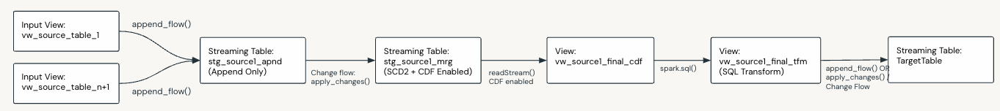

Multi-Source Streaming
=======================

Description
------------
Suitable for multi-source streaming with basic transformations.
Use when:

- You need to stream multiple tables in a single target table via a basic transform.
- The source tables share common business keys.
- You only need to perform basic single row transforms.

**Layers:** Generally Silver

**Models:**

- 3NF such as ODS, Inmon and Enterprise Models
- Data Vault

**Data Flow Components:**

.. list-table::
   :header-rows: 1
   :widths: 5 15 60 20

   * - No.
     - Component
     - Description
     - M / O
   * - 1
     - Input Views
     - Input views are created over each streaming source table (as many as required). All source tables must share a common set of PK's and must contain a sequence by column of the same data type. These views can optionally read from CDF if the source tables are CDF enabled.
     - M
   * - 2
     - Append Flows
     - Append flows load the rows from each streaming source table into a staging table.
     - M
   * - 3
     - Staging Append Only Table
     - A streaming append only table, the schema of which consists of the common primary keys, sequence by and the data columns returned by each input view.
     - M
   * - 4
     - Change Flow
     - A single change flow loads the data into the staging merge table. It essentially merges and dedupes all the rows on the common PK's.
     - M
   * - 5
     - Staging Merge Table
     - A streaming table, the schema of which consists of the common primary keys, sequence by and the data columns returned by each input view. CDF is enabled on this table.
     - M
   * - 6
     - Final CDF View
     - A view over the staging merge table that reads a stream from the merge tables change data feed.
     - M
   * - 7
     - Final Transform View
     - A view that applies a SQL transform (SELECT or CTE) to the data returned by the Final CDF View. This is optional and not required if no transformation needs to be applied. If you don't have a transform requirement you can omit the transform view. You may for example only need to specify which columns you want or perform a basic column renaming, which you can do in the Final CDF View (component 6).
     - O
   * - 8
     - Append or Change Flow
     - An Append Flow (for transactional or fact based target tables) or an SCD1/2 Change Flow that loads the data into the final target table.
     - M
   * - 9
     - Target Table
     - A streaming table, the schema of which is specified in the dataflowspec. This table is the final target table for the given flow.
     - M

\* M / O: Mandatory or Optional.

Feature Support
---------------

.. list-table::
   :header-rows: 1
   :widths: 50 50

   * - Supported
     - Not Supported
   * - * Append Only & SCD 1/2
       * Basic transforms such as:

         * Data type conversion
         * Concatenation
         * Single row calculations
         * Formatting

       * Cleansing & Data Quality Rules
       * Conditionals and calculations (single row) across multiple source tables
     - * Complex transforms such as aggregations
       * Joins
       * Window By

Considerations and Limitations
------------------------------

.. important::

   - All source tables must share the same business keys. The column names do not need to be the same in the sources, but the keys must be conceptually the same.
   - In SCD 2 scenarios, a new version of a row will be generated any time data changes in any of the source streams. This will be particularly noticeable when you have late arriving records across streams and will lead to more row versions than normally expected.

Sample
------
- Bundle: ``dlt_framework/src/samples/silver_sample``
- Sample: ``dlt_framework/src/samples/silver_sample/src/dataflows/customer_p4``

Example Data Flow
------------------

.. note::

   In the below example data flow, customer ID 4 demonstrates the behaviour for late arriving records in streaming sources. This ultimately means you will potentially have more versions for a row in SCD2 scenarios. This needs to be weighed against your requirements and will either be acceptable or not. If this is not acceptable, please refer to the stream-static patterns below.

Day 1 Load
~~~~~~~~~~

* **Source Tables (Append-Only)**

  CUSTOMER

  .. list-table::
     :header-rows: 1
     :widths: 15 15 15 25 30

     * - customer_id
       - first_name
       - last_name
       - email
       - load_timestamp
     * - 1
       - John
       - Doe
       - john.doe@example.com
       - 2023-01-01 10:00
     * - 2
       - Jane
       - Smith
       - jane.smith@example.com
       - 2023-01-01 10:00

  CUSTOMER_ADDRESS

  .. list-table::
     :header-rows: 1
     :widths: 15 15 15 30

     * - customer_id
       - city
       - state
       - load_timestamp
     * - 1
       - Melbourne
       - VIC
       - 2023-01-01 10:00
     * - 2
       - Melbourne
       - VIC
       - 2023-01-01 10:00
     * - 4
       - Hobart
       - TAS
       - 2023-01-01 10:00

* **Staging Table (stg_source_1_appnd)**

.. list-table::
   :header-rows: 1
   :widths: 15 15 15 25 15 15 30

   * - customer_id
     - first_name
     - last_name
     - email
     - city
     - state
     - load_timestamp
   * - 1
     - John
     - Doe
     - john.doe@example.com
     - NULL
     - NULL
     - 2023-01-01 10:00
   * - 2
     - Jane
     - Smith
     - jane.smith@example.com
     - NULL
     - NULL
     - 2023-01-01 10:00
   * - 1
     - NULL
     - NULL
     - NULL
     - Melbourne
     - VIC
     - 2023-01-01 10:00
   * - 2
     - NULL
     - NULL
     - NULL
     - Melbourne
     - VIC
     - 2023-01-01 10:00
   * - 4
     - NULL
     - NULL
     - NULL
     - Hobart
     - TAS
     - 2023-01-01 10:00

* **Staging Table (stg_source_1_mrg)**

.. list-table::
   :header-rows: 1
   :widths: 15 15 15 25 15 15 25 25

   * - customer_id
     - first_name
     - last_name
     - email
     - city
     - state
     - _START_AT
     - _END_AT
   * - 1
     - John
     - Doe
     - john.doe@example.com
     - Melbourne
     - VIC
     - 2023-01-01 10:00
     - NULL
   * - 2
     - Jane
     - Smith
     - jane.smith@example.com
     - Melbourne
     - VIC
     - 2023-01-01 10:00
     - NULL
   * - 4
     - NULL
     - NULL
     - NULL
     - Hobart
     - TAS
     - 2023-01-01 10:00
     - NULL

* Target Table

  * **Append-Only Scenario**

  .. list-table::
     :header-rows: 1
     :widths: 15 15 15 15 25 15 15 30

     * - customer_id
       - first_name
       - last_name
       - full_name
       - email
       - city
       - state
       - load_timestamp
     * - 1
       - John
       - Doe
       - John Doe
       - john.doe@example.com
       - Melbourne
       - VIC
       - 2023-01-01 10:00
     * - 2
       - Jane
       - Smith
       - Jane Smith
       - jane.smith@example.com
       - Melbourne
       - VIC
       - 2023-01-01 10:00
     * - 4
       - NULL
       - NULL
       - NULL
       - NULL
       - Hobart
       - TAS
       - 2023-01-01 10:00

  * SCD1 Scenario

  .. list-table::
     :header-rows: 1
     :widths: 15 15 15 15 25 15 15

     * - customer_id
       - first_name
       - last_name
       - full_name
       - email
       - city
       - state
     * - 1
       - John
       - Doe
       - John Doe
       - john.doe@example.com
       - Melbourne
       - VIC
     * - 2
       - Jane
       - Smith
       - Jane Smith
       - jane.smith@example.com
       - Melbourne
       - VIC
     * - 4
       - NULL
       - NULL
       - NULL
       - NULL
       - Hobart
       - TAS

  * SCD2 Scenario

  .. list-table::
     :header-rows: 1
     :widths: 15 15 15 15 25 15 15 25 25

     * - customer_id
       - first_name
       - last_name
       - full_name
       - email
       - city
       - state
       - _START_AT
       - _END_AT
     * - 1
       - John
       - Doe
       - John Doe
       - john.doe@example.com
       - Melbourne
       - VIC
       - 2023-01-01 10:00
       - NULL
     * - 2
       - Jane
       - Smith
       - Jane Smith
       - jane.smith@example.com
       - Melbourne
       - VIC
       - 2023-01-01 10:00
       - NULL
     * - 4
       - NULL
       - NULL
       - NULL
       - NULL
       - Hobart
       - TAS
       - 2023-01-01 10:00
       - NULL

Day 2 Load
~~~~~~~~~~

* **Source Tables (Append-Only)**
    
    CUSTOMER

    .. raw:: html

        

        <table class="docutils align-default"> <tr> <th>customer_id</th> <th>first_name</th> <th>last_name</th> <th>email</th> <th>load_timestamp</th> </tr>
        <tr> <td>1</td> <td>John</td> <td>Doe</td> <td>john.doe@example.com</td> <td>2023-01-01 10:00</td> </tr>
        <tr> <td>2</td> <td>Jane</td> <td>Smith</td> <td>jane.smith@example.com</td> <td>2023-01-01 10:00</td> </tr>
        <tr class="highlight-row"> <td>1</td> <td>John</td> <td>Doe</td> <td>jdoe@example.com</td> <td>2023-01-02 10:00</td> </tr>
        <tr class="highlight-row"> <td>3</td> <td>Alice</td> <td>Green</td> <td>alice.green@example.com</td> <td>2023-01-02 10:00</td> </tr>
        <tr class="highlight-row"> <td>4</td> <td>Joe</td> <td>Bloggs</td> <td>joe.bloggs@example.com</td> <td>2023-01-02 10:00</td> </tr>
        </table>
    
    CUSTOMER_ADDRESS

    .. raw:: html

        <table class="docutils align-default"> <tr> <th>customer_id</th> <th>city</th> <th>state</th> <th>load_timestamp</th> </tr>
        <tr> <td>1</td> <td>Melbourne</td> <td>VIC</td> <td>2023-01-01 10:00</td> </tr>
        <tr> <td>2</td> <td>Melbourne</td> <td>VIC</td> <td>2023-01-01 10:00</td> </tr>
        <tr> <td>4</td> <td>Hobart</td> <td>TAS</td> <td>2023-01-01 10:00</td> </tr>
        <tr class="highlight-row"> <td>2</td> <td>Perth</td> <td>WA</td> <td>2023-01-02 10:00</td> </tr>
        <tr class="highlight-row"> <td>3</td> <td>Sydney</td> <td>NSW</td> <td>2023-01-02 10:00</td> </tr>
        </table>
* **Staging Table (stg_source_1_appnd)**

    .. raw:: html

        <table class="docutils align-default"> <tr> <th>customer_id</th> <th>first_name</th> <th>last_name</th> <th>email</th> <th>city</th> <th>state</th> <th>load_timestamp</th> </tr>
        <tr> <td>1</td> <td>John</td> <td>Doe</td> <td>john.doe@example.com</td> <td>NULL</td> <td>NULL</td> <td>2023-01-01 10:00</td> </tr>
        <tr> <td>2</td> <td>Jane</td> <td>Smith</td> <td>jane.smith@example.com</td> <td>NULL</td> <td>NULL</td> <td>2023-01-01 10:00</td> </tr>
        <tr> <td>1</td> <td>NULL</td> <td>NULL</td> <td>NULL</td> <td>Melbourne</td> <td>VIC</td> <td>2023-01-01 10:00</td> </tr>
        <tr> <td>2</td> <td>NULL</td> <td>NULL</td> <td>NULL</td> <td>Melbourne</td> <td>VIC</td> <td>2023-01-01 10:00</td> </tr>
        <tr> <td>4</td> <td>NULL</td> <td>NULL</td> <td>NULL</td> <td>Hobart</td> <td>TAS</td> <td>2023-01-01 10:00</td> </tr>
        <tr class="highlight-row"> <td>1</td> <td>John</td> <td>Doe</td> <td>jdoe@example.com</td> <td>NULL</td> <td>NULL</td> <td>2023-01-02 10:00</td> </tr>
        <tr class="highlight-row"> <td>3</td> <td>Alice</td> <td>Green</td> <td>alice.green@example.com</td> <td>NULL</td> <td>NULL</td> <td>2023-01-02 10:00</td> </tr>
        <tr class="highlight-row"> <td>2</td> <td>NULL</td> <td>NULL</td> <td>NULL</td> <td>Perth</td> <td>WA</td> <td>2023-01-02 10:00</td> </tr>
        <tr class="highlight-row"> <td>3</td> <td>NULL</td> <td>NULL</td> <td>NULL</td> <td>Sydney</td> <td>NSW</td> <td>2023-01-02 10:00</td> </tr>
        <tr class="highlight-row"> <td>4</td> <td>Joe</td> <td>Bloggs</td> <td>joe.bloggs@example.com</td> <td>NULL</td> <td>NULL</td> <td>2023-01-02 10:00</td> </tr>
        </table>

* **Staging Table (stg_source_1_mrg)**

    .. raw:: html

        <table class="docutils align-default"> <tr> <th>customer_id</th> <th>first_name</th> <th>last_name</th> <th>email</th> <th>city</th> <th>state</th> <th>_START_AT</th> <th>_END_AT</th> </tr>
        <tr class="highlight-row"> <td>1</td> <td>John</td> <td>Doe</td> <td>jdoe@example.com</td> <td>Melbourne</td> <td>VIC</td> <td>2023-01-02 10:00</td> <td>NULL</td> </tr>
        <tr> <td>1</td> <td>John</td> <td>Doe</td> <td>john.doe@example.com</td> <td>Melbourne</td> <td>VIC</td> <td>2023-01-01 10:00</td> <td class="highlight-cell">2023-01-02 10:00</td> </tr>
        <tr class="highlight-row"> <td>2</td> <td>Jane</td> <td>Smith</td> <td>jane.smith@example.com</td> <td>Perth</td> <td>WA</td> <td>2023-01-02 10:00</td> <td>NULL</td> </tr>
        <tr> <td>2</td> <td>Jane</td> <td>Smith</td> <td>jane.smith@example.com</td> <td>Melbourne</td> <td>VIC</td> <td>2023-01-01 10:00</td> <td class="highlight-cell">2023-01-02 10:00</td> </tr>
        <tr> <td>3</td> <td>Alice</td> <td>Green</td> <td>alice.green@example.com</td> <td>Sydney</td> <td>NSW</td> <td>2023-01-01 10:00</td> <td>NULL</td> </tr>
        <tr class="highlight-row"> <td>4</td> <td>Joe</td> <td>Bloggs</td> <td>joe.bloggs@example.com</td> <td>Hobart</td> <td>TAS</td> <td>2023-01-02 10:00</td> <td>NULL</td> </tr>
        <tr> <td>4</td> <td>NULL</td> <td>NULL</td> <td>NULL</td> <td>Hobart</td> <td>TAS</td> <td>2023-01-01 10:00</td> <td class="highlight-cell">2023-01-02 10:00</td> </tr>
        </table>

* **Target Table**

    * Append-Only Scenario

        .. raw:: html

            <table class="docutils align-default"> <tr> <th>customer_id</th> <th>first_name</th> <th>last_name</th> <th>full_name</th> <th>email</th> <th>city</th> <th>state</th> <th>load_timestamp</th> </tr>
            <tr> <td>1</td> <td>John</td> <td>Doe</td> <td>John Doe</td> <td>john.doe@example.com</td> <td>Melbourne</td> <td>VIC</td> <td>2023-01-01 10:00</td> </tr>
            <tr> <td>2</td> <td>Jane</td> <td>Smith</td> <td>Jane Smith</td> <td>jane.smith@example.com</td> <td>Melbourne</td> <td>VIC</td> <td>2023-01-01 10:00</td> </tr>
            <tr> <td>4</td> <td>NULL</td> <td>NULL</td> <td>NULL</td> <td>NULL</td> <td>Hobart</td> <td>TAS</td> <td>2023-01-01 10:00</td> </tr>
            <tr class="highlight-row"> <td>1</td> <td>John</td> <td>Doe</td> <td>John Doe</td> <td>jdoe@example.com</td> <td>Melbourne</td> <td>VIC</td> <td>2023-01-02 10:00</td> </tr>
            <tr class="highlight-row"> <td>2</td> <td>Jane</td> <td>Smith</td> <td>Jane Smith</td> <td>jane.smith@example.com</td> <td>Perth</td> <td>WA</td> <td>2023-01-02 10:00</td> </tr>        
            <tr class="highlight-row"> <td>3</td> <td>Alice</td> <td>Green</td> <td>alice.green@example.com</td> <td>alice.green@example.com</td> <td>Sydney</td> <td>NSW</td> <td>2023-01-02 10:00</td> </tr>
            <tr class="highlight-row"> <td>4</td> <td>Joe</td> <td>Bloggs</td> <td>Joe Bloggs</td> <td>joe.bloggs@example.com</td> <td>Hobart</td> <td>TAS</td> <td>2023-01-02 10:00</td> </tr>
            </table>    

    * SCD1 Scenario

        .. raw:: html

            <table class="docutils align-default"> <tr> <th>customer_id</th> <th>first_name</th> <th>last_name</th> <th>full_name</th> <th>email</th> <th>city</th> <th>state</th> </tr>
            <tr> <td>1</td> <td>John</td> <td>Doe</td> <td>John Doe</td> <td class="highlight-cell">jdoe@example.com</td> <td>Melbourne</td> <td>VIC</td> </tr>
            <tr> <td>2</td> <td>Jane</td> <td>Smith</td> <td>Jane Smith</td> <td>jane.smith@example.com</td> <td class="highlight-cell">Perth</td> <td class="highlight-cell">WA</td> </tr>
            <tr> <td>3</td> <td>Alice</td> <td>Green</td> <td>alice.green@example.com</td> <td>alice.green@example.com</td> <td>Sydney</td> <td>NSW</td> </tr>
            <tr> <td>4</td> <td class="highlight-cell">Joe</td> <td class="highlight-cell">Bloggs</td> <td class="highlight-cell">Joe Bloggs</td> <td class="highlight-cell">joe.bloggs@example.com</td> <td>Hobart</td> <td>TAS</td> </tr>
            </table>

    * SCD2 Scenario

        .. raw:: html

            <table class="docutils align-default"> <tr> <th>customer_id</th> <th>first_name</th> <th>last_name</th> <th>full_name</th> <th>email</th> <th>city</th> <th>state</th> <th>_START_AT</th> <th>_END_AT</th> </tr>
            <tr class="highlight-row"> <td>1</td> <td>John</td> <td>Doe</td> <td>John Doe</td> <td>jdoe@example.com</td> <td>Melbourne</td> <td>VIC</td> <td>2023-01-02 10:00</td> <td>NULL</td> </tr>
            <tr> <td>1</td> <td>John</td> <td>Doe</td> <td>John Doe</td> <td>john.doe@example.com</td> <td>Melbourne</td> <td>VIC</td> <td>2023-01-01 10:00</td> <td class="highlight-cell">2023-01-02 10:00</td> </tr>
            <tr class="highlight-row"> <td>2</td> <td>Jane</td> <td>Smith</td> <td>Jane Smith</td> <td>jane.smith@example.com</td> <td>Perth</td> <td>WA</td> <td>2023-01-02 10:00</td> <td>NULL</td> </tr>
            <tr> <td>2</td> <td>Jane</td> <td>Smith</td> <td>Jane Smith</td> <td>jane.smith@example.com</td> <td>Melbourne</td> <td>VIC</td> <td>2023-01-01 10:00</td> <td class="highlight-cell">2023-01-02 10:00</td> </tr>
            <tr> <td>3</td> <td>Alice</td> <td>Green</td> <td>Alice Green</td> <td>alice.green@example.com</td> <td>Sydney</td> <td>NSW</td> <td>2023-01-01 10:00</td> <td>NULL</td> </tr>
            <tr class="highlight-row"> <td>4</td> <td>Joe</td> <td>Bloggs</td> <td>Joe Bloggs</td> <td>joe.bloggs@example.com</td> <td>Hobart</td> <td>TAS</td> <td>2023-01-02 10:00</td> <td>NULL</td> </tr>
            <tr> <td>4</td> <td>NULL</td> <td>NULL</td> <td>NULL</td> <td>NULL</td> <td>Hobart</td> <td>TAS</td> <td>2023-01-01 10:00</td> <td class="highlight-cell">2023-01-02 10:00</td> </tr>
            </table>