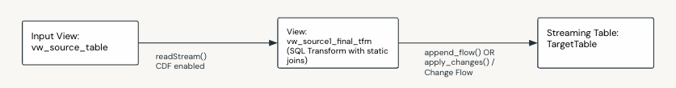

Stream-Static Basic
====================

Description
------------
Suitable for when you have a streaming table that you need to join to one or many additional static tables to derive your desired target data set.

Use when:

- You have a single streaming table driving the data flow and want to join to one or more other tables.
- You only need to reflect changes when the driving streaming table updates.
- The source tables do not share common business keys.
- You only need to perform basic single row transforms.

**Layers:**

- Silver
- Gold (no complex transforms or aggregations)

**Models:**

- 3NF such as ODS, Inmon and Enterprise Models
- Data Vault
- Dimensional: dimensions and basic transactional facts

Data Flow Components:
---------------------

.. list-table::
   :header-rows: 1
   :widths: 5 20 55 20

   * - No.
     - Component
     - Description
     - M / O
   * - 1
     - Input View
     - Input view created over the streaming source table that will ultimately static join to one or more additional source tables, in the next view below. This view can optionally read from CDF if the source table is CDF enabled.
     - M
   * - 2
     - View
     - A view that defines SQL, joining the input view above to one or more additional source tables.
     - M
   * - 3
     - Append or Change Flow
     - An Append Flow (for transactional or fact based target tables) or an SCD1/2 Change Flow that loads the data into the final target table.
     - M
   * - 4
     - Target Table
     - A streaming table, the schema of which is specified in the dataflowspec. This table is the final target table for the given flow.
     - M

\* M / O: Mandatory or Optional.

Feature Support
---------------

.. list-table::
   :header-rows: 1
   :widths: 50 50

   * - Supported
     - Not Supported
   * - - Append Only & SCD 1/2
       - Basic transforms such as:
         - Data type conversion
         - Concatenation
         - Single row calculations
         - Formatting
         - Cleansing & Data Quality Rules
         - Conditionals and calculations (single row) across multiple source tables
         - Joins
     -  - Complex transforms such as aggregations
        - Window By

Considerations and Limitations
---------------------------

.. important::
   - Updates in joined tables will not be reflected until a row with matching keys comes through on the driving streaming table.

Sample
------
- Bundle: ``dlt_framework/src/samples/silver_sample``
- Sample: ``dlt_framework/src/samples/silver_sample/src/dataflows/stream_static_p6``

Example Data Flow
---------------

.. important::
   - The Day 3 load below demonstrates a limitation of this pattern. Updates in any of the static tables will only be loaded once corresponding rows (with the same PK's) in the primary streaming table are updated. This is resolved by the :doc:`Streaming Data Warehouse <patterns_streaming_stream_static_streaming_dwh>` pattern below.
   
   Note this behavior may be perfectly acceptable in a given scenario, which is why this pattern remains relevant, as it is a simpler implementation than the :doc:`Streaming Data Warehouse <patterns_streaming_stream_static_streaming_dwh>` pattern

Day 1 Load
~~~~~~~~~~

* **Source Tables (Append-Only)**

  CUSTOMER

  .. list-table::
     :header-rows: 1
     :widths: 15 15 15 25 30

     * - customer_id
       - first_name
       - last_name
       - email
       - load_timestamp
     * - 1
       - John
       - Doe
       - john.doe@example.com
       - 2023-01-01 10:00
     * - 2
       - Jane
       - Smith
       - jane.smith@example.com
       - 2023-01-01 10:00

  CUSTOMER_ADDRESS

  .. list-table::
     :header-rows: 1
     :widths: 15 15 15 30

     * - customer_id
       - city
       - state
       - load_timestamp
     * - 1
       - Melbourne
       - VIC
       - 2023-01-01 10:00
     * - 2
       - Melbourne
       - VIC
       - 2023-01-01 10:00
     * - 4
       - Hobart
       - TAS
       - 2023-01-01 10:00

* Target Table

  * **Append-Only Scenario**

  .. list-table::
     :header-rows: 1
     :widths: 15 15 15 15 25 15 15 30

     * - customer_id
       - first_name
       - last_name
       - full_name
       - email
       - city
       - state
       - load_timestamp
     * - 1
       - John
       - Doe
       - John Doe
       - john.doe@example.com
       - Melbourne
       - VIC
       - 2023-01-01 10:00
     * - 2
       - Jane
       - Smith
       - Jane Smith
       - jane.smith@example.com
       - Melbourne
       - VIC
       - 2023-01-01 10:00

  * SCD1 Scenario

  .. list-table::
     :header-rows: 1
     :widths: 15 15 15 15 25 15 15

     * - customer_id
       - first_name
       - last_name
       - full_name
       - email
       - city
       - state
     * - 1
       - John
       - Doe
       - John Doe
       - john.doe@example.com
       - Melbourne
       - VIC
     * - 2
       - Jane
       - Smith
       - Jane Smith
       - jane.smith@example.com
       - Melbourne
       - VIC

  * SCD2 Scenario

  .. list-table::
     :header-rows: 1
     :widths: 15 15 15 15 25 15 15 25 25

     * - customer_id
       - first_name
       - last_name
       - full_name
       - email
       - city
       - state
       - _START_AT
       - _END_AT
     * - 1
       - John
       - Doe
       - John Doe
       - john.doe@example.com
       - Melbourne
       - VIC
       - 2023-01-01 10:00
       - NULL
     * - 2
       - Jane
       - Smith
       - Jane Smith
       - jane.smith@example.com
       - Melbourne
       - VIC
       - 2023-01-01 10:00
       - NULL

Day 2 Load
~~~~~~~~~~

* **Source Tables (Append-Only)**

    CUSTOMER

    .. raw:: html

        <table class="docutils align-default"> <tr> <th>customer_id</th> <th>first_name</th> <th>last_name</th> <th>email</th> <th>load_timestamp</th> </tr>
        <tr> <td>1</td> <td>John</td> <td>Doe</td> <td>john.doe@example.com</td> <td>2023-01-01 10:00</td> </tr>
        <tr> <td>2</td> <td>Jane</td> <td>Smith</td> <td>jane.smith@example.com</td> <td>2023-01-01 10:00</td> </tr>
        <tr class="highlight-row"> <td>1</td> <td>John</td> <td>Doe</td> <td>jdoe@example.com</td> <td>2023-01-02 10:00</td> </tr>
        <tr class="highlight-row"> <td>3</td> <td>Alice</td> <td>Green</td> <td>alice.green@example.com</td> <td>2023-01-02 10:00</td> </tr>
        <tr class="highlight-row"> <td>4</td> <td>Joe</td> <td>Bloggs</td> <td>joe.bloggs@example.com</td> <td>2023-01-02 10:00</td> </tr>
        </table>

    CUSTOMER_ADDRESS

    .. raw:: html

        <table class="docutils align-default"> <tr> <th>customer_id</th> <th>city</th> <th>state</th> <th>load_timestamp</th> </tr>
        <tr> <td>1</td> <td>Melbourne</td> <td>VIC</td> <td>2023-01-01 10:00</td> </tr>
        <tr> <td>2</td> <td>Melbourne</td> <td>VIC</td> <td>2023-01-01 10:00</td> </tr>
        <tr> <td>4</td> <td>Hobart</td> <td>TAS</td> <td>2023-01-01 10:00</td> </tr>
        <tr class="highlight-row"> <td>2</td> <td>Perth</td> <td>WA</td> <td>2023-01-02 10:00</td> </tr>
        <tr class="highlight-row"> <td>3</td> <td>Sydney</td> <td>NSW</td> <td>2023-01-02 10:00</td> </tr>
        </table>

**Target Table**

    - Append-Only Scenario

        .. raw:: html

            <table class="docutils align-default"> <tr> <th>customer_id</th> <th>first_name</th> <th>last_name</th> <th>full_name</th> <th>email</th> <th>city</th> <th>state</th> <th>load_timestamp</th> </tr>
            <tr> <td>1</td> <td>John</td> <td>Doe</td> <td>John Doe</td> <td>john.doe@example.com</td> <td>Melbourne</td> <td>VIC</td> <td>2023-01-01 10:00</td> </tr>
            <tr> <td>2</td> <td>Jane</td> <td>Smith</td> <td>Jane Smith</td> <td>jane.smith@example.com</td> <td>Melbourne</td> <td>VIC</td> <td>2023-01-01 10:00</td> </tr>
            <tr class="highlight-row"> <td>1</td> <td>John</td> <td>Doe</td> <td>John Doe</td> <td>jdoe@example.com</td> <td>Melbourne</td> <td>VIC</td> <td>2023-01-02 10:00</td> </tr>
            <tr class="highlight-row"> <td>2</td> <td>Jane</td> <td>Smith</td> <td>Jane Smith</td> <td>jane.smith@example.com</td> <td>Perth</td> <td>WA</td> <td>2023-01-02 10:00</td> </tr>        
            <tr class="highlight-row"> <td>3</td> <td>Alice</td> <td>Green</td> <td>alice.green@example.com</td> <td>alice.green@example.com</td> <td>Sydney</td> <td>NSW</td> <td>2023-01-02 10:00</td> </tr>
            <tr class="highlight-row"> <td>4</td> <td>Joe</td> <td>Bloggs</td> <td>Joe Bloggs</td> <td>joe.bloggs@example.com</td> <td>Hobart</td> <td>TAS</td> <td>2023-01-02 10:00</td> </tr>
            </table>

    - SCD1 Scenario

        .. raw:: html

            <table class="docutils align-default"> <tr> <th>customer_id</th> <th>first_name</th> <th>last_name</th> <th>full_name</th> <th>email</th> <th>city</th> <th>state</th> </tr>
            <tr> <td>1</td> <td>John</td> <td>Doe</td> <td>John Doe</td> <td class="highlight-cell">jdoe@example.com</td> <td>Melbourne</td> <td>VIC</td> </tr>
            <tr> <td>2</td> <td>Jane</td> <td>Smith</td> <td>Jane Smith</td> <td>jane.smith@example.com</td> <td class="highlight-cell">Perth</td> <td class="highlight-cell">WA</td> </tr>
            <tr class="highlight-row"> <td>3</td> <td>Alice</td> <td>Green</td> <td>alice.green@example.com</td> <td>alice.green@example.com</td> <td>Sydney</td> <td>NSW</td> </tr>
            <tr class="highlight-row"> <td>4</td> <td>Joe</td> <td>Bloggs</td> <td>Joe Bloggs</td> <td>joe.bloggs@example.com</td> <td>Hobart</td> <td>TAS</td> </tr>
            </table>

    - SCD2 Scenario

        .. raw:: html

            <table class="docutils align-default"> <tr> <th>customer_id</th> <th>first_name</th> <th>last_name</th> <th>full_name</th> <th>email</th> <th>city</th> <th>state</th> <th>_START_AT</th> <th>_END_AT</th> </tr>
            <tr class="highlight-row"> <td>1</td> <td>John</td> <td>Doe</td> <td>John Doe</td> <td>jdoe@example.com</td> <td>Melbourne</td> <td>VIC</td> <td>2023-01-02 10:00</td> <td>NULL</td> </tr>
            <tr> <td>1</td> <td>John</td> <td>Doe</td> <td>John Doe</td> <td>john.doe@example.com</td> <td>Melbourne</td> <td>VIC</td> <td>2023-01-01 10:00</td> <td class="highlight-cell">2023-01-02 10:00</td> </tr>
            <tr class="highlight-row"> <td>2</td> <td>Jane</td> <td>Smith</td> <td>Jane Smith</td> <td>jane.smith@example.com</td> <td>Perth</td> <td>WA</td> <td>2023-01-02 10:00</td> <td>NULL</td> </tr>
            <tr> <td>2</td> <td>Jane</td> <td>Smith</td> <td>Jane Smith</td> <td>jane.smith@example.com</td> <td>Melbourne</td> <td>VIC</td> <td>2023-01-01 10:00</td> <td class="highlight-cell">2023-01-02 10:00</td> </tr>
            <tr> <td>3</td> <td>Alice</td> <td>Green</td> <td>Alice Green</td> <td>alice.green@example.com</td> <td>Sydney</td> <td>NSW</td> <td>2023-01-01 10:00</td> <td>NULL</td> </tr>
            <tr class="highlight-row"> <td>4</td> <td>Joe</td> <td>Bloggs</td> <td>Joe Bloggs</td> <td>joe.bloggs@example.com</td> <td>Hobart</td> <td>TAS</td> <td>2023-01-02 10:00</td> <td>NULL</td> </tr>
            </table>

        .. note::

            - Customer 1's change of location to Brisbane did not propagate as there was no corresponding new row in the primary Customer table on this Day.
            - This change in location will only be reflected once a new row for customer 1 is loaded into the Customer source table.

Day 3 Load
~~~~~~~~~~

* **Source Tables (Append-Only)**

    CUSTOMER

    .. raw:: html

        <table class="docutils align-default"> <tr> <th>customer_id</th> <th>first_name</th> <th>last_name</th> <th>email</th> <th>load_timestamp</th> </tr>
        <tr> <td>1</td> <td>John</td> <td>Doe</td> <td>john.doe@example.com</td> <td>2023-01-01 10:00</td> </tr>
        <tr> <td>2</td> <td>Jane</td> <td>Smith</td> <td>jane.smith@example.com</td> <td>2023-01-01 10:00</td> </tr>
        <tr> <td>1</td> <td>John</td> <td>Doe</td> <td>jdoe@example.com</td> <td>2023-01-02 10:00</td> </tr>
        <tr> <td>3</td> <td>Alice</td> <td>Green</td> <td>alice.green@example.com</td> <td>2023-01-02 10:00</td> </tr>
        <tr> <td>4</td> <td>Joe</td> <td>Bloggs</td> <td>joe.bloggs@example.com</td> <td>2023-01-02 10:00</td> </tr>
        </table>
    
    CUSTOMER_ADDRESS

    .. raw:: html

        <table class="docutils align-default"> <tr> <th>customer_id</th> <th>city</th> <th>state</th> <th>load_timestamp</th> </tr>
        <tr> <td>1</td> <td>Melbourne</td> <td>VIC</td> <td>2023-01-01 10:00</td> </tr>
        <tr> <td>2</td> <td>Melbourne</td> <td>VIC</td> <td>2023-01-01 10:00</td> </tr>
        <tr> <td>4</td> <td>Hobart</td> <td>TAS</td> <td>2023-01-01 10:00</td> </tr>
        <tr> <td>2</td> <td>Perth</td> <td>WA</td> <td>2023-01-02 10:00</td> </tr>
        <tr> <td>3</td> <td>Sydney</td> <td>NSW</td> <td>2023-01-02 10:00</td> </tr>
        <tr class="highlight-row"> <td>1</td> <td>Brisbane</td> <td>QLD</td> <td>2023-01-03 10:00</td> </tr>
        </table>

* **Target Table**

    - Append-Only Scenario

        .. raw:: html

            <table class="docutils align-default"> <tr> <th>customer_id</th> <th>first_name</th> <th>last_name</th> <th>full_name</th> <th>email</th> <th>city</th> <th>state</th> <th>load_timestamp</th> </tr>
            <tr> <td>1</td> <td>John</td> <td>Doe</td> <td>John Doe</td> <td>john.doe@example.com</td> <td>Melbourne</td> <td>VIC</td> <td>2023-01-01 10:00</td> </tr>
            <tr> <td>2</td> <td>Jane</td> <td>Smith</td> <td>Jane Smith</td> <td>jane.smith@example.com</td> <td>Melbourne</td> <td>VIC</td> <td>2023-01-01 10:00</td> </tr>
            <tr> <td>1</td> <td>John</td> <td>Doe</td> <td>John Doe</td> <td>jdoe@example.com</td> <td>Melbourne</td> <td>VIC</td> <td>2023-01-02 10:00</td> </tr>
            <tr> <td>2</td> <td>Jane</td> <td>Smith</td> <td>Jane Smith</td> <td>jane.smith@example.com</td> <td>Perth</td> <td>WA</td> <td>2023-01-02 10:00</td> </tr>        
            <tr> <td>3</td> <td>Alice</td> <td>Green</td> <td>alice.green@example.com</td> <td>alice.green@example.com</td> <td>Sydney</td> <td>NSW</td> <td>2023-01-02 10:00</td> </tr>
            <tr> <td>4</td> <td>Joe</td> <td>Bloggs</td> <td>Joe Bloggs</td> <td>joe.bloggs@example.com</td> <td>Hobart</td> <td>TAS</td> <td>2023-01-02 10:00</td> </tr>
            </table>

    - SCD1 Scenario

        .. raw:: html

            <table class="docutils align-default"> <tr> <th>customer_id</th> <th>first_name</th> <th>last_name</th> <th>full_name</th> <th>email</th> <th>city</th> <th>state</th> </tr>
            <tr> <td>1</td> <td>John</td> <td>Doe</td> <td>John Doe</td> <td>jdoe@example.com</td> <td>Melbourne</td> <td>VIC</td> </tr>
            <tr> <td>2</td> <td>Jane</td> <td>Smith</td> <td>Jane Smith</td> <td>jane.smith@example.com</td> <td>Perth</td> <td>WA</td> </tr>
            <tr> <td>3</td> <td>Alice</td> <td>Green</td> <td>alice.green@example.com</td> <td>alice.green@example.com</td> <td>Sydney</td> <td>NSW</td> </tr>
            <tr> <td>4</td> <td>Joe</td> <td>Bloggs</td> <td>Joe Bloggs</td> <td>joe.bloggs@example.com</td> <td>Hobart</td> <td>TAS</td> </tr>
            </table>

    - SCD2 Scenario

        .. raw:: html

            <table class="docutils align-default"> <tr> <th>customer_id</th> <th>first_name</th> <th>last_name</th> <th>full_name</th> <th>email</th> <th>city</th> <th>state</th> <th>_START_AT</th> <th>_END_AT</th> </tr>
            <tr> <td>1</td> <td>John</td> <td>Doe</td> <td>John Doe</td> <td>jdoe@example.com</td> <td>Melbourne</td> <td>VIC</td> <td>2023-01-02 10:00</td> <td>NULL</td> </tr>
            <tr> <td>1</td> <td>John</td> <td>Doe</td> <td>John Doe</td> <td>john.doe@example.com</td> <td>Melbourne</td> <td>VIC</td> <td>2023-01-01 10:00</td> <td>2023-01-02 10:00</td> </tr>
            <tr> <td>2</td> <td>Jane</td> <td>Smith</td> <td>Jane Smith</td> <td>jane.smith@example.com</td> <td>Perth</td> <td>WA</td> <td>2023-01-02 10:00</td> <td>NULL</td> </tr>
            <tr> <td>2</td> <td>Jane</td> <td>Smith</td> <td>Jane Smith</td> <td>jane.smith@example.com</td> <td>Melbourne</td> <td>VIC</td> <td>2023-01-01 10:00</td> <td>2023-01-02 10:00</td> </tr>
            <tr> <td>3</td> <td>Alice</td> <td>Green</td> <td>Alice Green</td> <td>alice.green@example.com</td> <td>Sydney</td> <td>NSW</td> <td>2023-01-01 10:00</td> <td>NULL</td> </tr>
            <tr> <td>4</td> <td>Joe</td> <td>Bloggs</td> <td>Joe Bloggs</td> <td>joe.bloggs@example.com</td> <td>Hobart</td> <td>TAS</td> <td>2023-01-02 10:00</td> <td>NULL</td> </tr>
            </table>

        .. note::
            
            - Customer 1's change of location to Brisbane did not propagate as there was no corresponding new row in the primary Customer table on this Day.
            - This change in location will only be reflected once a new row for customer 1 is loaded into the Customer source table.

Day 4 Load
~~~~~~~~~~

* **Source Tables (Append-Only)**

    CUSTOMER

    .. raw:: html

        <table class="docutils align-default"> <tr> <th>customer_id</th> <th>first_name</th> <th>last_name</th> <th>email</th> <th>load_timestamp</th> </tr>
        <tr> <td>1</td> <td>John</td> <td>Doe</td> <td>john.doe@example.com</td> <td>2023-01-01 10:00</td> </tr>
        <tr> <td>2</td> <td>Jane</td> <td>Smith</td> <td>jane.smith@example.com</td> <td>2023-01-01 10:00</td> </tr>
        <tr> <td>1</td> <td>John</td> <td>Doe</td> <td>jdoe@example.com</td> <td>2023-01-02 10:00</td> </tr>
        <tr> <td>3</td> <td>Alice</td> <td>Green</td> <td>alice.green@example.com</td> <td>2023-01-02 10:00</td> </tr>
        <tr> <td>4</td> <td>Joe</td> <td>Bloggs</td> <td>joe.bloggs@example.com</td> <td>2023-01-02 10:00</td> </tr>
        <tr class="highlight-row"> <td>1</td> <td>John</td> <td>Doe</td> <td>john.doe@another.example.com</td> <td>2023-01-04 10:00</td> </tr>
        </table>
    
    CUSTOMER_ADDRESS

    .. raw:: html

        <table class="docutils align-default"> <tr> <th>customer_id</th> <th>city</th> <th>state</th> <th>load_timestamp</th> </tr>
        <tr> <td>1</td> <td>Melbourne</td> <td>VIC</td> <td>2023-01-01 10:00</td> </tr>
        <tr> <td>2</td> <td>Melbourne</td> <td>VIC</td> <td>2023-01-01 10:00</td> </tr>
        <tr> <td>4</td> <td>Hobart</td> <td>TAS</td> <td>2023-01-01 10:00</td> </tr>
        <tr> <td>2</td> <td>Perth</td> <td>WA</td> <td>2023-01-02 10:00</td> </tr>
        <tr> <td>3</td> <td>Sydney</td> <td>NSW</td> <td>2023-01-02 10:00</td> </tr>
        <tr> <td>1</td> <td>Brisbane</td> <td>QLD</td> <td>2023-01-03 10:00</td> </tr>
        </table>

* **Target Table**

    - Append-Only Scenario

        .. raw:: html

            <table class="docutils align-default"> <tr> <th>customer_id</th> <th>first_name</th> <th>last_name</th> <th>full_name</th> <th>email</th> <th>city</th> <th>state</th> <th>load_timestamp</th> </tr>
            <tr> <td>1</td> <td>John</td> <td>Doe</td> <td>John Doe</td> <td>john.doe@example.com</td> <td>Melbourne</td> <td>VIC</td> <td>2023-01-01 10:00</td> </tr>
            <tr> <td>2</td> <td>Jane</td> <td>Smith</td> <td>Jane Smith</td> <td>jane.smith@example.com</td> <td>Melbourne</td> <td>VIC</td> <td>2023-01-01 10:00</td> </tr>
            <tr> <td>1</td> <td>John</td> <td>Doe</td> <td>John Doe</td> <td>jdoe@example.com</td> <td>Melbourne</td> <td>VIC</td> <td>2023-01-02 10:00</td> </tr>
            <tr> <td>2</td> <td>Jane</td> <td>Smith</td> <td>Jane Smith</td> <td>jane.smith@example.com</td> <td>Perth</td> <td>WA</td> <td>2023-01-02 10:00</td> </tr>        
            <tr> <td>3</td> <td>Alice</td> <td>Green</td> <td>alice.green@example.com</td> <td>alice.green@example.com</td> <td>Sydney</td> <td>NSW</td> <td>2023-01-02 10:00</td> </tr>
            <tr> <td>4</td> <td>Joe</td> <td>Bloggs</td> <td>Joe Bloggs</td> <td>joe.bloggs@example.com</td> <td>Hobart</td> <td>TAS</td> <td>2023-01-02 10:00</td> </tr>
            <tr class="highlight-row"> <td>1</td> <td>John</td> <td>Doe</td> <td>John Doe</td> <td>john.doe@another.example.com</td> <td>Brisbane</td> <td>QLD</td> <td>2023-01-04 10:00</td> </tr>
            </table>

    - SCD1 Scenario

        .. raw:: html

            <table class="docutils align-default"> <tr> <th>customer_id</th> <th>first_name</th> <th>last_name</th> <th>full_name</th> <th>email</th> <th>city</th> <th>state</th> </tr>
            <tr> <td>1</td> <td>John</td> <td>Doe</td> <td>John Doe</td> <td class="highlight-cell">john.doe@another.example.com</td> <td class="highlight-cell">Brisbane</td> <td class="highlight-cell">QLD</td> </tr>
            <tr> <td>2</td> <td>Jane</td> <td>Smith</td> <td>Jane Smith</td> <td>jane.smith@example.com</td> <td>Perth</td> <td>WA</td> </tr>
            <tr> <td>3</td> <td>Alice</td> <td>Green</td> <td>alice.green@example.com</td> <td>alice.green@example.com</td> <td>Sydney</td> <td>NSW</td> </tr>
            <tr> <td>4</td> <td>Joe</td> <td>Bloggs</td> <td>Joe Bloggs</td> <td>joe.bloggs@example.com</td> <td>Hobart</td> <td>TAS</td> </tr>
            </table>

    - SCD2 Scenario

        .. raw:: html

            <table class="docutils align-default"> <tr> <th>customer_id</th> <th>first_name</th> <th>last_name</th> <th>full_name</th> <th>email</th> <th>city</th> <th>state</th> <th>_START_AT</th> <th>_END_AT</th> </tr>
            <tr class="highlight-row"> <td>1</td> <td>John</td> <td>Doe</td> <td>John Doe</td> <td>john.doe@another.example.com</td> <td>Brisbane</td> <td>QLD</td> <td>2023-01-04 10:00</td> <td>NULL</td> </tr>
            <tr> <td>1</td> <td>John</td> <td>Doe</td> <td>John Doe</td> <td>jdoe@example.com</td> <td>Melbourne</td> <td>VIC</td> <td>2023-01-02 10:00</td> <td class="highlight-cell">2023-01-04 10:00</td> </tr>
            <tr> <td>1</td> <td>John</td> <td>Doe</td> <td>John Doe</td> <td>john.doe@example.com</td> <td>Melbourne</td> <td>VIC</td> <td>2023-01-01 10:00</td> <td>2023-01-02 10:00</td> </tr>
            <tr> <td>2</td> <td>Jane</td> <td>Smith</td> <td>Jane Smith</td> <td>jane.smith@example.com</td> <td>Perth</td> <td>WA</td> <td>2023-01-02 10:00</td> <td>NULL</td> </tr>
            <tr> <td>2</td> <td>Jane</td> <td>Smith</td> <td>Jane Smith</td> <td>jane.smith@example.com</td> <td>Melbourne</td> <td>VIC</td> <td>2023-01-01 10:00</td> <td>2023-01-02 10:00</td> </tr>
            <tr> <td>3</td> <td>Alice</td> <td>Green</td> <td>Alice Green</td> <td>alice.green@example.com</td> <td>Sydney</td> <td>NSW</td> <td>2023-01-01 10:00</td> <td>NULL</td> </tr>
            <tr> <td>4</td> <td>Joe</td> <td>Bloggs</td> <td>Joe Bloggs</td> <td>joe.bloggs@example.com</td> <td>Hobart</td> <td>TAS</td> <td>2023-01-02 10:00</td> <td>NULL</td> </tr>
            </table>

        .. note::

            Both the change of address on day 3 and the change of email on day 4 come through on this load.