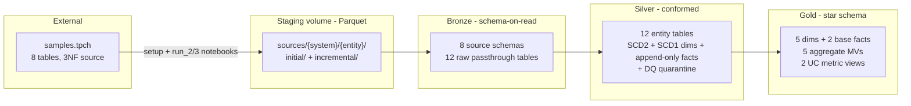
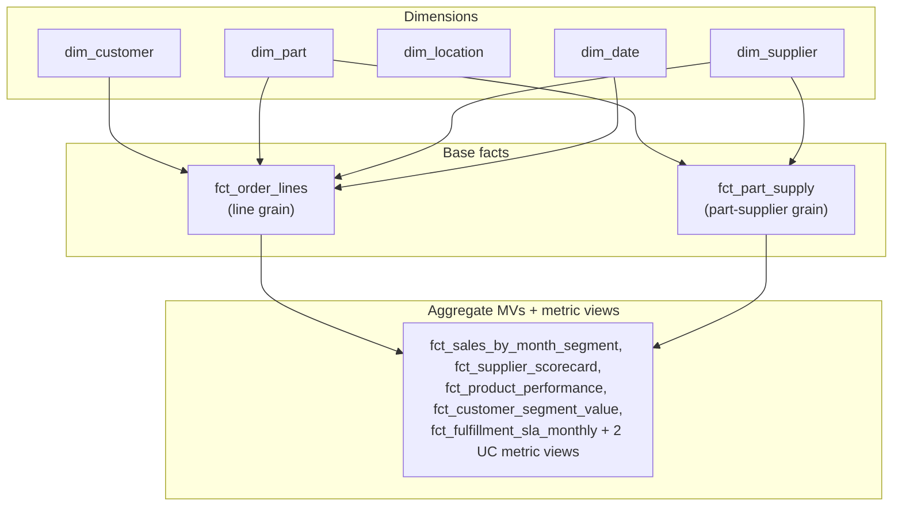

# TPC-H Sample — Architecture and Design

Background, architecture, the design rationale ("the why"), repository layout, staged source
data, and the Unity Catalog objects produced by the TPC-H sample. For deploy / run / demo
instructions, see the [README](./README.md).

## Table of contents

1. [Background & purpose](#1-background--purpose)
2. [Architecture overview](#2-architecture-overview)
3. [Design choices (the "why")](#3-design-choices-the-why)
4. [Repository layout](#4-repository-layout)
5. [Source data staged](#5-source-data-staged)
6. [Unity Catalog objects produced](#6-unity-catalog-objects-produced)
7. [Backlog / roadmap](#7-backlog--roadmap)

---

## 1. Background & purpose

`samples.tpch` (in the Databricks `samples` catalog) is a clean, denormalized, 3NF
**benchmark source schema** — eight tables (`customer`, `supplier`, `nation`, `region`,
`part`, `partsupp`, `orders`, `lineitem`). It is *not* a data warehouse: no history, no
multi-source merge, no quarantine, no star schema, and operational column names like
`c_custkey`.

This sample treats `samples.tpch` as the **"ERP database"** in a demo narrative and builds a
real warehouse on top of it. It demonstrates how to use the Lakeflow Framework to:

- **Land data from many simulated source systems** as Parquet files in a staging volume.
- **Ingest with schema-on-read bronze** (Auto Loader infers + evolves the schema).
- **Conform & historize** entities in silver (SCD2 dimensions, append-only facts, CDF).
- **Quarantine bad data** at silver via data-quality expectations.
- **Merge multiple sources into conformed gold dimensions** (`dim_customer`, `dim_supplier`).
- **Build a star schema** of dimensions + facts, plus **pre-aggregated materialized views**.
- **Generate surrogate keys** (`xxhash64`) and resolve facts to the dimension version that was
**effective as of the order date** (point-in-time / as-of joins).
- **Expose a governed semantic layer** with **UC Metric Views**.
- **Layer natural-language analytics** with an optional **AI/BI Genie space** over the gold schema.
- **Ship optional AI/BI (Lakeview) dashboards** as native bundle resources — a commercial overview
  and a pipeline-health / governance view.
- **Simulate incremental operation** over three "days," including SCD2 changes and a backdated
out-of-order correction on the business timeline.

**Audience:** SAs / DEs evaluating the framework, and anyone wanting a copy-paste reference for
a real medallion build.

---

## 2. Architecture overview

`samples.tpch` is exported by the setup notebook into per-source landing zones, then flows
through three DLT pipelines, bronze then silver then gold.




The gold star schema (surrogate keys with natural keys retained; base facts resolve
customer/supplier dimensions as-of the order date, part at its current version):




---

## 3. Design choices (the "why")

### 3.1 Single-catalog, schema-per-layer UC model

Everything deploys into **one catalog** (default `main`), with each medallion layer — and each
bronze source system — as its own **schema**: `{schema_namespace}_<layer>[_<source>]{logical_env}`
(default namespace `tpch_sample`). Tables keep native entity names. This mirrors the other
samples, keeps governance simple, and makes the three-part `targetDetails.database`
(`catalog.schema.table`) the single mechanism for placement.

### 3.2 Multi-source landing zones (`initial/` + `incremental/`)

Each entity lands under `sources/{system}/{entity}/` split into an **`initial/`** zone (day-1
baseline) and an **`incremental/`** zone (day-2/3 batches), with timestamped filenames. Bronze
Auto Loader reads the entity directory recursively, so both zones are picked up. This makes the
incremental file-append story realistic and lets you reset to day 1 by clearing only
`incremental/`.

### 3.3 Parquet staging + schema-on-read bronze

Staging lands typed, self-describing **Parquet**. Bronze flows declare **no schema and no
projection** — Auto Loader infers the schema on first run and evolves it
(`cloudFiles.schemaEvolutionMode: addNewColumns`) as upstream columns appear. Bronze is a
faithful **raw passthrough** (it carries `source_system` / `batch_id` / `load_timestamp`
metadata); all conforming, renaming, and projection happen in silver. This deliberately
demonstrates schema evolution and retires the entire class of CSV positional-parse errors.

### 3.4 Silver: conform, clean names, historize

One silver table per business entity, read 1:1 from its bronze source, with **clean business
column names** (no `c_`/`s_`/`l_`/`o_`/`p_` prefixes). Most **dimensions are SCD2** (`__START_AT` /
`__END_AT`, CDF enabled); the **static reference data (`nation`, `region`) is SCD1** (overwrite,
no history) since it never changes and gold only ever reads its current version; **facts
(`orders`, `lineitem`, `partsupp`) are append-only** immutable events. The customer/supplier
dimension feeds (`customer`, `customer_address`, `customer_phone`, `supplier`) `sequence_by` a
synthetic business **`effective_date`** so their SCD2 windows live on the order timeline
(1992-1998) for point-in-time joins; the remaining feeds `sequence_by: load_timestamp`. Either way
the sequence column orders changes and resolves out-of-order arrivals. Silver does *not* merge
sources — that is gold's job.

### 3.5 Data-quality quarantine at silver

Two silver feeds opt into DQ expectations with **`quarantineMode: table`**, so rows failing an
expectation are dropped from the clean table and routed to an auto-created `<table>_quarantine`:

- **`silver.customer_address`** (SCD2 dimension feed) — referential-integrity rule
(`nation_key IS NOT NULL`).
- **`silver.orders`** (append-only fact feed) — `order_key IS NOT NULL`, `total_price >= 0`.

The Run 2/3 staging notebooks inject a small, tagged cohort of malformed rows so the quarantine
tables are populated for the demo. (PK-null is demonstrated on the append-only fact; a NULL
SCD2 key is an `apply_changes` edge case, so the dimension uses an FK violation on a valid key.)

### 3.6 Gold: star schema + two ways to build a dimension

Gold reassembles the silver slices into a conformed star. It deliberately shows **two SDP
products building the same kind of SCD2 dimension side by side**:

- **`dim_customer`** — a multi-source **flow spec** (staging tables, append views, merge, SQL
DML) merging `customer` + `customer_address` + `customer_phone`.
- **`dim_supplier`** — a **materialized view** that merges `supplier` + address + phone + nation
while preserving the real `__START_AT` / `__END_AT` validity windows.

`dim_location`, `dim_part`, and `dim_date` are also materialized views; `dim_date` is a
generated calendar (see §3.8).

### 3.7 Append-only facts + degenerate order dimension (no `fct_orders`)

There is intentionally **no order-header fact**. Order-header attributes (`order_status`,
`order_priority`, `clerk`, `ship_priority`, `order_date`) are folded onto `fct_order_lines` as
**degenerate dimension columns**. The two base facts are `fct_order_lines` (line grain) and
`fct_part_supply` (part-supplier grain). `o_totalprice` is not carried to gold (it would
double-count at line grain and is derivable from `sum(extended_price * (1 - discount))`).

### 3.8 `dim_date` with a fiscal calendar

A static generated calendar dimension over the TPC-H range (1992–1998) via `sequence` +
`explode`. It includes standard parts (`year`, `quarter`, `month`, `is_weekend`, …) **and a
fiscal calendar** (`fiscal_year`, `fiscal_quarter`, `fiscal_month`, `fiscal_year_label`,
`fiscal_quarter_label`, `fiscal_period`). The fiscal year starts **1 April** (a single,
clearly-commented constant in the SQL — easy to change to e.g. Oct for US federal).

### 3.9 Metrics layer — pre-aggregated MVs **vs** UC Metric Views

The sample ships **both** ways to serve the same business metrics:


|          | Pre-aggregated MV (`facts_aggregated`)            | UC Metric View (`create_metric_views`)                  |
| -------- | ------------------------------------------------- | ------------------------------------------------------- |
| Built by | Gold pipeline (`dataFlowType: materialized_view`) | Notebook task after gold (`CREATE VIEW … WITH METRICS`) |
| Storage  | Materialized (physical)                           | Computed at query time                                  |
| Grain    | Fixed per MV                                      | Any grain via `MEASURE(...)`                            |
| Best for | Known dashboard slices, cheap reads               | Self-serve BI / Genie / ad-hoc                          |


Metric views are a **post-pipeline** step because the dataflow framework has no metric-view
`dataFlowType`; they are created idempotently as a task in the Run 1 job after the gold
pipeline. Note: UC Metric Views only support **star joins off `source`** (no chained joins), so
geography (`nation_name`, `region_name`) is denormalized onto `dim_customer` / `dim_supplier`.

### 3.10 Spec organization — standalone vs grouped

The framework allows multiple materialized views in one spec. This sample uses a **hybrid** to
teach both idioms: unique/complex objects get their own spec (`dim_customer`, `fct_order_lines`,
`fct_part_supply`), while homogeneous families are grouped (`dimensions_main.json`,
`facts_aggregated_main.json`).

### 3.11 Surrogate keys + point-in-time (as-of) joins

Dimensions carry a **surrogate key** generated with **`xxhash64`** — fast, deterministic, and
stable on recompute (unlike `IDENTITY`, which DLT `APPLY CHANGES` targets and MVs do not support
reliably). The key folds the natural key and the SCD2 start into one value:

- `dim_customer.customer_sk = xxhash64('customer', customer_key, __START_AT)`
- `dim_supplier.supplier_sk = xxhash64('supplier', supplier_key, __START_AT)`
- `dim_part.part_sk = xxhash64('part', part_key, __START_AT)`, `dim_location.location_sk = xxhash64('location', nation_key)`

The leading literal is a per-dimension salt so the same natural key in two dimensions (e.g.
customer 1 vs supplier 1) never produces the same surrogate value.

Natural keys are **kept** alongside the surrogate keys for traceability. `fct_order_lines`
resolves customer and supplier **as-of the `order_date`** (range join on the SCD2 window) and
part at its current version, so each fact row points at the dimension version that was effective
when the order was placed — true point-in-time analysis. Because the dimensions are themselves
sequenced on the business `effective_date`, an order in 1994 and an order in 1997 for the same
customer correctly carry different `customer_sk` values. (`dim_customer` aligns its composite
sources with as-of joins so each version reflects the right address/segment/phone at that point.)

### 3.12 Row tracking for incremental MV refresh

Materialized views can refresh **incrementally** (recompute only what changed) instead of fully
recomputing only when every base table in their lineage has Delta **row tracking**
(`delta.enableRowTracking = true`). The sample enables it on all silver tables and all gold
tables (alongside `delta.enableChangeDataFeed`), so the dimension MVs, `fct_part_supply`, and the
five aggregate MVs can incrementalize as facts and dimensions grow across Runs 2-3. The property
is applied at table creation (Run 1 full refresh).

### 3.13 Three-run incremental model

Setup loads the full baseline once; then three processing runs simulate days 1–3 (full refresh,
then two incremental runs) covering SCD2 change, significant fact growth, a supplier update, a
backdated out-of-order dimension correction, and ongoing quarantine. See the
[demo walkthrough](./GUIDE.md#3-demo-flow--walkthrough).

### 3.14 Bronze as a reusable template spec

The 12 bronze flows are identical except for source system and table, so instead of 12 near-duplicate
spec files they are expressed as a single **template definition**
(`src/templates/bronze_parquet_ingestion_template.json`) plus one **template usage spec**
(`bronze/dataflowspec/bronze_ingestion_main.json`) that lists one `parameterSet` per table. The
framework expands this into 12 concrete specs at pipeline init, validating each independently. The
constant pattern (cloudFiles + Parquet, `addNewColumns`, stream, CDF) lives once in the template;
adding a new source becomes a six-key parameter set rather than a whole file. Note the
`"{bronze_${param.sourceSystem}_schema}"` value — template substitution resolves `${param.*}` first,
leaving the `{...}` substitution token for normal pipeline-config resolution at runtime. See the
[Templates feature docs](../../docs/source/feature_templates.rst).

### 3.15 Silver as template specs (by archetype)

Silver has a few structural shapes — SCD2 dimensions (a `cdcSettings` block with `scd_type: 2` that
triggers an `APPLY CHANGES` merge and keeps `__START_AT`/`__END_AT` history), SCD1 reference data
(`scd_type: 1`, overwrite-in-place, no history columns), and append-only facts (no `cdcSettings`).
Because the template engine has **no conditional logic**, a single template can't cover all three:
whatever is in the template body lands in every generated spec, and the *presence and shape* of
`cdcSettings` is exactly what differs. So silver uses **three** templates by archetype —
`silver_scd2_template` (6 historized dimensions), `silver_scd1_template` (`nation`, `region`), and
`silver_append_template` (`lineitem`, `partsupp`). The bespoke parts (`selectExp`, `keys`,
`sequenceBy`, `exceptColumnList`) are list/string parameters per table. SCD2 dimensions omit
`track_history_column_list` entirely so the framework tracks history on **all** tracked columns. The two data-quality demo tables (`customer_address`, `orders`) are **deliberately left as
standalone specs** so the quarantine wiring stays fully readable. This is also a useful contrast with
bronze: bronze flows are identical so templating is a big win, whereas silver's per-table logic means
the parameter sets carry most of the content.

### 3.16 Schema evolution (Auto Loader)

To make the schema-on-read claim concrete, Run 2's `customer` batch introduces a brand-new upstream
column (`loyalty_tier`) that did not exist on day 1. Because bronze reads Parquet with
`cloudFiles.schemaEvolutionMode: addNewColumns`, `bronze_crm.customer` gains the column
automatically — earlier rows read back `NULL` — with no spec change. Silver keeps its explicit
contract and does **not** project the new column, a deliberate contrast: schema-on-read bronze
*evolves*, while contract-bound silver only surfaces columns you opt into (adding it there would be a
schema change, not free evolution).

**What a developer would do next (real deployment):** bronze captures the new column immediately, but
it stops there — silver only emits its `selectExp` columns. Once the data contract is agreed, a
developer adds the column to the silver `customer` `selectExp` and `customer_schema.json` so it flows
through to gold. The sample deliberately leaves silver unchanged so the "captured in bronze, not yet
promoted" state stays visible.

### 3.17 Deletes (tombstones via `apply_as_deletes`)

Every SCD2 dimension feed carries a CDC `cdc_operation` flag (`'U'` for upserts, `'D'` for deletes). The column
is listed in `except_column_list` so it drives the merge but is never stored. The SCD2 template sets
`cdcSettings.apply_as_deletes: "cdc_operation = 'D'"`, so a delete **closes the open SCD2 version (tombstone)**
rather than inserting. Run 3 discontinues supplier 3 (`cdc_operation='D'`): its open version is closed effective
1997; pre-1997 orders still resolve it via the as-of join, while later orders find no open version and
fall through to the unknown member (§3.18).

### 3.18 Late-arriving dimensions (unknown member)

Each materialized-view dimension (`dim_part`, `dim_supplier`, `dim_location`) carries a synthetic
**unknown member** with surrogate key `-1`, and `fct_order_lines` wraps those lookups in
`COALESCE(..., -1)`. Run 2 stages a line item for part `9000001` whose master record only arrives in
Run 3 — that fact resolves to the Unknown part. New Run-3 facts for `9000001` resolve to the real
part once it lands. Note the realistic trade-off: facts are **append-only**, so the Run-2 row keeps
the unknown member (it is not retro-repointed); only a full refresh would re-resolve it. (`dim_customer`
is a streaming `APPLY CHANGES` table rather than an MV, so it has no physical `-1` member and
`customer_sk` is left un-coalesced.)

**What a developer would do next (real deployment):** the surrogate key is resolved once at append
time, so the Run-2 row stays stamped `-1` even after the master lands — the unknown member is the
interim state that keeps the row countable and the gap explicit (`WHERE part_sk = -1`). The proper
remediation once the late dimension arrives is to **full-refresh `fct_order_lines`** so it re-reads all
line items and resolves the previously-unknown rows to the real member. Teams typically monitor the
unknown-member count and schedule that rebuild after a known backfill, since incremental runs never
silently rewrite history.

### 3.19 Genie space via notebook

Run 1 finishes by creating an **AI/BI Genie space** over the gold star schema
(`src/notebooks/create_genie_space`, task `create_genie_space`, after `create_metric_views`). It
curates the space to the facts, conformed dimensions, and both metric views, and is **idempotent**
(find-or-create by title, so re-runs update in place). It is **optional**: with no `warehouse_id`
the notebook exits cleanly without failing the job (see the
[README prerequisites](./README.md#1-prerequisites)), so users without SQL warehouse access are
never blocked.

**Why a notebook (via the Genie API) rather than declaring it in the bundle?** Genie space support
is **new and still evolving**, and this approach keeps the sample runnable for everyone: not all
users are on the latest Databricks CLI, and some cannot upgrade it in their environment. A notebook
task is universally supported, so the sample deploys on any CLI version. We therefore use this
approach for now.

**Forward-looking:** the space definition in the notebook is authored as a self-contained config
block, so as native bundle support for Genie spaces matures it can move into a
`resources/.../genie/*.yml` file and this notebook task be retired — a lift-and-shift, not a
rewrite. One trade-off today: `bundle destroy` does not manage the space, so `destroy_tpch.sh`
trashes it via the CLI (`databricks genie trash-space`) before destroying the bundle (see
[README cleanup](./README.md#4-cleanup)).

### 3.20 AI/BI (Lakeview) dashboards via native bundle resources

Unlike Genie, **AI/BI dashboards are first-class Asset Bundle resources**, so the two dashboards
(`src/dashboards/*.lvdash.json`) are declared in `resources/{classic,serverless}/dashboards/tpch_dashboards.yml`
using the `dashboards` resource type — no notebook or API call needed. `bundle deploy` creates and
publishes them; **`bundle destroy` removes them automatically** (no CLI cleanup helper, in contrast
to the Genie space).

**How they "marry" to the namespace + logical environment.** DABs does not rewrite the serialized
`.lvdash.json`, so the dataset queries deliberately use **unqualified** table names (`FROM
fct_order_lines`, `JOIN dim_customer …`). The resource then sets the default context via
`dataset_catalog: ${var.catalog}` and `dataset_schema: ${var.gold_schema}` — and because
`gold_schema` already resolves to `<schema_namespace>_gold<logical_env>`, every dataset targets the
correct catalog, namespace and environment automatically. The display names carry
`(${var.schema_namespace}${var.logical_env})` so multiple environments don't collide.

**Optional, same as Genie.** The dashboards are warehouse-backed, so `deploy` drops the dashboard
resource file when no `warehouse_id` is supplied (a one-line gate in `common.sh`); everything else
still deploys. The queries were validated against the gold schema before authoring, per the Lakeview
build workflow.

### 3.21 Realistic data distribution (staging-side reshaping)

Raw `samples.tpch` is **uniformly generated** — orders are flat over time, categories/segments/
regions split evenly, every supplier looks the same, and extended prices aggregate into the
trillions. That reads as obviously synthetic on the dashboards and in Genie. So the sample reshapes
the data **in staging**, before it lands in bronze, in two complementary passes. Both are
**volume-preserving** (row counts never change — only values/labels/dates move) and **deterministic**
(hash-based), and both **pin the Run 2/3 narrative keys** (customers 1–3, suppliers 1–3) so the
incremental demo (§3.13, §3.16–3.18) stays byte-stable. Nothing is "fudged" in gold — gold still
just aggregates what it is given.

**Pass 1 — always-on economics + SLA (`initialize.ipynb`, every batch).** Two batch-independent
adjustments run on the initial load *and* every incremental run so magnitude and fulfillment
behaviour stay consistent across batches:

- **Unit-price reduction** (`PRICE_SCALE`) scales `l_extendedprice` / `o_totalprice` so total net
  sales land near ~$800M instead of trillions. Quantity is untouched — price-per-unit drops, so the
  reshaping is purely economic and never changes row counts.
- **Ship-mode fulfillment SLA** (`SHIP_MODE_TRANSIT`) derives `l_receiptdate = l_shipdate +
  transit(ship_mode)`, so faster modes beat the commit date more often and the on-time rate varies
  by mode (AIR best → MAIL worst) instead of being identical everywhere.

**Pass 2 — optional distribution reshaping (`tpch_data_realism.ipynb`, initial load only).** A
library notebook `%run` from `setup_catalogs_and_staging.ipynb`, gated by a `data_realism_enabled`
widget (default `true`). It applies five tiers:

1. **Temporal** — growth + seasonality via **weighted date remapping**: orders (and their line-item
   ship/commit dates) are re-allocated across the 1992–1998 months by a cumulative growth×seasonality
   weight (uniform hashed position → month via a broadcast range join), so volume trends up over
   time with an intra-year shape rather than sitting flat.
2. **Supplier** — a **rank-based Zipf** value skew on `l_extendedprice` (weight ≈ `1/rank^0.9`),
   producing a clear #1 ≫ #2 ≫ #3 supplier leaderboard that decays into a long tail.
3. **Category** — relabel `o_orderpriority` and `l_shipmode` to non-uniform shares (e.g. URGENT/HIGH
   a minority; AIR + TRUCK dominant) via percentile bucketing.
4. **Market segment** — relabel customer `mktseg` away from an even 20% split (BUILDING ~30% …
   FURNITURE ~10%).
5. **Region** — relabel customer `nat_id` so geography skews toward target region shares
   (EUROPE/ASIA lead, AFRICA smallest) rather than an even split.

Because it only touches the initial `batch_id = 1` load and preserves the pinned keys, Pass 2 can be
toggled off entirely (`data_realism_enabled=false`) for a strict, benchmark-faithful load without
affecting the incremental narrative.

---

## 4. Repository layout

```
tpch_sample/
├── databricks.yml                     # bundle: catalog/schema vars, single catalog
├── resources/{serverless,classic}/
│   ├── pipelines/                     # tpch_bronze / tpch_silver / tpch_gold pipelines
│   └── jobs/                          # setup + run_1 / run_2 / run_3 jobs
└── src/
    ├── pipeline_configs/
    │   └── dev_substitutions.json     # {catalog}.{schema} tokens per layer/source
    ├── notebooks/
    │   ├── initialize.ipynb           # shared vars + landing-zone helpers + always-on economics/SLA (§3.21)
    │   ├── setup_catalogs_and_staging.ipynb   # CREATE schemas/volume + full initial load
    │   ├── tpch_data_realism.ipynb    # optional volume-preserving distribution reshaping, initial load (§3.21)
    │   ├── run_2_staging_load.ipynb   # incremental batch 2 (+ schema evolution + late arrival + DQ)
    │   ├── run_3_staging_load.ipynb   # incremental batch 3 (+ supplier update/delete + backdated fix + late arrival + DQ)
    │   ├── reset_to_day1.ipynb        # clears incremental/ for a clean full refresh
    │   └── create_metric_views.ipynb  # UC metric views (post-gold task)
    ├── templates/
    │   ├── bronze_parquet_ingestion_template.json  # reusable bronze cloudFiles pattern
    │   ├── silver_scd2_template.json   # reusable SCD2 (historized) conform pattern
    │   ├── silver_scd1_template.json   # reusable SCD1 (overwrite) conform pattern
    │   └── silver_append_template.json # reusable append conform pattern
    └── dataflows/
        ├── bronze/dataflowspec/       # 1 template usage spec -> 12 cloudFiles flows (schema-on-read)
        ├── silver/
        │   ├── dataflowspec/          # 3 template usage specs (6 SCD2 + 2 SCD1 + 2 append) + 2 standalone DQ specs
        │   └── expectations/          # customer_address_dqe.json, orders_dqe.json
        └── gold/
            ├── dataflowspec/       # star schema: 5 dims, 2 base facts, 5 aggregate MVs
            └── dml/                # one .sql per gold table (referenced via sqlPath)
```

---

## 5. Source data staged

Setup reads the eight `samples.tpch` tables (a **scale-factor ~5** benchmark dataset) and lands
**12 staging entities** as Parquet, deliberately **shredding the customer and supplier masters
across several simulated source systems** so gold has a real multi-source merge to perform. Each
entity lands under `sources/{source_system}/{entity}/initial/` for the baseline (`batch_id = 1`);
the incremental batches (Runs 2–3) land far smaller cohorts under `…/incremental/`.


| Staging entity     | Source system (schema) | From `samples.tpch` | Description                                                     | Initial rows (batch 1) |
| ------------------ | ---------------------- | ------------------- | --------------------------------------------------------------- | ---------------------- |
| `region`           | `reference_data`       | `region`            | Geographic regions (continents)                                 | 5                      |
| `nation`           | `reference_data`       | `nation`            | Countries, FK to region                                         | 25                     |
| `customer`         | `crm`                  | `customer`          | Customer master: name, account balance, market segment          | 750,000                |
| `customer_address` | `crm`                  | `customer`          | Address + nation FK, shredded out of the customer record        | 750,000                |
| `customer_phone`   | `crm`                  | `customer`          | Phone, shredded out (carries a synthetic phone-type `'M'`)      | 750,000                |
| `supplier`         | `procurement`          | `supplier`          | Supplier master: name, account balance                          | 50,000                 |
| `supplier_address` | `vendor_mgmt`          | `supplier`          | Address + nation FK, shredded into a different source system    | 50,000                 |
| `supplier_phone`   | `vendor_mgmt`          | `supplier`          | Phone, shredded out                                             | 50,000                 |
| `part`             | `product_catalog`      | `part`              | Product catalog: brand, type, size, container, retail price     | 1,000,000              |
| `partsupp`         | `inventory`            | `partsupp`          | Part-supplier inventory: available qty, supply cost             | 4,000,000              |
| `orders`           | `order_mgmt`           | `orders`            | Order headers: status, priority, clerk, order date, total price | 7,500,000              |
| `lineitem`         | `order_fulfillment`    | `lineitem`          | Order line items (the grain of `fct_order_lines`)               | ~30,000,000            |


**Worth knowing:**

- **8 source tables become 12 staging entities across 8 source-system schemas.** The split mirrors how
customer/supplier attributes typically live in separate operational systems (CRM, billing,
procurement, vendor management), which is exactly what gold's `dim_customer` / `dim_supplier`
reconcile back together.
- **Operational column names on purpose.** Staging keeps source-style names (`customer_id`,
`nat_id`, `mktseg`, `ptype`) — they are conformed to clean business names in silver.
- **Lineage metadata on every row.** Each landed file is stamped with `source_system`,
`batch_id`, and `load_timestamp`. The customer/supplier feeds additionally carry a business
`effective_date` that drives their SCD2 sequencing and point-in-time joins (see §3.11).
- **Parquet, schema-on-read.** Typed Parquet means bronze can infer + evolve the schema with no
hand-written DDL (see §3.3).
- **Incremental batches are tiny.** Runs 2–3 append small cohorts (new orders/line items, a few
SCD2 dimension changes, a supplier update, a backdated out-of-order correction, and a handful of
intentionally malformed rows for the quarantine demo) — see the [demo walkthrough](./GUIDE.md#3-demo-flow--walkthrough).

---

## 6. Unity Catalog objects produced

Everything deploys into a single catalog (default `main`) with one schema per medallion layer,
plus one schema per simulated bronze source system.


| Schema                             | Purpose                                                                                                                                                                                                           |
| ---------------------------------- | ----------------------------------------------------------------------------------------------------------------------------------------------------------------------------------------------------------------- |
| `tpch_sample_staging`              | Parquet landing zones (volume `stg_volume`): `initial/` + `incremental/` files per source/entity                                                                                                                  |
| `tpch_sample_bronze_<source>` (×8) | Raw, schema-on-read passthrough tables — one schema per source system (`crm`, `procurement`, `vendor_mgmt`, `reference_data`, `product_catalog`, `inventory`, `order_mgmt`, `order_fulfillment`); 12 tables total |
| `tpch_sample_silver`               | 12 conformed entities (SCD2 + SCD1 dimensions + append-only facts) plus `*_quarantine` tables for DQ rejects                                                                                                             |
| `tpch_sample_gold`                 | Star schema: 5 dimensions, 2 base facts, 5 aggregate MVs, 2 UC metric views                                                                                                                                       |


> **Logical environments.** Every schema name actually ends with a logical-environment suffix
> (the `-l` flag at deploy time, e.g. `_dev` or your initials) so multiple independent
> deployments can share one catalog without collisions. That suffix is **omitted throughout these
> docs** for readability — substitute your own (e.g. `tpch_sample_gold` becomes `tpch_sample_gold_dev`).
