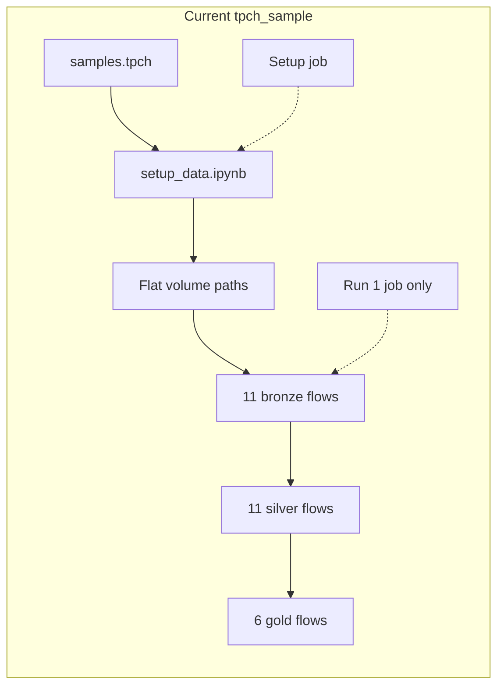
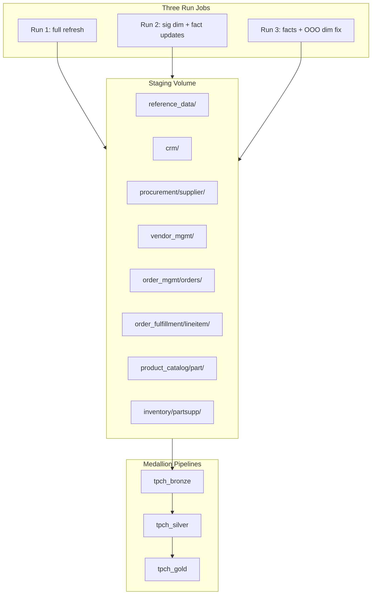
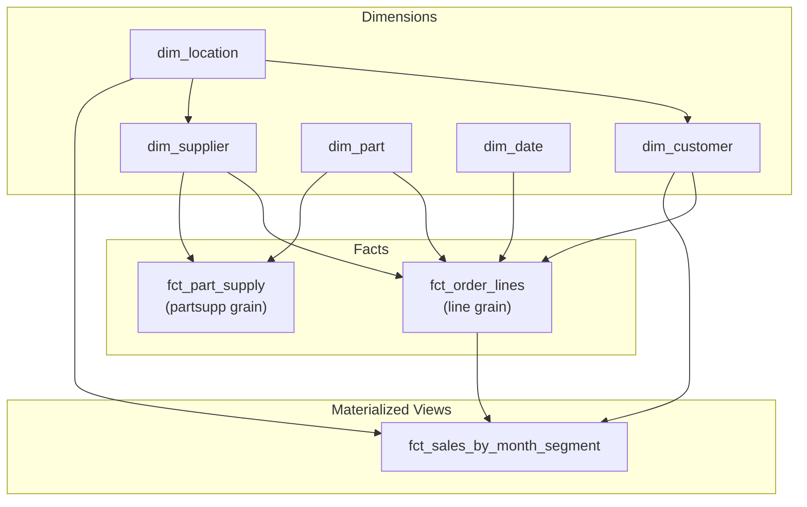
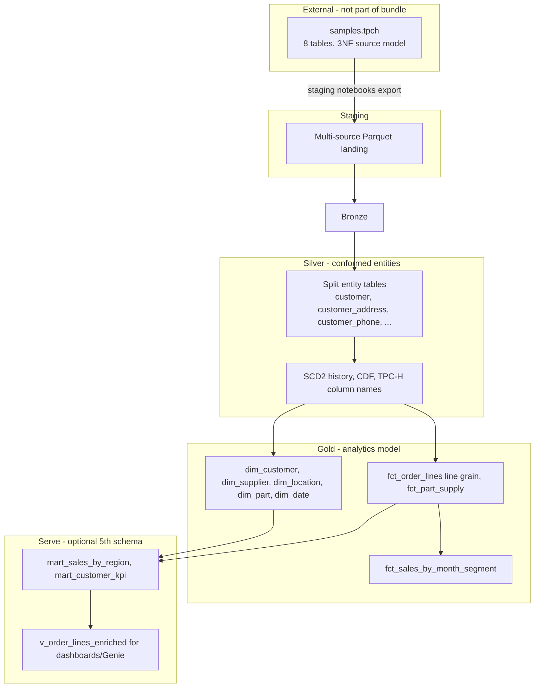

# TPC-H Sample Modernisation Plan

## Goal

Transform [`samples/tpch_sample`](samples/tpch_sample) from an outdated WIP bundle into a production-quality end-to-end medallion reference — aligned with [`samples/pattern-samples`](samples/pattern-samples) conventions, with realistic multi-source staging (Tier 1) and three-run incremental simulation (Tier 2).

**Out of scope for this plan:** Genie room, dashboards, Tier 3 messiness (JSON sources, delete flags, schema drift), adding tpch to main [`deploy.sh`](samples/deploy.sh), silver domain schemas (see Backlog).

## Confirmed decisions (locked)

1. **Single-catalog UC model.** Every layer lives in ONE catalog (default `main`, overridable). Layers/sources are separated by **schema**, named `{schema_namespace}_<layer>[_<source>]{logical_env}` (default `schema_namespace=tpch_sample`). Bronze uses schema-per-source; silver/gold have one conformed schema each. Three-part `targetDetails.database` (`{catalog}.{schema}`) is the mechanism. Wiring mirrors `feature-samples` (catalog + schema vars driven by `deploy_tpch.sh`, user-overridable). *(Earlier revision used catalog-per-layer; reverted to single catalog for simpler governance + alignment with the other samples.)*
2. **Build approach — BIG BANG.** Build the full bundle end-to-end (all bronze/silver/gold flows, notebooks, jobs, plumbing) in one pass; test afterwards. No incremental vertical-slice gating.
3. **`dim_supplier` — real SCD2 dimension built via materialized view.** It IS a genuine SCD2 dim; the MV is just a different SDP product under the hood. The MV must read the **full SCD2 view** of the joined silver feeds and **preserve the `__START_AT` / `__END_AT` temporal columns** — NOT collapse them with `GREATEST`/`LEAST`. Columns must stay and reflect the actual data being read.
4. **Run 3 out-of-order dimension fix — KEEP.** Late-arriving correction with an older `load_timestamp` resolved by `sequence_by`. This is a supported SDP feature.
5. **Data scale — FULL `samples.tpch`** (no down-sampling).

### Design decisions (data model / demo — confirmed)

6. **Facts are append-only.** `orders`, `lineitem`, `partsupp` silver flows become insert/append (NO `scd_type: 2`). Remove fact SCD2 `cdcSettings`. Facts are immutable events.
7. **`acctbal` is Type 1 (current-only).** Remove `c_acctbal` / `s_acctbal` from `track_history_column_list`; keep the column on the dim but do not generate SCD2 versions on balance changes.
8. **Synthetic shred — KEEP, reframe believably.** Retain customer→(customer/customer_address/customer_phone) and supplier→(supplier/supplier_address/supplier_phone) to preserve the multi-source merge demo (`dim_customer` flow spec, `dim_supplier` MV). Ensure source-system framing reads plausibly.
9. **Add `dim_date` to v1.** Promote from backlog. Generated calendar dimension covering TPC-H date range (`orderdate`/`shipdate`/`commitdate`/`receiptdate`). No incremental logic. Facts carry date keys.
10. **`dim_orders` — DROP as a dimension; NO separate order-header fact.** Fold order header attributes (`orderdate`, `orderstatus`, `orderpriority`, `clerk`, `shippriority`, etc.) as **degenerate dimension columns on `fct_order_lines`**. `orders` remains a silver entity (append-only) to source the fact join. **There is intentionally no `fct_orders` (order-header grain):** the gold facts are `fct_order_lines` (line grain) + `fct_part_supply` (part-supplier grain). The order-header measure `o_totalprice` is deliberately **not carried into gold** — it would double-count at line grain and is fully derivable by aggregating `fct_order_lines` (`sum(extended_price * (1 - discount) * (1 + tax))`). *(Revisited and confirmed: keep a single transactional fact; do not add `fct_orders`.)*
11. **Clean business column names in silver.** Drop cryptic TPC-H `c_/s_/l_/o_/p_` prefixes in silver and gold (e.g. `market_segment`, `customer_key`, `account_balance`). (Bronze keeps native/source naming.)
12. **Ingestion — Parquet-everything via cloudFiles, with schema inference + evolution.** Staging lands typed, self-describing **Parquet** files (still split into `initial/` and `incremental/` zones) for the incremental Run 2/3 file-append demo (including fact batches). *(Revised from the earlier CSV-everything choice — see decision 13.)*
13. **Bronze has NO declared schema — Auto Loader infers + evolves it.** All source/target `schemaPath` declarations and `selectExp` projections are removed from the bronze flows. Bronze reads Parquet via `cloudFiles` with `cloudFiles.schemaEvolutionMode: addNewColumns`, letting DLT/Lakeflow infer the schema on first run and automatically pick up new columns as upstream entities evolve — a deliberate **schema-evolution demonstration**. Consequences: bronze is now a faithful raw passthrough (it also carries the `source_system` / `batch_id` / `load_timestamp` metadata columns), and all conforming, renaming, and projection move to silver. This also retires the entire class of CSV positional-mapping / NOT-NULL parse errors, since Parquet is typed and self-describing.

### REVISIT after initial build + test (flagged, not changed now)

- **R1 — Single vs double historization.** Currently SCD2 in BOTH silver and gold dims. Keep for v1; revisit collapsing to historize-once (SCD2 masters in silver, gold dims carry-through) once the pipeline runs end-to-end.
- **R2 — Surrogate keys / point-in-time. DONE.** Dimensions now carry `xxhash64` surrogate keys (`customer_sk`, `supplier_sk`, `part_sk`, `location_sk`) alongside the retained natural keys. `fct_order_lines` resolves customer and supplier **as-of `order_date`** (range join on the SCD2 window) and part at current version. To make business-time PIT possible (TPC-H order dates are 1992-1998 but processing time is "now"), the customer/supplier SCD2 feeds `sequence_by` a synthetic business **`effective_date`** (1992 baseline; 1996 + 1997 updates; 1994 backdated correction). The Run-3 out-of-order demo is recast as a **backdated business correction** (effective 1994, arrives in Run 3). `dim_customer` also aligns its composite sources with as-of joins so each version reflects the correct address/segment/phone.
- **R3 — Bronze as a template spec. DONE.** The 12 near-identical bronze flows are collapsed into one template definition (`src/templates/bronze_parquet_ingestion_template.json`) + one usage spec (`bronze/dataflowspec/bronze_ingestion_main.json`) with a six-key parameter set per table (`dataFlowId`, `sourceSystem`, `sourceViewName`, `path`, `database`, `table`). The framework expands these into 12 concrete specs at init. The unused leftover `bronze/schemas/{source,target}` and `bronze/expectations` dirs (dead since the schema-on-read pivot) were removed.
- **R4 — Silver as template specs (by archetype). DONE.** Silver mixes structural shapes (SCD2 dims with a `cdcSettings` merge block, SCD1 reference data, and append-only facts without one); with no conditional logic in templates, this needs three templates: `silver_scd2_template` (6 historized dims) + `silver_scd1_template` (`nation`, `region`) + `silver_append_template` (`lineitem`, `partsupp`). Per-table bespoke logic (`selectExp`, `keys`, `sequenceBy`, `exceptColumnList`, `trackHistoryColumnList` for SCD2) becomes list/string params. The two DQ-demo tables (`customer_address`, `orders`) stay standalone so the quarantine wiring reads in full.
- **R5 — Right-size SCD2 vs SCD1. DONE.** `nation` and `region` (static reference data that never changes and is only ever read at current version in gold) were converted from SCD2 to SCD1. The gold dims (`dim_supplier`, `dim_customer`, `dim_location`) dropped their now-redundant `nation`/`region` `__END_AT IS NULL` predicates. Remaining inert-but-SCD2 tables (`part`, `customer_phone`, `supplier_address`, `supplier_phone`) were left as SCD2 deliberately — `customer_phone` is consumed via an as-of join in the composite `dim_customer`, and the others keep the pattern visible.

---

## Current State Summary



**Known bugs to fix:**
- Nation written to `nation1/` but bronze expects `nation/*.csv`
- Supplier phone glob: `supplier_phone*.csv` (missing `/`)
- Pipeline targets use `${var.bronze_schema}${var.logical_env}` — double `{logical_env}` suffix
- [`deploy_tpch.sh`](samples/deploy_tpch.sh) does not export `BUNDLE_VAR_bronze_schema` etc. (unlike [`deploy_pattern_samples.sh`](samples/deploy_pattern_samples.sh))
- [`databricks.yml`](samples/tpch_sample/databricks.yml) missing layer schema variables
- `partsupp` staged but no bronze/silver pipeline
- Junk: `customer_schema copy 2.json`, broken [`tests/main_test.py`](samples/tpch_sample/tests/main_test.py)

---

## Target Architecture



## UC Naming Model (decided)

**Single catalog, schema-per-layer.** Everything is deployed into ONE catalog (default `main`, overridable via `--catalog`). Each medallion layer — and each bronze source system — is a **schema** within that catalog. Tables keep native entity names.

**Schema naming pattern** (from `deploy_tpch.sh` + `schema_namespace` + `logical_env`):

```
{schema_namespace}_<layer>[_<source>]{logical_env}
```

`schema_namespace` defaults to `tpch_sample` (suggested by the deploy script, user-overridable). The redundant sub-schema is dropped for staging/silver/gold (each has exactly one schema); bronze keeps the per-source suffix.

Default example with `catalog=main`, `schema_namespace=tpch_sample`, `logical_env=_es`:

| Layer | Catalog | Schema(s) | Example table |
|-------|---------|-----------|---------------|
| Staging | `main` | `tpch_sample_staging_es` | (volume: `stg_volume`) |
| Bronze | `main` | `tpch_sample_bronze_<source>_es` | `tpch_sample_bronze_crm_es`.`customer` |
| Silver | `main` | `tpch_sample_silver_es` | `tpch_sample_silver_es`.`customer` |
| Gold | `main` | `tpch_sample_gold_es` | `tpch_sample_gold_es`.`dim_customer` |

**Bronze three-part names:**

```
main.tpch_sample_bronze_crm_es.customer
main.tpch_sample_bronze_crm_es.customer_address
main.tpch_sample_bronze_crm_es.customer_phone
main.tpch_sample_bronze_order_mgmt_es.orders
main.tpch_sample_bronze_reference_data_es.region
main.tpch_sample_bronze_vendor_mgmt_es.supplier_address
main.tpch_sample_bronze_vendor_mgmt_es.supplier_phone
```

**Day 1 infrastructure:** Dedicated setup notebook + job — **separate from pipeline processing** so demos can skip schema/staging load time. The target catalog is assumed to exist (not created by the bundle).

**Re-run behaviour:** Runs 2–3 do **not** recreate schemas. Setup job is idempotent if re-run manually.

**Deploy script drives names:** [`deploy_tpch.sh`](samples/deploy_tpch.sh) exports `catalog` + per-pipeline `*_schema` bundle vars and updates substitutions — same mechanism as [`deploy_feature_samples.sh`](samples/deploy_feature_samples.sh), producing schemas under a single catalog. Both `--catalog` and `--schema_namespace` are user-overridable.

---

## Phase 1: Bundle Restructure & Deployment

**Objective:** Restructure the bundle; fix deployment; implement the single-catalog UC model.

### 1.1 Bundle configuration

Rewrite [`samples/tpch_sample/databricks.yml`](samples/tpch_sample/databricks.yml):
- Variables: `catalog` (default `main`), `schema_namespace` (default `tpch_sample`), `bronze_schema` / `silver_schema` / `gold_schema` (per-pipeline default schemas), `framework_source_path`, `workspace_host`, `logical_env`, `pipeline_cluster_config`, `job_cluster_name`, `job_cluster_config`
- Single `catalog` shared by all pipelines; layers separated by schema
- Set `name: tpch_samples`

Update [`samples/deploy_tpch.sh`](samples/deploy_tpch.sh) — **single catalog**, mirroring [`deploy_feature_samples.sh`](samples/deploy_feature_samples.sh):

```bash
# tpch-specific default namespace, applied before prompt; --schema_namespace overrides it
schema_namespace="${schema_namespace:-tpch_sample}"
setup_bundle_env "$BUNDLE_NAME"   # exports BUNDLE_VAR_catalog, schema_namespace, logical_env, ...
export BUNDLE_VAR_bronze_schema="${schema_namespace}_bronze_reference_data${logical_env}"
export BUNDLE_VAR_silver_schema="${schema_namespace}_silver${logical_env}"
export BUNDLE_VAR_gold_schema="${schema_namespace}_gold${logical_env}"
```

- Default `schema_namespace` is `tpch_sample` (suggested default, user-overridable via `--schema_namespace`)
- `--catalog` selects the single target catalog (default `main`)
- [`common.sh`](samples/common.sh) `update_tpch_substitutions_file` rewrites the catalog (`main.`) and namespace (`tpch_sample`) prefixes in the substitutions tokens when non-default values are supplied

Update pipeline YAML (single catalog, per-pipeline schema var):

```yaml
# bronze pipeline
catalog: ${var.catalog}
schema: ${var.bronze_schema}   # default schema (publishing mode requires one); every flow overrides via targetDetails.database
configuration:
  pipeline.dataFlowGroupFilter: tpch_bronze

# silver pipeline
catalog: ${var.catalog}
schema: ${var.silver_schema}
configuration:
  pipeline.dataFlowGroupFilter: tpch_silver

# gold pipeline
catalog: ${var.catalog}
schema: ${var.gold_schema}
configuration:
  pipeline.dataFlowGroupFilter: tpch_gold
```

### 1.2 Resource layout restructure

Move from flat files to subfolder layout matching pattern-samples:

```
resources/{classic,serverless}/
├── pipelines/
│   ├── tpch_bronze_pipeline.yml
│   ├── tpch_silver_pipeline.yml
│   └── tpch_gold_pipeline.yml
└── jobs/
```
resources/{classic,serverless}/jobs/
├── tpch_samples_setup_job.yml          # NEW — setup only (skippable in demos)
├── tpch_samples_run_1_job.yml          # bronze → silver → gold (processing only)
├── tpch_samples_run_2_job.yml
└── tpch_samples_run_3_job.yml
```

Pipeline YAML fixes:
- Set `catalog: ${var.catalog}` on every pipeline; set `schema: ${var.bronze_schema}` / `${var.silver_schema}` / `${var.gold_schema}` per pipeline
- The pipeline `schema` is only a publishing-mode default — every flow overrides via `targetDetails.database` (three-part `catalog.schema.table` tokens)
- Add `root_path: ${workspace.file_path}/src`

Delete old files: `orchestrator_setup_staging_data.yml`, `orchestrator_run_1.yml`, flat `*_pipeline.yml`.

### 1.3 Substitutions alignment

Standardise [`samples/tpch_sample/src/pipeline_configs/dev_substitutions.json`](samples/tpch_sample/src/pipeline_configs/dev_substitutions.json):

```json
{
  "tokens": {
    "staging_schema":                  "main.tpch_sample_staging{logical_env}",
    "silver_schema":                   "main.tpch_sample_silver{logical_env}",
    "gold_schema":                     "main.tpch_sample_gold{logical_env}",
    "staging_volume":                  "stg_volume",
    "sample_file_location":            "/Volumes/main/tpch_sample_staging{logical_env}/stg_volume",
    "bronze_reference_data_schema":    "main.tpch_sample_bronze_reference_data{logical_env}",
    "bronze_crm_schema":               "main.tpch_sample_bronze_crm{logical_env}",
    "bronze_procurement_schema":       "main.tpch_sample_bronze_procurement{logical_env}",
    "bronze_vendor_mgmt_schema":       "main.tpch_sample_bronze_vendor_mgmt{logical_env}",
    "bronze_order_mgmt_schema":        "main.tpch_sample_bronze_order_mgmt{logical_env}",
    "bronze_order_fulfillment_schema": "main.tpch_sample_bronze_order_fulfillment{logical_env}",
    "bronze_product_catalog_schema":   "main.tpch_sample_bronze_product_catalog{logical_env}",
    "bronze_inventory_schema":         "main.tpch_sample_bronze_inventory{logical_env}"
  }
}
```

Tokens are `catalog.schema` two-part prefixes (the dataflow appends `.table` for a three-part `database` field). The `main.` catalog prefix and `tpch_sample` namespace prefix are rewritten by `update_tpch_substitutions_file` when non-default `--catalog` / `--schema_namespace` are passed. Schemas created by the **setup job** (not the Run 1 processing job); the catalog is assumed to exist.

**Compute (decided):** **Serverless** default (`-c 1` / serverless resource tree). Classic resource tree maintained for parity but not the primary demo path.

### 1.4 Notebook relocation

Move from [`src/test_data/`](samples/tpch_sample/src/test_data/) to [`src/notebooks/`](samples/pattern-samples/src/notebooks/):

| Notebook | Purpose | Job |
|----------|---------|-----|
| `initialize.ipynb` | Widgets: `catalog`, `schema_namespace`, `logical_env`; derives all schema names | (imported via `%run`) |
| **`setup_catalogs_and_staging.ipynb`** | **Part 1:** idempotent CREATE SCHEMA/VOLUME (catalog assumed to exist). **Part 2:** full initial staging load — dims, partsupp, customer*, supplier*, **orders, lineitem** | **`tpch_samples_setup_job`** only |
| `run_2_staging_load.ipynb`, `run_3_staging_load.ipynb` | Incremental staging loads (write to `incremental/` zone) | Runs 2–3 jobs (first task) |
| `reset_to_day1.ipynb` | Clears the `incremental/` zone (keeps `initial/`) for a clean day-1 full refresh | (manual) |

**Demo pattern:** Run `tpch_samples_setup_job` once (or pre-provision). Demo Run 1 job starts at bronze — no catalog/staging wait time on stage.

Delete `create_schemas_and_tables.ipynb` as a separate notebook — merged into `setup_catalogs_and_staging.ipynb`.

Delete `src/test_data/` after migration.

### 1.5 Cleanup

Remove:
- [`customer_schema copy 2.json`](samples/tpch_sample/src/dataflows/bronze/schemas/target/customer_schema copy 2.json)
- [`tests/main_test.py`](samples/tpch_sample/tests/main_test.py), `pytest.ini`, `fixtures/`, `.vscode/settings.json`

---

## Phase 2: Tier 1 — Multi-Source Landing Layout

**Objective:** Simulate distinct upstream systems with separate volume paths; update bronze specs accordingly.

### 2.1 Volume layout

Under `{sample_file_location}/sources/`, each entity has an **`initial/`** zone (day-1 baseline) and an **`incremental/`** zone (day-2/3 batches). Bronze Auto Loader reads the entity dir recursively (`cloudFiles.format: parquet`, `pathGlobFilter: *.parquet`), so it picks up both zones:

```
sources/{system}/{entity}/initial/{entity}_<yyyymmddHHMMSS>.parquet       <- setup (batch 1)
sources/{system}/{entity}/incremental/{entity}_<yyyymmddHHMMSS>.parquet   <- run 2 / run 3
```

| Path | Source system (bronze schema) | TPC-H source |
|------|------------------------------|--------------|
| `reference_data/region/` | `reference_data` | `region` |
| `reference_data/nation/` | `reference_data` | `nation` |
| `crm/customer/` | `crm` | `customer` (core cols) |
| `crm/customer_address/` | `crm` | `customer` (address cols) |
| `crm/customer_phone/` | `crm` | `customer` (phone cols) |
| `procurement/supplier/` | `procurement` | `supplier` (core cols) |
| `vendor_mgmt/supplier_address/` | `vendor_mgmt` | `supplier` (address cols) |
| `vendor_mgmt/supplier_phone/` | `vendor_mgmt` | `supplier` (phone cols) |
| `order_mgmt/orders/` | `order_mgmt` | `orders` |
| `order_fulfillment/lineitem/` | `order_fulfillment` | `lineitem` |
| `product_catalog/part/` | `product_catalog` | `part` |
| `inventory/partsupp/` | `inventory` | `partsupp` |

### 2.2 Staging conventions (in `initialize.ipynb`)

- Landing-zone helper `write_landing(df, system, entity, zone, load_ts)` writes one timestamped Parquet `{entity}_<yyyymmddHHMMSS>.parquet` per batch (via `coalesce(1)` + rename) into the `initial`/`incremental` zone. Parquet is typed/self-describing, so bronze can infer + evolve the schema without any declared source schema.
- Filename timestamp = the batch `load_ts`, so the filename aligns with the data's `load_timestamp` column. (The Run-3 out-of-order file lands with a *current* filename timestamp but carries an *older* `load_timestamp` — a realistic late correction.)
- Metadata columns on every export: `source_system`, `batch_id`, `load_timestamp`.
- **Reset to day 1:** `reset_incremental()` (or the `reset_to_day1` notebook) deletes every `incremental/` folder, leaving `initial/` intact. Then run **1 - Run 1 - Full Refresh** to reprocess the day-1 baseline only — no need to re-stage the initial sample. The setup job (which clears `sources/` entirely) is only needed for a from-scratch rebuild.

### 2.3 Bronze layer — single catalog, schema-per-source, schema-on-read (decided)

**Principle:** Each bronze source system is its own **schema** in the single catalog, named `{schema_namespace}_bronze_<source>{logical_env}` (e.g. `tpch_sample_bronze_crm`). Tables keep native entity names.

**Schema-on-read (no declared schema):** Bronze flows declare **no** `schemaPath` (source or target) and **no** `selectExp`. Auto Loader infers the schema from the Parquet footer on first run and evolves it (`cloudFiles.schemaEvolutionMode: addNewColumns`) as upstream columns appear. The `src/dataflows/bronze/schemas/` directory (source + target schema JSONs) has been removed. Bronze is a raw passthrough — every staged column (including `source_system`, `batch_id`, `load_timestamp`) flows through untouched; conforming/renaming/projection happens in silver.

#### Bronze source system naming (decided)

8 source systems (schemas), 12 bronze flows. Renamed from original WIP names for demo clarity. All customer entities share **`crm`**; supplier address + phone share **`vendor_mgmt`**.

| Source system | Replaces | Tables in schema |
|---------------|----------|------------------|
| `reference_data` | `ref_data_hub` | `region`, `nation` |
| `crm` | `crm` + `mdm` + `contact_center` | `customer`, `customer_address`, `customer_phone` |
| `procurement` | *(unchanged)* | `supplier` |
| `vendor_mgmt` | `logistics` + `telecom` | `supplier_address`, `supplier_phone` |
| `order_mgmt` | `erp_orders` | `orders` |
| `order_fulfillment` | `erp_fulfillment` | `lineitem` |
| `product_catalog` | `pim` | `part` |
| `inventory` | *(unchanged)* | `partsupp` |

**Orders naming (decided):** Keep vendor-neutral **`order_mgmt`** / **`order_fulfillment`**. Evaluated against SAP (**SD** + **LE**) and Workday (**Revenue Management**); neutral names are clearer for a cross-ERP demo sample.

**Domain grouping for demos:**

- Customer: all under `crm` (3 tables, split exports)
- Supplier: `procurement` → `vendor_mgmt` (address + phone)
- Orders: `order_mgmt` → `order_fulfillment`
- Product: `product_catalog` → `inventory`
- Reference: `reference_data`

**UC layout after Run 1:**

```
main.tpch_sample_bronze_reference_data_es.region
main.tpch_sample_bronze_reference_data_es.nation
main.tpch_sample_bronze_crm_es.customer
main.tpch_sample_bronze_crm_es.customer_address
main.tpch_sample_bronze_crm_es.customer_phone
main.tpch_sample_bronze_procurement_es.supplier
main.tpch_sample_bronze_vendor_mgmt_es.supplier_address
main.tpch_sample_bronze_vendor_mgmt_es.supplier_phone
main.tpch_sample_bronze_order_mgmt_es.orders
main.tpch_sample_bronze_order_fulfillment_es.lineitem
main.tpch_sample_bronze_product_catalog_es.part
main.tpch_sample_bronze_inventory_es.partsupp
```

**Source → bronze schema → table (12 flows, 8 schemas):**

| sourceSystem | Bronze schema (`tpch_sample_bronze_<this>`) | Table | Staging path |
|--------------|-------------------------------|-------|--------------|
| `reference_data` | `reference_data` | `region` | `sources/reference_data/region/` |
| `reference_data` | `reference_data` | `nation` | `sources/reference_data/nation/` |
| `crm` | `crm` | `customer` | `sources/crm/customer/` |
| `crm` | `crm` | `customer_address` | `sources/crm/customer_address/` |
| `crm` | `crm` | `customer_phone` | `sources/crm/customer_phone/` |
| `procurement` | `procurement` | `supplier` | `sources/procurement/supplier/` |
| `vendor_mgmt` | `vendor_mgmt` | `supplier_address` | `sources/vendor_mgmt/supplier_address/` |
| `vendor_mgmt` | `vendor_mgmt` | `supplier_phone` | `sources/vendor_mgmt/supplier_phone/` |
| `order_mgmt` | `order_mgmt` | `orders` | `sources/order_mgmt/orders/` |
| `order_fulfillment` | `order_fulfillment` | `lineitem` | `sources/order_fulfillment/lineitem/` |
| `product_catalog` | `product_catalog` | `part` | `sources/product_catalog/part/` |
| `inventory` | `inventory` | `partsupp` | `sources/inventory/partsupp/` |

**Example spec** (`crm/customer_main.json`):

```json
{
  "dataFlowId": "crm_customer_bronze",
  "dataFlowGroup": "tpch_bronze",
  "sourceSystem": "crm",
  "sourceType": "cloudFiles",
  "mode": "stream",
  "sourceDetails": {
    "path": "{sample_file_location}/sources/crm/customer/",
    "readerOptions": {
      "cloudFiles.format": "parquet",
      "cloudFiles.schemaEvolutionMode": "addNewColumns",
      "pathGlobFilter": "*.parquet"
    }
  },
  "targetFormat": "delta",
  "targetDetails": {
    "database": "{bronze_crm_schema}",
    "table": "customer",
    "tableProperties": { "delta.enableChangeDataFeed": "true" }
  }
}
```

No `schemaPath` / `selectExp` — schema is inferred and evolved at read time.

Where `bronze_crm_schema` = `main.tpch_sample_bronze_crm{logical_env}`.

**Silver/gold** use their own conformed schemas in the same catalog:

```
main.tpch_sample_silver_es.customer
main.tpch_sample_gold_es.dim_customer
```

**Pipeline:** Single `tpch_bronze` pipeline with `catalog: ${var.catalog}` and `schema: ${var.bronze_schema}`; each flow sets `targetDetails.database` to its `{bronze_<source>_schema}` token.

**Silver reads cross-schema within the catalog:**

| Silver table | Bronze source |
|--------------|---------------|
| `customer` | `{bronze_crm_schema}.customer` |
| `customer_address` | `{bronze_crm_schema}.customer_address` |
| `customer_phone` | `{bronze_crm_schema}.customer_phone` |
| `supplier_address` | `{bronze_vendor_mgmt_schema}.supplier_address` |
| `supplier_phone` | `{bronze_vendor_mgmt_schema}.supplier_phone` |
| `orders` | `{bronze_order_mgmt_schema}.orders` |

**Prerequisite:** `tpch_samples_setup_job` must run before Run 1 processing — creates source schemas + volume + initial staging data. Requires `CREATE SCHEMA` privilege on the target catalog (the catalog itself is assumed to exist).

### 2.4 Silver layer design (fresh — ignore existing specs)

**Role of silver:** Conform, cleanse, and **historize** each entity — one silver table per business entity, reading 1:1 from its bronze source. **Do not merge** customer slices here; that is gold's job (`dim_customer`).

**Schema:** `{schema_namespace}_silver{logical_env}` (e.g. `tpch_sample_silver_es`)

#### Schema layout — **decided: Option A (single conformed schema)**

Single conformed silver schema in the catalog. All 12 entity tables live here.

```
main.tpch_sample_silver_es.customer
main.tpch_sample_silver_es.orders
main.tpch_sample_silver_es.partsupp
```

**Why this choice:** Simplest pipeline config (one `schema: ${var.silver_schema}`), minimal Day 1 DDL, mirrors the gold schema layout (`tpch_sample_gold_es.*`).

**Backlog (revisit after end-to-end working):** Evaluate **domain schemas** (Option B: `customer.*`, `supplier.*`, `reference.*`, `orders.*`, `product.*`) for improved UC browsing and domain-oriented access control. Do not implement until bronze → silver → gold runs reliably.

~~Schema layout options~~ (reference only):

| Option | Silver UC example | Status |
|--------|-------------------|--------|
| **A. Single schema `tpch`** | `silver_es.tpch.customer` | **Selected** |
| B. Domain schemas (5) | `silver_es.customer.customer` | Backlog |
| C. Domain schemas (3) | `silver_es.party.customer` | Backlog |
| D. Mirror bronze sources | `silver_es.crm.customer` | Not recommended |

#### Silver entity model (12 tables, 1:1 from bronze)

Each flow: bronze CDF stream → silver table with **clean business column names** (no `c_`/`s_`/`l_`/`o_`/`p_` prefixes). Dimensions are SCD2; facts are append-only.

| Silver table | Reads from (bronze) | Business key | Historization |
|--------------|----------------------|--------------|---------------|
| `customer` | `{bronze_crm_schema}.customer` | `customer_key` | SCD2 tracks `customer_name`, `market_segment` (`account_balance` = Type 1, untracked) |
| `customer_address` | `{bronze_crm_schema}.customer_address` | `customer_key` | SCD2 tracks `address`, `nation_key` |
| `customer_phone` | `{bronze_crm_schema}.customer_phone` | `customer_key` | SCD2 tracks `phone` |
| `supplier` | `{bronze_procurement_schema}.supplier` | `supplier_key` | SCD2 tracks `supplier_name`, `comment` (`account_balance` = Type 1, untracked) |
| `supplier_address` | `{bronze_vendor_mgmt_schema}.supplier_address` | `supplier_key` | SCD2 tracks `address`, `nation_key` |
| `supplier_phone` | `{bronze_vendor_mgmt_schema}.supplier_phone` | `supplier_key` | SCD2 tracks `phone` |
| `region` | `{bronze_reference_data_schema}.region` | `region_key` | SCD2 tracks `region_name` |
| `nation` | `{bronze_reference_data_schema}.nation` | `nation_key` | SCD2 tracks `nation_name`, `region_key` |
| `orders` | `{bronze_order_mgmt_schema}.orders` | `order_key` | **Append-only** (immutable order events) |
| `lineitem` | `{bronze_order_fulfillment_schema}.lineitem` | `order_key`, `line_number` | **Append-only** (immutable line events) |
| `part` | `{bronze_product_catalog_schema}.part` | `part_key` | SCD2 (all part attrs) |
| `partsupp` | `{bronze_inventory_schema}.partsupp` | `part_key`, `supplier_key` | **Append-only** (supply snapshot) |

**Dataflow type:** Dimensions use standard streaming flows with `cdcSettings` (SCD2). Facts (`orders`, `lineitem`, `partsupp`) are append-only streaming inserts — **no `cdcSettings`**. Silver is entity conformance, not multi-source merge.

**dataFlowGroup:** `tpch_silver` (single group, single pipeline)

#### Column conventions

- **Clean business names** at silver (`customer_id` → `customer_key`, `mktseg` → `market_segment`, `acctbal` → `account_balance`, etc.) — bronze keeps source-friendly names; silver is the conformed enterprise model with no cryptic `c_`/`s_`/`l_`/`o_`/`p_` prefixes
- **`sequence_by`:** `load_timestamp` from staging (controlled per run for Runs 2–3)
- **Drop** staging metadata cols (`source_system`, `batch_id`) or move to operational metadata struct
- **Enable CDF** on all silver targets (required for gold flows)

#### Optional reconciliation views (high demo value)

SQL views in silver catalog proving pipeline fidelity vs `samples.tpch`:

```sql
-- silver_es.tpch.v_customer_tpch_shape
-- clean silver columns, aliased back to TPC-H names for side-by-side reconciliation
SELECT c.customer_key   AS c_custkey,
       c.customer_name  AS c_name,
       ca.address       AS c_address,
       ca.nation_key    AS c_nationkey,
       cp.phone         AS c_phone,
       c.account_balance AS c_acctbal,
       c.market_segment AS c_mktsegment
FROM tpch.customer c
JOIN tpch.customer_address ca ON c.customer_key = ca.customer_key
JOIN tpch.customer_phone cp   ON c.customer_key = cp.customer_key
WHERE c.__END_AT IS NULL AND ca.__END_AT IS NULL ...
```

Side-by-side with `samples.tpch.customer` validates the deconstruct → reconstruct journey.

#### Incremental behaviour (Runs 2–3)

| Run | Silver impact |
|-----|---------------|
| **Run 1** | Full refresh; initial SCD2 current records; complete gold baseline |
| **Run 2** | **Focused dim updates (1–2 customers + suppliers in one region) + significant fact append** — SCD2 on a handful of keys; large order/lineitem batch |
| **Run 3** | **Facts only + out-of-order dim fix** — more orders/lineitems; one dimension correction with **older `load_timestamp`** than Run 2 to exercise `sequence_by` / SCD2 ordering |

Runs 2–3 are where silver proves its value — historized entity changes and incremental facts feeding gold dim/fact refreshes.

#### What silver deliberately does NOT do

- Merge customer + address + phone into one table (gold `dim_customer`)
- Build star schema or aggregates (gold)
- Mirror `samples.tpch` denormalized layout as tables (optional view only)
- Retain source-system schema names (that is bronze)

#### Pipeline config

```yaml
# tpch_silver_pipeline.yml
catalog: ${var.catalog}
schema: ${var.silver_schema}
pipeline.dataFlowGroupFilter: tpch_silver
```

#### Repo structure

```
src/dataflows/tpch_samples/silver/
├── dataflowspec/
│   ├── customer_main.json
│   ├── customer_address_main.json
│   ├── orders_main.json
│   ├── partsupp_main.json
│   └── ...
├── schemas/
└── dml/
    └── v_customer_tpch_shape.sql   # optional reconciliation view
```

### 2.5 Bronze spec updates (mechanical)

- Restructure specs by source-system subfolder
- 12 flows with per-source `targetDetails.database` + native `table` names
- Update silver specs to reference `{bronze_{source}_schema}.{table}`
- Fix supplier_phone path bug

---

## Phase 3: Tier 2 — Three-Run Incremental Loads

**Objective:** Exercise incremental pipeline mode (`full_refresh: false`), SCD2 historization, fact growth, and out-of-order dimension correction.

### 3.1 Run schedule (decided — 3 processing runs)

| Run | Staging notebook | Job | Data landed | Pipeline mode | Demo story |
|-----|------------------|-----|-------------|---------------|------------|
| **Setup** | `setup_catalogs_and_staging` | `tpch_samples_setup_job` | CREATE schemas + volume (single catalog) + **full initial staging** (all entities) | N/A | One-time provisioning; skippable in demos |
| **Run 1** | — | `tpch_samples_run_1_job` | *(assumes setup done)* | bronze → silver → gold `full_refresh: true` | **Day 1:** complete star schema — all dims, facts, MVs populated |
| **Run 2** | `run_2_staging_load` | `tpch_samples_run_2_job` | **Focused dim + significant facts** (see §3.4) | `full_refresh: false` | **Day 2:** traceable SCD2 on named keys in one region; large fact/MV jump |
| **Run 3** | `run_3_staging_load` | `tpch_samples_run_3_job` | **Facts + out-of-order dim fix** (see §3.5) | `full_refresh: false` | **Day 3:** more sales activity; late correction with older timestamp |

- Setup job clears `sources/` root and loads initial staging data; idempotent schema/volume DDL with graceful error handling
- Runs 2–3 **append** staging Parquet files only; use controlled `batch_id` and `load_timestamp` values defined in `initialize.ipynb`
- **Run 4 eliminated** — original date-split order loads and separate dim-only run merged into Runs 2–3

### 3.2 Orchestration jobs

**Setup job** (`tpch_samples_setup_job.yml`) — **run separately, exclude from demos:**

```
setup_catalogs_and_staging
```

Display name: `Lakeflow Framework - TPCH Samples - Setup Catalogs and Staging (${var.logical_env})`

**Run 1** (`tpch_samples_run_1_job.yml`) — **processing only, demo entry point:**

```
bronze → silver → gold
(all full_refresh: true, queue enabled)
```

No setup task — assumes catalogs, schemas, volume, and full initial staging data already exist.

**Runs 2–3:**

```
run_N_staging_load → bronze → silver → gold
(all full_refresh: false, queue enabled)
```

Job display names: `Lakeflow Framework - TPCH Samples - Run N - ... (${var.logical_env})`

### 3.3 Setup notebook structure (`setup_catalogs_and_staging.ipynb`)

**Part 1 — Infrastructure (idempotent):**
- All DDL uses `IF NOT EXISTS`
- Wrap each create in try/except; log OK / SKIP (exists) / PERMISSION ERROR
- Do not fail on "already exists"; fail clearly on missing `CREATE SCHEMA` privilege on the catalog

**Part 2 — Initial staging load:**
- `%run "./initialize"` then load **full initial dataset** to volume paths: reference, customer*, supplier*, part, partsupp, orders, lineitem
- Set `batch_id = 1`, `load_timestamp = T1` (Run 1 baseline timestamp) on all exports
- **Run 1 gold validation:** after setup + Run 1 job, all gold objects (dims, facts, MVs) must be populated

### 3.4 Run 2 staging — focused dim updates + significant facts (`run_2_staging_load.ipynb`)

**Timestamp:** `load_timestamp = T2` where `T2 > T1`

**Demo cohort (decided):** Select **one region** (e.g. `EUROPE` → `GERMANY`, or `AMERICA` → `UNITED STATES`) and fix **1–2 customer keys** + **1–2 supplier keys** in that region at notebook init time. Store chosen keys in `initialize.ipynb` as `RUN2_DEMO_CUSTOMER_KEYS`, `RUN2_DEMO_SUPPLIER_KEYS`, `RUN2_DEMO_NATION_KEY`, `RUN2_DEMO_REGION_NAME` for repeatable demos and doc examples.

**Dimension updates (small, traceable — only the demo cohort):**

| Entity | Source path | Changes |
|--------|-------------|---------|
| `crm.customer` | `crm/customer/` | **1–2 customers:** `mktsegment` change (e.g. `AUTOMOBILE` → `BUILDING`) |
| `crm.customer_address` | `crm/customer_address/` | Same keys: address update; `c_nationkey` stays in demo region |
| `crm.customer_phone` | `crm/customer_phone/` | Same keys: phone update |
| `procurement.supplier` | `procurement/supplier/` | **1–2 suppliers** in same region: name/comment change |
| `vendor_mgmt.supplier_address` | `vendor_mgmt/supplier_address/` | Same supplier keys: address update |

**Fact updates (significant — the main Run 2 volume story):**

| Entity | Source path | Changes |
|--------|-------------|---------|
| `order_mgmt.orders` | `order_mgmt/orders/` | **Large append batch** — e.g. all orders for demo customers **plus** additional orders in demo nation/region (~15–25% of total order count, or all orders in a multi-year date window for that region) |
| `order_fulfillment.lineitem` | `order_fulfillment/lineitem/` | All lineitems for appended orders (full join to order batch) |

**Selection logic (in notebook):**
```sql
-- Pick demo customers/suppliers from a single nation (example)
SELECT c_custkey FROM samples.tpch.customer c
JOIN samples.tpch.nation n ON c.c_nationkey = n.n_nationkey
JOIN samples.tpch.region r ON n.n_regionkey = r.r_regionkey
WHERE r.r_name = '{RUN2_DEMO_REGION_NAME}' LIMIT 2

-- Significant orders: all orders for demo customers + regional slice
SELECT o.* FROM samples.tpch.orders o
WHERE o.c_custkey IN ({demo_customer_keys})
   OR o.c_custkey IN (SELECT c_custkey FROM ... WHERE region = demo region)
```

**Expected pipeline impact:**
- Silver: **2–4 SCD2 version rows** easy to inspect in UI (not thousands); clear before/after on named customers/suppliers
- Gold: `dim_customer` / `dim_supplier` show targeted changes; **`fct_order_lines` grows significantly**; `fct_sales_by_month_segment` shows a **large revenue jump** for the demo region/segment — the primary Run 2 dashboard story

### 3.5 Run 3 staging — facts + supplier update + backdated correction (`run_3_staging_load.ipynb`)

**Implemented design (business-effective dates):** all SCD2 sequencing for customer/supplier is on a synthetic business `effective_date`, not processing time. Run 3 carries a forward supplier update **and** a backdated customer correction.

**Fact updates (primary load):**

| Entity | Source path | Changes |
|--------|-------------|---------|
| `order_mgmt.orders` | `order_mgmt/orders/` | Append another order batch (`load_timestamp = T3`) |
| `order_fulfillment.lineitem` | `order_fulfillment/lineitem/` | Matching lineitems (`load_timestamp = T3`) |

**Dimension changes:**

| Entity | Source path | Changes |
|--------|-------------|---------|
| `procurement.supplier` | `procurement/supplier/` | Rename suppliers 1–2 again, **`effective_date = 1997-01-01`** — a forward SCD2 version (multi-version history across 1996 + 1997) |
| `crm.customer_address` | `crm/customer_address/` | Backdated correction for customer 1, **`effective_date = 1994-01-01`** — arrives in Run 3 but is effective *before* the Run 2 (1996) update |

**Expected pipeline impact:**
- Silver: `sequence_by: effective_date` slots the backdated correction (1994) between the 1992 baseline and the 1996 update while 1996 stays current; supplier gets a 1997 version.
- Gold: `fct_order_lines` grows further; surrogate keys resolve point-in-time so orders in 1994/1996/1997 carry different `customer_sk`/`supplier_sk`; MV revenue continues to increase.
- **Demo talking point:** backdated/out-of-order source corrections are common in real integrations, and as-of joins give true point-in-time analysis.

### 3.6 Timestamp constants (in `initialize.ipynb`)

```python
T1 = ...  # Run 1 baseline (setup)
T2 = T1 + timedelta(days=1)       # Run 2
T_OOO = T1 + timedelta(hours=12)  # Run 3 OOO dim fix (between T1 and T2)
T3 = T2 + timedelta(days=1)       # Run 3 facts
```

All staging exports include `source_system`, `batch_id`, `load_timestamp` metadata columns.

---

## Gold Layer Design (fresh — ignore existing specs)

### Role of gold

Silver holds **split, historized entities**. Gold is where the sample delivers its main story:

1. **Multi-source merge** — reassemble customer/supplier slices into conformed dimensions
2. **Star schema** — dims + facts for analytics
3. **Framework gold features** — flow specs, SQL transforms, materialized views, SCD1/SCD2
4. **TPC-H query coverage** — answer classic benchmark-style questions without joining 8 source tables

**Schema:** `{schema_namespace}_gold{logical_env}` (e.g. `tpch_sample_gold_es`) — single conformed gold schema in the catalog (mirrors silver — revisit domain schemas in backlog)

---

### Star schema overview



---

### Dimension tables (5)

| Table | Source(s) from silver | Merge? | Type | SCD / temporal cols | Demo purpose |
|-------|----------------------|--------|------|---------------------|--------------|
| **`dim_customer`** | `customer` + `customer_address` + `customer_phone` | **Yes** — 3 silver tables | **Flow spec** | SCD2 (`__START_AT`, `__END_AT`) | Core multi-source gold story |
| **`dim_supplier`** | `supplier` + `supplier_address` + `supplier_phone` + `nation` | **Yes** — 4 silver tables | **Materialized view** | **`__START_AT`, `__END_AT`** preserved from silver SCD2 (full view, not collapsed) | Real SCD2 dim built via MV (different SDP product); demonstrates MV merge while keeping true temporal history |
| **`dim_location`** | `nation` + `region` | Join only | Flow spec or standard | SCD1 | Geography hierarchy |
| **`dim_part`** | `part` | No | Standard | SCD2 (`__START_AT`, `__END_AT`) | Product catalog dimension |
| **`dim_date`** | generated | No | Standard (static) | n/a | Calendar dim over TPC-H date range; facts carry date keys. **`dim_orders` dropped** — order header attrs become degenerate columns on `fct_order_lines` |

**`dim_customer` target columns (example):**

| Column | Source |
|--------|--------|
| `customer_key` | silver `customer.customer_key` |
| `customer_name` | silver `customer.customer_name` |
| `address` | silver `customer_address.address` |
| `phone` | silver `customer_phone.phone` |
| `nation_key` | silver `customer_address.nation_key` |
| `market_segment` | silver `customer.market_segment` |
| `account_balance` | silver `customer.account_balance` (Type 1) |

This is what `samples.tpch.customer` looks like denormalized — but built from three sources with SCD2 history.

**`dim_supplier` as materialized view (decided — real SCD2 dim, MV mechanism):**

`dim_supplier` is a **genuine SCD2 dimension**; it is simply built via `dataFlowType: materialized_view` (a different SDP product under the hood) instead of a streaming flow spec. The MV reads the **full SCD2 view** of the joined silver feeds and **carries the real `__START_AT` / `__END_AT` temporal columns through** — it does NOT collapse history into a single intersection window via `GREATEST`/`LEAST`.

Example shape for `dim_supplier.sql`:

```sql
SELECT
    s.supplier_key                       AS supplier_key,
    s.supplier_name                      AS supplier_name,
    sa.address                           AS supplier_address,
    sp.phone                             AS supplier_phone,
    sa.nation_key                        AS nation_key,
    n.nation_name                        AS nation_name,
    s.account_balance                    AS account_balance,
    s.__START_AT                         AS __START_AT,
    s.__END_AT                           AS __END_AT
FROM {silver_schema}.supplier s
JOIN {silver_schema}.supplier_address sa ON s.supplier_key = sa.supplier_key
JOIN {silver_schema}.supplier_phone sp  ON s.supplier_key = sp.supplier_key
JOIN {silver_schema}.nation n           ON sa.nation_key = n.nation_key
-- full SCD2 view: emit every version with its real validity window;
-- temporal join across the supplier slices preserves true __START_AT/__END_AT
```

**Temporal column rules for `dim_supplier` MV:**

- Output schema **must include** `__START_AT` and `__END_AT` (nullable timestamp), preserved as **real** validity windows from the silver SCD2 feeds — not synthesised via `GREATEST`/`LEAST`.
- The MV exposes the **full view of the data being read** (all SCD2 versions), so history is queryable exactly like the flow-spec dims.
- Schema file `dim_supplier_schema.json` must declare these columns alongside business attributes.
- On Run 2 supplier changes, the refreshed MV shows new versions with their true `__START_AT`/`__END_AT` — semantically identical to `dim_customer` SCD2 behaviour.

**Contrast with `dim_customer`:** customer = flow spec (streaming SCD2 merge); supplier = MV (SDP materialized view) — same SCD2 result, two different SDP products demonstrated side-by-side.

**`dim_date` (standard calendar dimension):**

A standard, statically generated calendar dim covering the TPC-H date range (min/max across `orderdate`/`shipdate`/`commitdate`/`receiptdate`, padded to whole years). Generated by SQL `sequence(...)` + `explode` (no incremental logic; rebuilt on full refresh). Standard columns — we can adjust later:

| Column | Notes |
|--------|-------|
| `date_key` | `INT` `yyyyMMdd` (FK target for fact date keys) |
| `date` | `DATE` |
| `year`, `quarter`, `month`, `day` | parts |
| `month_name`, `day_name` | labels |
| `day_of_week`, `week_of_year` | parts |
| `is_weekend` | boolean |

Facts carry `order_date_key` / `ship_date_key` / `commit_date_key` / `receipt_date_key` referencing `date_key`.

---

### Fact tables (2)

| Table | Grain | Source(s) | Measures | Flow type |
|-------|-------|-----------|----------|-----------|
| **`fct_order_lines`** | One row per order line | `lineitem` ⋈ `orders` ⋈ current `customer` | `quantity`, `extended_price`, `discount`, `tax`, `net_sales`¹ | **Flow spec + SQL** |
| **`fct_part_supply`** | One row per part–supplier pair | `partsupp` ⋈ `part` ⋈ `supplier` | `avail_qty`, `supply_cost` | Standard or flow + SQL |

¹ `net_sales = extended_price * (1 - discount)` — derived column, common in TPC-H Q1-style queries.

**`fct_order_lines` keys (role-playing / degenerate):**

| Column | Role |
|--------|------|
| `order_key` | Degenerate dimension (no `dim_orders`) |
| `order_status`, `order_priority`, `clerk`, `ship_priority` | Degenerate order-header attrs folded onto the fact |
| `line_number` | Line grain |
| `customer_key` | FK → `dim_customer` |
| `part_key` | FK → `dim_part` |
| `supplier_key` | FK → `dim_supplier` |
| `order_date_key` / `ship_date_key` / `commit_date_key` / `receipt_date_key` | FK → `dim_date` |
| `return_flag`, `line_status`, … | TPC-H lineitem attrs |

**Why line grain:** Matches TPC-H `lineitem` — supports revenue, discount, shipping analysis. ~30M rows at scale (same as source).

---

### Materialized views (1–2)

Pre-aggregated for dashboard/Genie backlog; built in gold pipeline now so Runs 2–3 show growing totals.

| MV | Grain | Metrics | SQL driver |
|----|-------|---------|------------|
| **`fct_sales_by_month_segment`** | month × market_segment × region | `order_count`, `total_quantity`, `gross_sales`, `net_sales`, `avg_discount` | Join `fct_order_lines` → `dim_customer` → `dim_location` |
| **`mv_supplier_part_summary`** *(optional)* | nation × part manufacturer | `supplier_count`, `avg_supply_cost`, `total_avail_qty` | Join `fct_part_supply` → dims |

Use framework `dataFlowType: materialized_view` (same pattern as monthly snapshot MV in pattern-samples).

---

### Framework feature mapping

| Gold object | Framework capability demonstrated |
|-------------|-----------------------------------|
| `dim_customer` | Multi-source **flow spec** — staging tables, append_view, merge, SQL DML, SCD2 |
| `dim_supplier` | **Materialized view** — multi-source SQL merge with **`__START_AT` / `__END_AT`** temporal columns |
| `dim_location` | Stream-static join (nation + region) |
| `dim_part` | Standard streaming SCD2 from single silver source |
| `dim_date` | Static generated calendar dimension |
| `fct_order_lines` (order attrs) | Degenerate dimension columns folded onto the fact (no `dim_orders`) |
| `fct_order_lines` | Flow spec + **SQL transform** joining multiple silver tables |
| `fct_sales_by_month_segment` | **Materialized view** — aggregated KPIs |
| `fct_fulfillment_sla_monthly` | **Materialized view** — OTIF / lead-time supply-chain KPIs |
| `fct_product_performance` | **Materialized view** — merchandising KPIs (units, sales, return rate) |
| `fct_customer_segment_value` | **Materialized view** — commercial KPIs (active customers, AOV) |
| `fct_supplier_scorecard` | **Materialized view** — procurement KPIs incl. estimated margin (joins `fct_part_supply`) |
| `mv_sales_metrics` | **UC Metric View** — governed semantic layer over `fct_order_lines` (query any grain) |
| `mv_supply_metrics` | **UC Metric View** — governed semantic layer over `fct_part_supply` |

#### Gold pipeline build gotchas (learned during build/test)

- **MVs that read other datasets in the *same* pipeline must use `live.<table>`** (e.g. `fct_sales_by_month_segment` reads `live.fct_order_lines`, `live.dim_customer`, `live.dim_location`). A fully-qualified `{catalog}.{schema}.{table}` reference does not register the pipeline dependency, so DLT can't order the build and fails with *"dataset is defined in the pipeline but could not be resolved."* Cross-pipeline reads (gold MVs reading **silver** tables) correctly stay fully-qualified via `{silver_schema}`.
- **Append-only facts have no `__START_AT`.** `fct_order_lines` is sequenced by **`load_timestamp`** (carried through the silver `lineitem` CDF feed), not `__START_AT`. Only genuine SCD2 sources (silver dims, gold `dim_customer`) expose `__START_AT` / `__END_AT`.

---

### UC layout (gold objects)

Built by the **gold pipeline** (`tpch_gold` group filter, `catalog: ${var.catalog}`, `schema: ${var.gold_schema}`) — 5 dims, 2 facts, 5 pre-aggregated MVs:

```
main.tpch_sample_gold_es.dim_customer
main.tpch_sample_gold_es.dim_supplier
main.tpch_sample_gold_es.dim_location
main.tpch_sample_gold_es.dim_part
main.tpch_sample_gold_es.dim_date
main.tpch_sample_gold_es.fct_order_lines
main.tpch_sample_gold_es.fct_part_supply
main.tpch_sample_gold_es.fct_sales_by_month_segment      # sales by month x segment x region
main.tpch_sample_gold_es.fct_fulfillment_sla_monthly     # OTIF / lead time by month x supplier-nation x ship mode
main.tpch_sample_gold_es.fct_product_performance         # units/sales/return rate by month x brand x part type
main.tpch_sample_gold_es.fct_customer_segment_value      # active customers/AOV by month x segment x region
main.tpch_sample_gold_es.fct_supplier_scorecard          # supplied sales/on-time/margin by month x supplier
```

Created **after** the gold pipeline by the `create_metric_views` job task (UC Metric Views — semantic layer):

```
main.tpch_sample_gold_es.mv_sales_metrics               # WITH METRICS over fct_order_lines + dims
main.tpch_sample_gold_es.mv_supply_metrics              # WITH METRICS over fct_part_supply + dims
```

---

### Metrics layer — pre-aggregated MVs vs UC Metric Views (side by side)

The sample deliberately ships **both** ways of serving the same business metrics so users can compare:

| | Pre-aggregated MV | UC Metric View |
|---|---|---|
| Built by | Gold pipeline (`dataFlowType: materialized_view`) | `create_metric_views` notebook (`CREATE VIEW … WITH METRICS LANGUAGE YAML`) post-gold |
| Storage | Materialized (physical) | None — computed at query time |
| Grain | Fixed per MV | Any grain from one definition, via `MEASURE(...)` |
| Metric consistency | Re-implemented per MV | Single governed definition |
| Best for | Known dashboard slices, cheap reads | Self-serve BI / Genie / ad-hoc |
| Always fresh | No (refresh) | Yes |

**Why metric views are a post-pipeline step:** the dataflow framework only supports `flow` / `standard` / `materialized_view` — there is no metric-view dataFlowType. Metric views are therefore created as an idempotent `CREATE OR REPLACE VIEW … WITH METRICS` step wired into the **Run 1 job** after the gold pipeline (serverless: serverless task; classic: job-cluster task). SCD2 dims are pinned to the current version inside the join predicate (`__END_AT IS NULL`).

**Metric-view join limitation (learned during build/test):** UC Metric Views only support **star joins off `source`** — a join's `on` clause cannot reference a *previous* join's alias (no chained/snowflake joins). The first build chained `dim_location` off `dim_customer` (`cust.nation_key = loc.nation_key`) and failed with `UNRESOLVED_COLUMN … cust.nation_key`. Fix: **denormalize geography names onto the dims** so each metric-view join is keyed directly off the fact — `dim_customer` now carries `nation_name` + `region_name` (joined from silver nation/region) and `dim_supplier` carries `region_name`. The pre-aggregated MVs are plain SQL and may still chain joins freely.

**Industry metrics exposed** (commercial + supply-chain): Gross/Net Sales, Units, Orders, AOV, Avg Selling Price, Weighted Discount Rate, Return Rate, On-Time Delivery Rate (OTIF), Avg Fulfillment Lead Time, Active Customers; and on the supply side Inventory Value, Available Units, Avg Supply Cost, Supplier/Part counts, plus an estimated gross margin (`net_sales − qty·supply_cost`) on `fct_supplier_scorecard`.

```sql
-- Same metric, two ways:
SELECT sales_month, market_segment, net_sales FROM <gold>.fct_sales_by_month_segment;          -- fixed-grain MV
SELECT `Order Month`, `Market Segment`, MEASURE(`Net Sales`), MEASURE(`On-Time Delivery Rate`)
FROM <gold>.mv_sales_metrics GROUP BY 1, 2;                                                     -- metric view, any grain
```

---

### Incremental behaviour (Runs 2–3)

| Run | Gold impact |
|-----|-------------|
| **Run 1** | Full refresh; all dims + facts + MVs populated |
| **Run 2** | `dim_customer` / `dim_supplier` SCD2 on **1–2 traceable keys**; **`fct_order_lines` grows significantly**; `fct_sales_by_month_segment` large revenue jump in demo region |
| **Run 3** | More order lines; OOO `customer_address` correction applied via `sequence_by`; MV revenue continues to grow |

Run 2 is the dashboard headline: **large fact/MV growth in a named region**, with **traceable SCD2 changes** on 1–2 customers and suppliers you can point to in the UI. Run 3 adds **out-of-order correction** as a framework talking point.

---

### TPC-H query coverage (validation targets)

Gold should answer these without touching `samples.tpch`:

| Query intent | Gold objects used |
|--------------|-------------------|
| Revenue by date range (Q1-style) | `fct_order_lines.net_sales`, `order_date` |
| Revenue by market segment (Q3-style) | `fct_order_lines` ⋈ `dim_customer` |
| Revenue by nation/region (Q5-style) | `fct_order_lines` ⋈ `dim_customer` ⋈ `dim_location` |
| Supplier/part availability (Q2-style) | `fct_part_supply` ⋈ `dim_part` ⋈ `dim_supplier` |
| Monthly sales trend (dashboard) | `fct_sales_by_month_segment` |

---

### What gold deliberately does NOT do (backlog → Serve layer)

- Wide denormalized `v_order_lines_enriched` view for BI tools
- Additional marts (`mart_customer_kpi`, `mart_supplier_performance`)
- Literal reproduction of `samples.tpch` table names

---

### Repo structure

```
src/dataflows/tpch_samples/gold/
├── dataflowspec/
│   ├── dim_customer_main.json              # flow spec
│   ├── dim_supplier_main.json              # materialized_view (not flow spec)
│   ├── dim_location_main.json
│   ├── dim_part_main.json
│   ├── dim_date_main.json                  # generated calendar dim (dim_orders dropped)
│   ├── fct_order_lines_main.json           # flow spec + SQL; order header attrs as degenerate cols
│   ├── fct_part_supply_main.json
│   └── fct_sales_by_month_segment_main.json
├── schemas/
│   ├── dim_supplier_schema.json            # includes __START_AT, __END_AT
│   └── ...
├── dml/
│   ├── dim_customer.sql
│   ├── dim_supplier.sql                    # MV query with __START_AT, __END_AT
│   ├── dim_location.sql
│   ├── dim_date.sql                        # standard calendar dim (sequence + explode)
│   ├── fct_order_lines.sql
│   └── fct_sales_by_month_segment.sql
```

---

### Legacy context: where `samples.tpch` sits

| Layer | `samples.tpch`? | Why |
|-------|-----------------|-----|
| Bronze | No | Not raw landing files; data is clean, typed, relational |
| Silver | Closest analogy, but not really | Entity-complete 3NF tables, but no SCD history, no multi-source merge, no DQE/quarantine, denormalized dims (address/phone in `customer` row) |
| Gold | No | No star schema, no surrogate keys, no marts/aggregates, operational column names (`c_custkey`) |
| Serve | No | No dashboard-ready wide tables or KPI marts |

**Verdict:** `samples.tpch` is a **curated operational / benchmark source schema** — the thing you simulate landing via staging Parquet exports. It is the "ERP database" in the demo narrative, not silver or gold.

### Recommended medallion target for this sample



- **Silver** = conformed, historized **entity tables** (split sources merged back to TPC-H grain with SCD2). Optionally add silver views that mirror `samples.tpch` column layout as a **reconciliation checkpoint** (e.g. `v_customer_tpch_shape`).
- **Gold** = **dimensional model** (dims + facts) + framework materialized views. This is where multi-source merge (`dim_customer` from the `crm` slices: `customer` + `customer_address` + `customer_phone`) belongs — work `samples.tpch` never needed because it starts denormalized.
- **Serve** (optional `{namespace}_serve{env}` schema, future phase) = **dashboard marts and semantic views** on top of gold — not a 4th DLT pipeline; UC views or additional gold MV specs. Targets for Lakeview dashboards and Genie rooms.

### Gold completeness vs v1 scope

| Object | v1 | Notes |
|--------|-----|-------|
| `dim_customer` | Yes | Multi-source merge — headline demo |
| `dim_supplier` | Yes | **Materialized view** — multi-source SQL; **`__START_AT` / `__END_AT` required** |
| `dim_location` | Yes | nation + region |
| `dim_part` | Yes | From silver `part` |
| `dim_date` | Yes | Static generated calendar dim (order header attrs are degenerate cols on `fct_order_lines`) |
| `fct_order_lines` | Yes | Line grain fact (with degenerate order attrs) |
| `fct_part_supply` | Yes | partsupp bridge fact |
| `fct_sales_by_month_segment` | Yes | Dashboard-ready aggregate |
| `mv_supplier_part_summary` | Optional | Add if time permits |
| Serve marts / views | Backlog | After end-to-end working |

### Parked: additional dashboard-visible changes

Runs 2–3 cover the primary incremental demo narrative. Optional future runs could add partsupp cost/qty changes or supplier nation mix shifts if a 4th demo day is needed later.

---

## Phase 4: Medallion Gaps

| Item | Action | Day 1? |
|------|--------|--------|
| **partsupp** | Bronze + silver flows (inventory source) | Yes |
| **Gold layer** | Implement fresh gold model per Gold Layer Design — 7 tables + 1 MV | Yes |
| **acctbal** | Include in bronze/silver customer + supplier columns (currently dropped in bronze `selectExp`) | Yes |
| **DQE** | Wire expectation files into bronze/silver flows | **No — post-Day-1 backlog** |

### DQE strategy (decided)

- **Day 1:** Leave existing expectation files in repo (`supplier_dqe.json`, etc.) but **do not enable** `dataQualityExpectationsEnabled` on flows — same as current behaviour
- **Post-Day-1:** Wire DQE into selected bronze/silver flows to demonstrate quarantine/expectations on customer, supplier, and order entities
- Do **not** delete expectation files; they are placeholders for the follow-up pass

---

## Phase 5: Deploy, Destroy, and Docs

### Scripts
- [`destroy_tpch.sh`](samples/destroy_tpch.sh): dedicated tpch destroy script (mirrors `deploy_tpch.sh`; exports catalog + schema vars, `cd tpch_sample`, destroy). The shared [`destroy.sh`](samples/destroy.sh) is left untouched (feature + pattern samples only).
- Validate [`deploy_tpch.sh`](samples/deploy_tpch.sh) end-to-end after Phase 1 fixes

### Documentation
- [`samples/README.md`](samples/README.md): remove "under development"; add "Using the TPC-H Sample" section (setup + 3-run workflow, job names, schema naming)
- [`docs/source/deploy_samples.md`](docs/source/deploy_samples.md): same updates
- Optional: [`samples/tpch_sample/README.md`](samples/tpch_sample/README.md) with source-system mapping table and architecture diagram

---

## Suggested PR Sequence

| PR | Phases | Description |
|----|--------|-------------|
| **PR 1** | Phase 1 | Restructure, deploy fix, cleanup — mechanical, low risk |
| **PR 2** | Phases 2 + 3 | Tier 1 layout, Tier 2 notebooks, bronze paths, orchestration |
| **PR 3** | Phases 4 + 5 | partsupp, acctbal, docs, destroy, workspace validation |
| **PR 4** *(optional)* | DQE backlog | Wire expectations into bronze/silver flows |

Alternatively: single PR on branch `feature/tpch-sample-modernisation` if preferred.

---

## Backlog (revisit after end-to-end working)

| Item | Description |
|------|-------------|
| **Silver domain schemas** | Split flat `tpch` schema into business domains: `customer.*`, `supplier.*`, `reference.*`, `orders.*`, `product.*` — better UC navigation and domain ACLs |
| **Serve layer** | Dashboard marts + Genie/Lakeview views above gold |
| **Run 2–3 dashboard deltas** | Covered by sig dim+fact (Run 2) and OOO fix (Run 3) staging design |
| **Reconciliation views** | `v_customer_tpch_shape` etc. vs `samples.tpch` |
| **Tier 3 messiness — JSON sources** | Semi-structured JSON ingestion alongside the Parquet sources (would need a second bronze template variant); the other Tier-3 items are now delivered (see below) |

**Recently delivered (moved out of backlog):**

| Item | Description |
|------|-------------|
| **DQE wiring — DONE** | Expectation files wired into `silver.customer_address` (FK rule) and `silver.orders` (PK + non-negative price) with `quarantineMode: table`; Runs 2–3 inject tagged malformed rows |
| **Surrogate keys / point-in-time — DONE** | `xxhash64` surrogate keys on all dims; `fct_order_lines` as-of joins customer/supplier on `order_date`; business `effective_date` sequencing (see R2 above) |
| **`dim_date` fiscal calendar — DONE** | Generated calendar with fiscal year/quarter/month (1 April fiscal start) |
| **Row tracking — DONE** | `delta.enableRowTracking` on all silver + gold tables so the dimension/fact MVs can refresh incrementally instead of full-recompute |
| **Tier 3 messiness (partial) — DONE** | (1) **Schema evolution**: Run 2 `customer` adds a new `loyalty_tier` column that bronze auto-evolves (§11.16). (2) **Deletes/tombstones**: all SCD2 feeds carry a CDC `cdc_operation` flag; template sets `apply_as_deletes: "cdc_operation = 'D'"`; Run 3 deletes supplier 3 (§11.17). (3) **Late-arriving dimensions**: `-1` unknown member on all MV dims + `COALESCE` in `fct_order_lines`; Run 2 part `9000001` arrives Run 3 (§11.18). JSON sources remain in backlog. |

---

## Validation Checklist

- [ ] `./deploy_tpch.sh` succeeds with `-l _test`
- [ ] **Setup job** (`tpch_samples_setup_job`): schemas/volume (single catalog) + initial staging load — idempotent, re-run safe
- [ ] **Run 1 job** (processing only): bronze → silver → gold completes without setup task
- [ ] Demo flow: skip setup job when environment pre-provisioned; Run 1 starts at bronze
- [ ] Run 1: gold populated — `dim_customer`, `dim_supplier`, `dim_location`, `dim_part`, `dim_date`, `fct_order_lines` (with degenerate order attrs), `fct_part_supply`, `fct_sales_by_month_segment`
- [ ] Runs 2–3: incremental staging loads, pipelines run with `full_refresh: false`
- [ ] Run 2: silver SCD2 version history visible (effective 1996); gold facts and MVs grow
- [ ] Run 3: supplier update (effective 1997) + backdated `customer_address` correction (effective 1994) resolve correctly via `sequence_by: effective_date`
- [ ] Surrogate keys stable across re-run; `fct_order_lines` point-in-time joins resolve the version effective as of `order_date`
- [ ] `./destroy_tpch.sh` cleans up tpch resources
- [ ] No junk files remain in bundle
