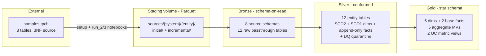
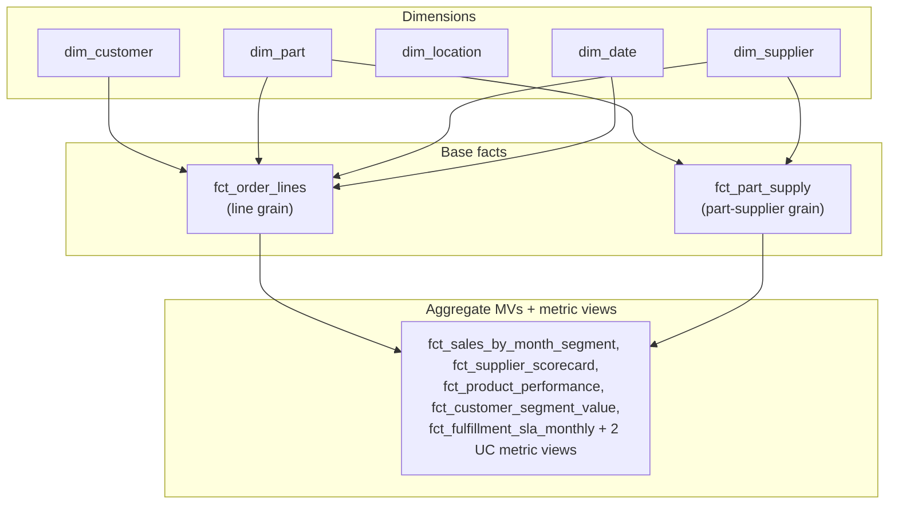

# TPC-H Sample - End-to-End Medallion Reference

A comprehensive, end-to-end Lakeflow Framework bundle that reverse-engineers the
`samples.tpch` benchmark schema into a fully streaming **medallion data warehouse**: from
multi-source ingestion, through conformed/historized silver, to a governed gold star schema with
materialized views, a semantic metric layer, data-quality quarantine, and a three-day
incremental-load simulation.

This is the most comprehensive sample in the framework. Where `feature-samples` shows each
feature in isolation and `pattern-samples` shows the core medallion patterns, `tpch_sample`
ties everything together on a realistic sample dataset at scale.

---

## Table of contents

1. [Background & purpose](#1-background--purpose)
2. [Architecture overview](#2-architecture-overview)
3. [Quickstart](#3-quickstart)

**Part 1 — Deploy and Run**

4. [Prerequisites](#4-prerequisites)
5. [Setup & deployment](#5-setup--deployment)
6. [Execution](#6-execution)
7. [Demo flow / walkthrough](#7-demo-flow--walkthrough)
8. [Validating results — sample queries](#8-validating-results--sample-queries)
9. [Troubleshooting & gotchas](#9-troubleshooting--gotchas)
10. [Cleanup](#10-cleanup)

**Part 2 — Architecture and Design**

11. [Design choices (the "why")](#11-design-choices-the-why)
12. [Repository layout](#12-repository-layout)
13. [Source data staged](#13-source-data-staged)
14. [Unity Catalog objects produced](#14-unity-catalog-objects-produced)
15. [Backlog / roadmap](#15-backlog--roadmap)

---

## 1. Background & purpose

`samples.tpch` (in the Databricks `samples` catalog) is a clean, denormalized, 3NF
**benchmark source schema** — eight tables (`customer`, `supplier`, `nation`, `region`,
`part`, `partsupp`, `orders`, `lineitem`). It is *not* a data warehouse: no history, no
multi-source merge, no quarantine, no star schema, and operational column names like
`c_custkey`.

This sample treats `samples.tpch` as the **"ERP database"** in a demo narrative and builds a
real warehouse on top of it. It demonstrates how to use the Lakeflow Framework to:

- **Land data from many simulated source systems** as Parquet files in a staging volume.
- **Ingest with schema-on-read bronze** (Auto Loader infers + evolves the schema).
- **Conform & historize** entities in silver (SCD2 dimensions, append-only facts, CDF).
- **Quarantine bad data** at silver via data-quality expectations.
- **Merge multiple sources into conformed gold dimensions** (`dim_customer`, `dim_supplier`).
- **Build a star schema** of dimensions + facts, plus **pre-aggregated materialized views**.
- **Generate surrogate keys** (`xxhash64`) and resolve facts to the dimension version that was
**effective as of the order date** (point-in-time / as-of joins).
- **Expose a governed semantic layer** with **UC Metric Views**.
- **Simulate incremental operation** over three "days," including SCD2 changes and a backdated
out-of-order correction on the business timeline.

**Audience:** SAs / DEs evaluating the framework, and anyone wanting a copy-paste reference for
a real medallion build.

---

## 2. Architecture overview

`samples.tpch` is exported by the setup notebook into per-source landing zones, then flows
through three DLT pipelines, bronze then silver then gold.




The gold star schema (surrogate keys with natural keys retained; base facts resolve
customer/supplier dimensions as-of the order date, part at its current version):




---

## 3. Quickstart

Build the full warehouse end-to-end (deploy, stage data, then run all three days) with a single
command. You need the Databricks CLI, the Lakeflow Framework already deployed, and a catalog you
can `CREATE SCHEMA` in (full list in §4).

```bash
cd samples
./deploy_tpch_and_test.sh \
  -u <you@company.com> -h https://<workspace-host> -p DEFAULT \
  -c 1 -l _dev --catalog main --schema_namespace tpch_sample --runs 3
```

This deploys the three pipelines and four jobs, runs the one-time setup, then executes Run 1
(full refresh), Run 2, and Run 3. Re-running on staging that already exists? Add `--skip-setup`.

When it finishes you'll have a populated `tpch_sample_gold` star schema (5 dimensions, 2 base
facts, 5 aggregate MVs, 2 metric views). From there, jump to **§7 Demo flow** for the talk track
and **§8 Validating results** for copy-paste verification queries.

> Prefer to drive it step-by-step (deploy, then run each job yourself)? Skip the Quickstart and
> follow §4 through §6.

---

# Part 1 — Deploy and Run

## 4. Prerequisites

- **Databricks CLI** installed and configured with a profile.
- The **Lakeflow Framework already deployed** to your workspace (see the framework deploy docs).
- A target **Unity Catalog** that exists (default `main`) and on which you have `**CREATE SCHEMA`**
privilege. The bundle creates schemas + the staging volume; it does **not** create the catalog.
- Access to the `samples.tpch` catalog (available by default in most workspaces).
- **Serverless** is the default/primary compute path (a classic resource tree is maintained for parity).
- **(Optional) A SQL warehouse** — only needed if you want the **AI/BI Genie space**. The deploy
  prompt asks for a warehouse id; leave it blank to **skip Genie deployment**. Everything else in
  the sample deploys and runs without a warehouse, so users without SQL warehouse access are not
  blocked.

---

## 5. Setup & deployment

Deploy the bundle with `deploy_tpch.sh` (run from the `samples/` directory).

**Interactive:**

```bash
cd samples
./deploy_tpch.sh
```

**Single command:**

```bash
cd samples
./deploy_tpch.sh \
  -u <you@company.com> \
  -h https://<workspace-host> \
  -p DEFAULT \
  -c 1 \
  -l _dev \
  --catalog main \
  --schema_namespace tpch_sample
```


| Flag                 | Meaning                                               | Default       |
| -------------------- | ----------------------------------------------------- | ------------- |
| `-u`                 | Databricks username                                   | (prompted)    |
| `-h`                 | Workspace host URL                                    | (prompted)    |
| `-p`                 | CLI profile                                           | `DEFAULT`     |
| `-c`                 | Compute: `0`=classic, `1`=serverless                  | `1`           |
| `-l`                 | Logical environment suffix (isolates your deployment) | `_test`       |
| `--catalog`          | Target catalog                                        | `main`        |
| `--schema_namespace` | Schema name prefix                                    | `tpch_sample` |
| `--warehouse_id`     | *(Optional)* SQL warehouse for the Genie space        | (prompted; blank = skip) |


> Always pass a unique `-l` (e.g. your initials `_jd`) so you don't collide with other
> deployments in a shared workspace.

> **Genie space is optional.** If you don't provide a `--warehouse_id` (or leave the prompt
> blank), Genie-space deployment is skipped and the rest of the sample is unaffected. This keeps
> the sample deployable for users who don't have access to a SQL warehouse. When a warehouse id is
> supplied, a Genie space is created over the gold schema as a post-build step.

This deploys three pipelines (`tpch_bronze`, `tpch_silver`, `tpch_gold`) and four jobs (setup +
runs 1–3) under `/Users/<you>/.bundle/tpch_samples/`.

---

## 6. Execution

Run the jobs in order. The setup job is a **one-time** provisioning step (slow — it loads the
full baseline) and is **skippable** once staging exists.


| #   | Job display name                                                   | What it does                                                               |
| --- | ------------------------------------------------------------------ | -------------------------------------------------------------------------- |
| 0   | `… TPCH Samples - 0 - Setup and Initialise Staging (_env)`         | CREATE schemas + volume + full initial Parquet staging                     |
| 1   | `… TPCH Samples - 1 - Run 1 - Full Refresh (_env)`                 | bronze, silver, then gold (`full_refresh: true`), then create metric views + (optional) Genie space |
| 2   | `… TPCH Samples - 2 - Run 2 - Dim + Fact Updates (_env)`           | stage batch 2, then run the pipelines (`full_refresh: false`)              |
| 3   | `… TPCH Samples - 3 - Run 3 - Facts + Out-of-Order Dim Fix (_env)` | stage batch 3, then run the pipelines (`full_refresh: false`)              |


Jobs are prefixed with the bundle target and your username, e.g.
`[dev jane_doe] Lakeflow Framework - TPCH Samples - 1 - Run 1 - Full Refresh (_jd)`.

### One-shot deploy + run everything

`deploy_tpch_and_test.sh` deploys and then runs the jobs end to end:

```bash
cd samples
# Deploy + setup + run 1/2/3:
./deploy_tpch_and_test.sh -u <you@company.com> -h https://<host> -p DEFAULT -c 1 -l _dev \
  --catalog main --schema_namespace tpch_sample --runs 3

# Re-run on existing staging (skip the slow setup job):
./deploy_tpch_and_test.sh -u <you@company.com> -h https://<host> -p DEFAULT -c 1 -l _dev \
  --catalog main --schema_namespace tpch_sample --runs 3 --skip-setup
```


| Option         | Meaning                                                     |
| -------------- | ----------------------------------------------------------- |
| `--runs 0..3`  | How many processing runs to execute (0 = deploy/setup only) |
| `--skip-setup` | Skip the one-time setup/staging job                         |


### Re-demoing from a clean day 1

Run the `**reset_to_day1**` notebook (or clear the `incremental/` folders) to wipe day-2/3 data,
then run the setup-free Run 1 (full refresh) to rebuild the baseline from `initial/` only.

---

## 7. Demo flow / walkthrough

### Day 1 — Run 1 (full refresh)

The complete star schema is built: all dims, both base facts, the five aggregate MVs, and the
two UC metric views. **Show:** the gold schema fully populated; `dim_customer` (flow spec) vs
`dim_supplier` (materialized view) producing equivalent SCD2 dimensions; query a metric view
with `MEASURE(...)`. If you supplied a warehouse id, an **AI/BI Genie space** ("TPC-H Sample -
Gold Analytics") is also created over the gold schema (§11.19) — **show** a natural-language
question (e.g. *"net sales by market segment in 1996"*).

### Day 2 — Run 2 (incremental: dims + significant facts + DQ)

- **Traceable SCD2 (effective 1996-01-01):** a handful of named customers/suppliers change,
producing new versions in silver and gold (point to specific keys in the UI). The change carries
a **business `effective_date`**, so gold facts attribute orders placed on/after 1996 to the new
version and earlier orders to the baseline — true point-in-time.
- **Fact growth:** a large batch of new orders and line items lands, growing `fct_order_lines`
and the aggregate MVs.
- **Schema evolution (§11.16):** the `customer` batch adds a new `loyalty_tier` column that bronze
picks up automatically. **Show:** `DESCRIBE <bronze_crm>.customer` — the column appears with no spec
change; baseline rows are `NULL`.
- **Late-arriving dimension (§11.18):** one line item references part `9000001`, whose master has not
arrived yet, so it resolves to the unknown member. **Show:** `SELECT part_sk FROM <gold>.fct_order_lines
WHERE part_key = 9000001` → `-1`.
- **Quarantine:** malformed `customer_address` and `orders` rows are dropped from the clean
tables and captured in `*_quarantine`. **Show:** `SELECT * FROM <silver>.orders_quarantine`.

### Day 3 — Run 3 (incremental: facts + supplier update/delete + backdated correction + late arrival + DQ)

- **More facts** land and grow the star further.
- **Supplier update (effective 1997-01-01):** a couple of suppliers get a second SCD2 version,
giving them multi-version history across Run 2 (1996) and Run 3 (1997). Orders resolve the
supplier name effective as of the order date.
- **Supplier delete (§11.17):** supplier 3 is discontinued (`cdc_operation='D'`); `apply_as_deletes` closes its
open SCD2 version. Historical orders still resolve it; later orders fall through to the unknown member.
- **Backdated out-of-order correction (effective 1994-01-01):** a late `customer_address` row
*arrives* in Run 3 but is *effective before* the Run 2 (1996) update. Because silver sequences
by `effective_date`, it slots into history between the 1992 baseline and the 1996 update while
the 1996 value stays current — the headline framework talking point.
- **Late-arrival resolution (§11.18):** part `9000001` finally arrives; a new line item for it resolves
to the real `dim_part` member, while the Run-2 fact keeps the unknown member (append-only facts are not
retro-repointed).
- **Quarantine** continues to catch a second bad batch.

---

## 8. Validating results — sample queries

```sql
-- TPC-H-style: revenue by market segment (no join to samples.tpch needed)
SELECT c.market_segment, sum(f.net_sales) AS net_sales
FROM main.tpch_sample_gold.fct_order_lines f
JOIN main.tpch_sample_gold.dim_customer c
  ON f.customer_key = c.customer_key AND c.__END_AT IS NULL
GROUP BY 1 ORDER BY 2 DESC;

-- Same metric, two ways:
SELECT sales_month, market_segment, net_sales
FROM main.tpch_sample_gold.fct_sales_by_month_segment;          -- fixed-grain MV

SELECT `Order Month`, `Market Segment`, MEASURE(`Net Sales`)
FROM main.tpch_sample_gold.tpch_sample_sales_metrics            -- metric view, any grain
GROUP BY 1, 2;

-- Data-quality quarantine
SELECT * FROM main.tpch_sample_silver.customer_address_quarantine;
SELECT order_key, total_price, comment FROM main.tpch_sample_silver.orders_quarantine;

-- Out-of-order SCD2 history (customer 1) on the business timeline: the backdated correction
-- (effective 1994) slots between the 1992 baseline and the 1996 update; 1996 stays current.
SELECT customer_key, address, __START_AT, __END_AT
FROM main.tpch_sample_silver.customer_address
WHERE customer_key = 1 ORDER BY __START_AT;

-- Point-in-time surrogate keys: every fact row carries the dim version effective as of order_date.
-- Customer 1's orders map to different customer_sk values across the 1992/1994/1996 windows.
SELECT f.order_date, f.customer_sk, c.address, c.market_segment
FROM main.tpch_sample_gold.fct_order_lines f
JOIN main.tpch_sample_gold.dim_customer c ON f.customer_sk = c.customer_sk
WHERE f.customer_key = 1 ORDER BY f.order_date;
```

---

## 9. Troubleshooting & gotchas

- **Run the setup job before Run 1** (or pass without `--skip-setup`): Run 1 assumes the schemas,
volume, and initial staging already exist.
- **In-pipeline references must use `live.<table>`.** A gold dataset that reads another dataset in
the *same* pipeline must reference it as `live.<table>` so DLT registers the dependency and
orders the build; a fully-qualified `{catalog}.{schema}.{table}` reference is treated as
external. Cross-pipeline reads (gold reading **silver**) correctly stay fully-qualified via
`{silver_schema}`. The base facts resolve surrogate keys by reading `live.dim_customer`,
`live.dim_supplier`, and `live.dim_part`, which is what makes the dims build before the facts in
the gold DAG.
- **Append-only facts have no `__START_AT`.** `fct_order_lines` is itself sequenced by
`load_timestamp` (not `__START_AT`); only genuine SCD2 sources expose `__START_AT` / `__END_AT`.
It still carries surrogate keys, resolved by as-of joining the dimensions on `order_date`.
- **Point-in-time uses a business `effective_date`, not processing time.** TPC-H order dates are
1992-1998, but DLT processing time (`__START_AT` derived from `load_timestamp`) is "now," so the
two never overlap. The customer/supplier SCD2 dimensions therefore sequence by a synthetic
business `effective_date` (1992 baseline, 1996/1997 updates, 1994 backdated correction) so facts
can resolve the version that was effective as of the `order_date`.
- **UC Metric Views only support star joins off `source`** (no chained/snowflake joins) — that
is why geography is denormalized onto `dim_customer` / `dim_supplier`.
- **Staging data types must match across batches.** When injecting custom staging rows, keep
column types identical to the initial load (e.g. don't let `-1 * total_price` widen a
`decimal(18,2)`), or schema-on-read bronze will rescue the value to NULL.

---

## 10. Cleanup

```bash
cd samples
./destroy_tpch.sh -h https://<workspace-host> [-p DEFAULT] [-l _dev] [--catalog main] [--schema_namespace tpch_sample]
```

This tears down the tpch bundle (pipelines, jobs, and the schemas it created).

> **Genie space cleanup is handled too.** The Genie space is created via the Genie API from a
> notebook task (see §11.19), so `bundle destroy` alone does not manage it. `destroy_tpch.sh`
> therefore trashes the space first via the CLI (`databricks genie list-spaces` / `trash-space`,
> matched by title) before destroying the bundle. This is best-effort and idempotent — safe if no
> space was ever created.

---

# Part 2 — Architecture and Design

## 11. Design choices (the "why")

### 11.1 Single-catalog, schema-per-layer UC model

Everything deploys into **one catalog** (default `main`), with each medallion layer — and each
bronze source system — as its own **schema**: `{schema_namespace}_<layer>[_<source>]{logical_env}`
(default namespace `tpch_sample`). Tables keep native entity names. This mirrors the other
samples, keeps governance simple, and makes the three-part `targetDetails.database`
(`catalog.schema.table`) the single mechanism for placement.

### 11.2 Multi-source landing zones (`initial/` + `incremental/`)

Each entity lands under `sources/{system}/{entity}/` split into an `**initial/`** zone (day-1
baseline) and an `**incremental/**` zone (day-2/3 batches), with timestamped filenames. Bronze
Auto Loader reads the entity directory recursively, so both zones are picked up. This makes the
incremental file-append story realistic and lets you reset to day 1 by clearing only
`incremental/`.

### 11.3 Parquet staging + schema-on-read bronze

Staging lands typed, self-describing **Parquet**. Bronze flows declare **no schema and no
projection** — Auto Loader infers the schema on first run and evolves it
(`cloudFiles.schemaEvolutionMode: addNewColumns`) as upstream columns appear. Bronze is a
faithful **raw passthrough** (it carries `source_system` / `batch_id` / `load_timestamp`
metadata); all conforming, renaming, and projection happen in silver. This deliberately
demonstrates schema evolution and retires the entire class of CSV positional-parse errors.

### 11.4 Silver: conform, clean names, historize

One silver table per business entity, read 1:1 from its bronze source, with **clean business
column names** (no `c_`/`s_`/`l_`/`o_`/`p_` prefixes). Most **dimensions are SCD2** (`__START_AT` /
`__END_AT`, CDF enabled); the **static reference data (`nation`, `region`) is SCD1** (overwrite,
no history) since it never changes and gold only ever reads its current version; **facts
(`orders`, `lineitem`, `partsupp`) are append-only** immutable events. The customer/supplier
dimension feeds (`customer`, `customer_address`, `customer_phone`, `supplier`) `sequence_by` a
synthetic business **`effective_date`** so their SCD2 windows live on the order timeline
(1992-1998) for point-in-time joins; the remaining feeds `sequence_by: load_timestamp`. Either way
the sequence column orders changes and resolves out-of-order arrivals. Silver does *not* merge
sources — that is gold's job.

### 11.5 Data-quality quarantine at silver

Two silver feeds opt into DQ expectations with `**quarantineMode: table`**, so rows failing an
expectation are dropped from the clean table and routed to an auto-created `<table>_quarantine`:

- `**silver.customer_address**` (SCD2 dimension feed) — referential-integrity rule
(`nation_key IS NOT NULL`).
- `**silver.orders**` (append-only fact feed) — `order_key IS NOT NULL`, `total_price >= 0`.

The Run 2/3 staging notebooks inject a small, tagged cohort of malformed rows so the quarantine
tables are populated for the demo. (PK-null is demonstrated on the append-only fact; a NULL
SCD2 key is an `apply_changes` edge case, so the dimension uses an FK violation on a valid key.)

### 11.6 Gold: star schema + two ways to build a dimension

Gold reassembles the silver slices into a conformed star. It deliberately shows **two SDP
products building the same kind of SCD2 dimension side by side**:

- `**dim_customer`** — a multi-source **flow spec** (staging tables, append views, merge, SQL
DML) merging `customer` + `customer_address` + `customer_phone`.
- `**dim_supplier`** — a **materialized view** that merges `supplier` + address + phone + nation
while preserving the real `__START_AT` / `__END_AT` validity windows.

`dim_location`, `dim_part`, and `dim_date` are also materialized views; `dim_date` is a
generated calendar (see §11.8).

### 11.7 Append-only facts + degenerate order dimension (no `fct_orders`)

There is intentionally **no order-header fact**. Order-header attributes (`order_status`,
`order_priority`, `clerk`, `ship_priority`, `order_date`) are folded onto `fct_order_lines` as
**degenerate dimension columns**. The two base facts are `fct_order_lines` (line grain) and
`fct_part_supply` (part-supplier grain). `o_totalprice` is not carried to gold (it would
double-count at line grain and is derivable from `sum(extended_price * (1 - discount))`).

### 11.8 `dim_date` with a fiscal calendar

A static generated calendar dimension over the TPC-H range (1992–1998) via `sequence` +
`explode`. It includes standard parts (`year`, `quarter`, `month`, `is_weekend`, …) **and a
fiscal calendar** (`fiscal_year`, `fiscal_quarter`, `fiscal_month`, `fiscal_year_label`,
`fiscal_quarter_label`, `fiscal_period`). The fiscal year starts **1 April** (a single,
clearly-commented constant in the SQL — easy to change to e.g. Oct for US federal).

### 11.9 Metrics layer — pre-aggregated MVs **vs** UC Metric Views

The sample ships **both** ways to serve the same business metrics:


|          | Pre-aggregated MV (`facts_aggregated`)            | UC Metric View (`create_metric_views`)                  |
| -------- | ------------------------------------------------- | ------------------------------------------------------- |
| Built by | Gold pipeline (`dataFlowType: materialized_view`) | Notebook task after gold (`CREATE VIEW … WITH METRICS`) |
| Storage  | Materialized (physical)                           | Computed at query time                                  |
| Grain    | Fixed per MV                                      | Any grain via `MEASURE(...)`                            |
| Best for | Known dashboard slices, cheap reads               | Self-serve BI / Genie / ad-hoc                          |


Metric views are a **post-pipeline** step because the dataflow framework has no metric-view
`dataFlowType`; they are created idempotently as a task in the Run 1 job after the gold
pipeline. Note: UC Metric Views only support **star joins off `source`** (no chained joins), so
geography (`nation_name`, `region_name`) is denormalized onto `dim_customer` / `dim_supplier`.

### 11.10 Spec organization — standalone vs grouped

The framework allows multiple materialized views in one spec. This sample uses a **hybrid** to
teach both idioms: unique/complex objects get their own spec (`dim_customer`, `fct_order_lines`,
`fct_part_supply`), while homogeneous families are grouped (`dimensions_main.json`,
`facts_aggregated_main.json`).

### 11.11 Surrogate keys + point-in-time (as-of) joins

Dimensions carry a **surrogate key** generated with **`xxhash64`** — fast, deterministic, and
stable on recompute (unlike `IDENTITY`, which DLT `APPLY CHANGES` targets and MVs do not support
reliably). The key folds the natural key and the SCD2 start into one value:

- `dim_customer.customer_sk = xxhash64('customer', customer_key, __START_AT)`
- `dim_supplier.supplier_sk = xxhash64('supplier', supplier_key, __START_AT)`
- `dim_part.part_sk = xxhash64('part', part_key, __START_AT)`, `dim_location.location_sk = xxhash64('location', nation_key)`

The leading literal is a per-dimension salt so the same natural key in two dimensions (e.g.
customer 1 vs supplier 1) never produces the same surrogate value.

Natural keys are **kept** alongside the surrogate keys for traceability. `fct_order_lines`
resolves customer and supplier **as-of the `order_date`** (range join on the SCD2 window) and
part at its current version, so each fact row points at the dimension version that was effective
when the order was placed — true point-in-time analysis. Because the dimensions are themselves
sequenced on the business `effective_date`, an order in 1994 and an order in 1997 for the same
customer correctly carry different `customer_sk` values. (`dim_customer` aligns its composite
sources with as-of joins so each version reflects the right address/segment/phone at that point.)

### 11.12 Row tracking for incremental MV refresh

Materialized views can refresh **incrementally** (recompute only what changed) instead of fully
recomputing only when every base table in their lineage has Delta **row tracking**
(`delta.enableRowTracking = true`). The sample enables it on all silver tables and all gold
tables (alongside `delta.enableChangeDataFeed`), so the dimension MVs, `fct_part_supply`, and the
five aggregate MVs can incrementalize as facts and dimensions grow across Runs 2-3. The property
is applied at table creation (Run 1 full refresh).

### 11.13 Three-run incremental model

Setup loads the full baseline once; then three processing runs simulate days 1–3 (full refresh,
then two incremental runs) covering SCD2 change, significant fact growth, a supplier update, a
backdated out-of-order dimension correction, and ongoing quarantine. See
[§7](#7-demo-flow--walkthrough).

### 11.14 Bronze as a reusable template spec

The 12 bronze flows are identical except for source system and table, so instead of 12 near-duplicate
spec files they are expressed as a single **template definition**
(`src/templates/bronze_parquet_ingestion_template.json`) plus one **template usage spec**
(`bronze/dataflowspec/bronze_ingestion_main.json`) that lists one `parameterSet` per table. The
framework expands this into 12 concrete specs at pipeline init, validating each independently. The
constant pattern (cloudFiles + Parquet, `addNewColumns`, stream, CDF) lives once in the template;
adding a new source becomes a six-key parameter set rather than a whole file. Note the
`"{bronze_${param.sourceSystem}_schema}"` value — template substitution resolves `${param.*}` first,
leaving the `{...}` substitution token for normal pipeline-config resolution at runtime. See the
[Templates feature docs](../../docs/source/feature_templates.rst).

### 11.15 Silver as template specs (by archetype)

Silver has a few structural shapes — SCD2 dimensions (a `cdcSettings` block with `scd_type: 2` that
triggers an `APPLY CHANGES` merge and keeps `__START_AT`/`__END_AT` history), SCD1 reference data
(`scd_type: 1`, overwrite-in-place, no history columns), and append-only facts (no `cdcSettings`).
Because the template engine has **no conditional logic**, a single template can't cover all three:
whatever is in the template body lands in every generated spec, and the *presence and shape* of
`cdcSettings` is exactly what differs. So silver uses **three** templates by archetype —
`silver_scd2_template` (6 historized dimensions), `silver_scd1_template` (`nation`, `region`), and
`silver_append_template` (`lineitem`, `partsupp`). The bespoke parts (`selectExp`, `keys`,
`sequenceBy`, `exceptColumnList`) are list/string parameters per table. SCD2 dimensions omit
`track_history_column_list` entirely so the framework tracks history on **all** tracked columns. The two data-quality demo tables (`customer_address`, `orders`) are **deliberately left as
standalone specs** so the quarantine wiring stays fully readable. This is also a useful contrast with
bronze: bronze flows are identical so templating is a big win, whereas silver's per-table logic means
the parameter sets carry most of the content.

### 11.16 Schema evolution (Auto Loader)

To make the schema-on-read claim concrete, Run 2's `customer` batch introduces a brand-new upstream
column (`loyalty_tier`) that did not exist on day 1. Because bronze reads Parquet with
`cloudFiles.schemaEvolutionMode: addNewColumns`, `bronze_crm.customer` gains the column
automatically — earlier rows read back `NULL` — with no spec change. Silver keeps its explicit
contract and does **not** project the new column, a deliberate contrast: schema-on-read bronze
*evolves*, while contract-bound silver only surfaces columns you opt into (adding it there would be a
schema change, not free evolution).

**What a developer would do next (real deployment):** bronze evolving is only half the story. The new
column now sits in `bronze_crm.customer` but stops there, because silver only emits the columns in its
`selectExp`. Once the data contract is agreed (name, type, semantics, nullability), a developer would
**add the column to the silver `customer` `selectExp`** (e.g. `"loyalty_tier"`) and to
`customer_schema.json`, so it flows into `silver.customer` and onward to gold. This two-step is the
point: bronze captures the new data immediately and losslessly the moment it appears (nothing is
dropped while the contract is still being discussed), and silver promotes it deliberately when the team
is ready — you never lose data waiting on a schema decision, and you never silently leak unmodelled
columns downstream. We intentionally leave silver unchanged here so the "captured in bronze, not yet
promoted" state is visible in the sample.

### 11.17 Deletes (tombstones via `apply_as_deletes`)

Every SCD2 dimension feed carries a CDC `cdc_operation` flag (`'U'` for upserts, `'D'` for deletes). The column
is listed in `except_column_list` so it drives the merge but is never stored. The SCD2 template sets
`cdcSettings.apply_as_deletes: "cdc_operation = 'D'"`, so a delete **closes the open SCD2 version (tombstone)**
rather than inserting. Run 3 discontinues supplier 3 (`cdc_operation='D'`): its open version is closed effective
1997; pre-1997 orders still resolve it via the as-of join, while later orders find no open version and
fall through to the unknown member (§11.18).

### 11.18 Late-arriving dimensions (unknown member)

Each materialized-view dimension (`dim_part`, `dim_supplier`, `dim_location`) carries a synthetic
**unknown member** with surrogate key `-1`, and `fct_order_lines` wraps those lookups in
`COALESCE(..., -1)`. Run 2 stages a line item for part `9000001` whose master record only arrives in
Run 3 — that fact resolves to the Unknown part. New Run-3 facts for `9000001` resolve to the real
part once it lands. Note the realistic trade-off: facts are **append-only**, so the Run-2 row keeps
the unknown member (it is not retro-repointed); only a full refresh would re-resolve it. (`dim_customer`
is a streaming `APPLY CHANGES` table rather than an MV, so it has no physical `-1` member and
`customer_sk` is left un-coalesced.)

**What a developer would do next (real deployment):** the surrogate key is resolved **once, at append
time**, and written into the fact row — so the Run-2 row is permanently stamped `-1` even after the
master lands. The unknown member is the *interim* state: it keeps the row countable and the gap
explicit (`WHERE part_sk = -1`) instead of dropping it or leaving a `NULL` key that breaks BI joins.
The **proper remediation, once the late dimension has arrived, is to full-refresh `fct_order_lines`**
(`full_refresh: true` for that table). That re-reads all line items from scratch, and because
`dim_part` now contains `9000001`, the previously-unknown rows resolve to the real member on rebuild.
This is a deliberate, heavier operation — incremental runs never silently rewrite history — so teams
typically monitor the unknown-member count and schedule a fact rebuild after a known backfill of
late-arriving masters.

### 11.19 Genie space via notebook

Run 1 finishes by creating an **AI/BI Genie space** over the gold star schema
(`src/notebooks/create_genie_space`, task `create_genie_space`, after `create_metric_views`). It
curates the space to the facts, conformed dimensions, and both metric views, and is **idempotent**
(find-or-create by title, so re-runs update in place). It is **optional**: with no `warehouse_id`
the notebook exits cleanly without failing the job (see §4/§5), so users without SQL warehouse
access are never blocked.

**Why a notebook (via the Genie API) rather than declaring it in the bundle?** Genie space support
is **new and still evolving**, and this approach keeps the sample runnable for everyone: not all
users are on the latest Databricks CLI, and some cannot upgrade it in their environment. A notebook
task is universally supported, so the sample deploys on any CLI version. We therefore use this
approach for now.

**Forward-looking:** the space definition in the notebook is authored as a self-contained config
block, so as native bundle support for Genie spaces matures it can move into a
`resources/.../genie/*.yml` file and this notebook task be retired — a lift-and-shift, not a
rewrite. One trade-off today: `bundle destroy` does not manage the space, so `destroy_tpch.sh`
trashes it via the CLI (`databricks genie trash-space`) before destroying the bundle (§10).

---

## 12. Repository layout

```
tpch_sample/
├── databricks.yml                     # bundle: catalog/schema vars, single catalog
├── resources/{serverless,classic}/
│   ├── pipelines/                     # tpch_bronze / tpch_silver / tpch_gold pipelines
│   └── jobs/                          # setup + run_1 / run_2 / run_3 jobs
└── src/
    ├── pipeline_configs/
    │   └── dev_substitutions.json     # {catalog}.{schema} tokens per layer/source
    ├── notebooks/
    │   ├── initialize.ipynb           # shared vars + landing-zone helpers
    │   ├── setup_catalogs_and_staging.ipynb   # CREATE schemas/volume + full initial load
    │   ├── run_2_staging_load.ipynb   # incremental batch 2 (+ schema evolution + late arrival + DQ)
    │   ├── run_3_staging_load.ipynb   # incremental batch 3 (+ supplier update/delete + backdated fix + late arrival + DQ)
    │   ├── reset_to_day1.ipynb        # clears incremental/ for a clean full refresh
    │   └── create_metric_views.ipynb  # UC metric views (post-gold task)
    ├── templates/
    │   ├── bronze_parquet_ingestion_template.json  # reusable bronze cloudFiles pattern
    │   ├── silver_scd2_template.json   # reusable SCD2 (historized) conform pattern
    │   ├── silver_scd1_template.json   # reusable SCD1 (overwrite) conform pattern
    │   └── silver_append_template.json # reusable append conform pattern
    └── dataflows/
        ├── bronze/dataflowspec/       # 1 template usage spec -> 12 cloudFiles flows (schema-on-read)
        ├── silver/
        │   ├── dataflowspec/          # 3 template usage specs (6 SCD2 + 2 SCD1 + 2 append) + 2 standalone DQ specs
        │   └── expectations/          # customer_address_dqe.json, orders_dqe.json
        └── gold/
            ├── dataflowspec/       # star schema: 5 dims, 2 base facts, 5 aggregate MVs
            └── dml/                # one .sql per gold table (referenced via sqlPath)
```

---

## 13. Source data staged

Setup reads the eight `samples.tpch` tables (a **scale-factor ~5** benchmark dataset) and lands
**12 staging entities** as Parquet, deliberately **shredding the customer and supplier masters
across several simulated source systems** so gold has a real multi-source merge to perform. Each
entity lands under `sources/{source_system}/{entity}/initial/` for the baseline (`batch_id = 1`);
the incremental batches (Runs 2–3) land far smaller cohorts under `…/incremental/`.


| Staging entity     | Source system (schema) | From `samples.tpch` | Description                                                     | Initial rows (batch 1) |
| ------------------ | ---------------------- | ------------------- | --------------------------------------------------------------- | ---------------------- |
| `region`           | `reference_data`       | `region`            | Geographic regions (continents)                                 | 5                      |
| `nation`           | `reference_data`       | `nation`            | Countries, FK to region                                         | 25                     |
| `customer`         | `crm`                  | `customer`          | Customer master: name, account balance, market segment          | 750,000                |
| `customer_address` | `crm`                  | `customer`          | Address + nation FK, shredded out of the customer record        | 750,000                |
| `customer_phone`   | `crm`                  | `customer`          | Phone, shredded out (carries a synthetic phone-type `'M'`)      | 750,000                |
| `supplier`         | `procurement`          | `supplier`          | Supplier master: name, account balance                          | 50,000                 |
| `supplier_address` | `vendor_mgmt`          | `supplier`          | Address + nation FK, shredded into a different source system    | 50,000                 |
| `supplier_phone`   | `vendor_mgmt`          | `supplier`          | Phone, shredded out                                             | 50,000                 |
| `part`             | `product_catalog`      | `part`              | Product catalog: brand, type, size, container, retail price     | 1,000,000              |
| `partsupp`         | `inventory`            | `partsupp`          | Part-supplier inventory: available qty, supply cost             | 4,000,000              |
| `orders`           | `order_mgmt`           | `orders`            | Order headers: status, priority, clerk, order date, total price | 7,500,000              |
| `lineitem`         | `order_fulfillment`    | `lineitem`          | Order line items (the grain of `fct_order_lines`)               | ~30,000,000            |


**Worth knowing:**

- **8 source tables become 12 staging entities across 8 source-system schemas.** The split mirrors how
customer/supplier attributes typically live in separate operational systems (CRM, billing,
procurement, vendor management), which is exactly what gold's `dim_customer` /  `dim_supplier`
reconcile back together.
- **Operational column names on purpose.** Staging keeps source-style names (`customer_id`,
`nat_id`, `mktseg`, `ptype`) — they are conformed to clean business names in silver.
- **Lineage metadata on every row.** Each landed file is stamped with `source_system`,
`batch_id`, and `load_timestamp`. The customer/supplier feeds additionally carry a business
`effective_date` that drives their SCD2 sequencing and point-in-time joins (see §11.11).
- **Parquet, schema-on-read.** Typed Parquet means bronze can infer + evolve the schema with no
hand-written DDL (see §11.3).
- **Incremental batches are tiny.** Runs 2–3 append small cohorts (new orders/line items, a few
SCD2 dimension changes, a supplier update, a backdated out-of-order correction, and a handful of
intentionally malformed rows for the quarantine demo) — see §7.

---

## 14. Unity Catalog objects produced

Everything deploys into a single catalog (default `main`) with one schema per medallion layer,
plus one schema per simulated bronze source system.


| Schema                             | Purpose                                                                                                                                                                                                           |
| ---------------------------------- | ----------------------------------------------------------------------------------------------------------------------------------------------------------------------------------------------------------------- |
| `tpch_sample_staging`              | Parquet landing zones (volume `stg_volume`): `initial/` + `incremental/` files per source/entity                                                                                                                  |
| `tpch_sample_bronze_<source>` (×8) | Raw, schema-on-read passthrough tables — one schema per source system (`crm`, `procurement`, `vendor_mgmt`, `reference_data`, `product_catalog`, `inventory`, `order_mgmt`, `order_fulfillment`); 12 tables total |
| `tpch_sample_silver`               | 12 conformed entities (SCD2 + SCD1 dimensions + append-only facts) plus `*_quarantine` tables for DQ rejects                                                                                                             |
| `tpch_sample_gold`                 | Star schema: 5 dimensions, 2 base facts, 5 aggregate MVs, 2 UC metric views                                                                                                                                       |


> **Logical environments.** Every schema name actually ends with a logical-environment suffix
> (the `-l` flag at deploy time, e.g. `_dev` or your initials) so multiple independent
> deployments can share one catalog without collisions. That suffix is **omitted throughout this
> README** for readability — substitute your own (e.g. `tpch_sample_gold` becomes `tpch_sample_gold_dev`).

---

## 15. Backlog / roadmap

- **Genie space — delivered via notebook** (§11.19). As native bundle support for Genie spaces
  matures, move the definition into a `resources/.../genie/*.yml` file and retire the
  `create_genie_space` notebook task.
- **Serve layer** — Lakeview dashboards.
